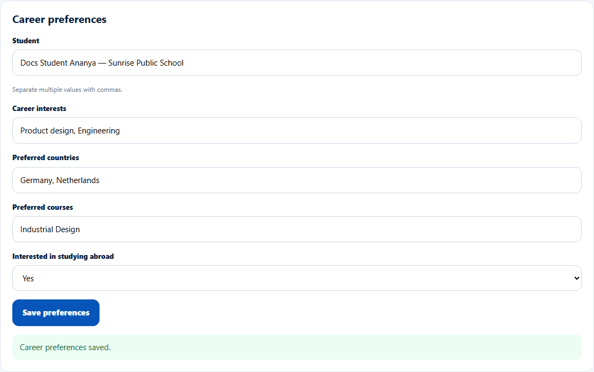

# Record a student's career preferences

> Doc ID: DOC-SCH-CAR-003 · Verified on 2026-10-06 against `main` @ `ce1f07c2` · Roles: Career Counselor

## Purpose
Keep a student's current career interests, preferred countries and courses, and interest in studying abroad up to date.

## Who Can Use This Feature
**Career Counselor.**

## Prerequisites
The student is in your school portfolio. (Not limited by partnership tier.)

## How to Access
Sidebar > **Dashboard** > **Career preferences**.

## Steps

### Step 1 — Choose the student
Pick the **Student**. Their saved preferences load into the form.

### Step 2 — Update and save
Edit **Career interests**, **Preferred countries**, **Preferred courses** (comma-separated) and **Interested in studying
abroad** (Not recorded, Yes, No). Click **Save preferences**. The message "Career preferences saved." appears.

## Fields
| Field | Description | Required | Example |
|---|---|---|---|
| Student | Pick from your portfolio. | Yes | Docs Student Ananya |
| Career interests | Comma-separated. | No | Product design, Engineering |
| Preferred countries | Comma-separated. | No | Germany, Netherlands |
| Preferred courses | Comma-separated. | No | Industrial Design |
| Interested in studying abroad | Not recorded, Yes, No. | No | Yes |

## Expected Result
The preferences appear on the student's profile page (the same fields the School Coordinator sees).

## Validation Messages
| Message | When |
|---|---|
| Could not load this student's preferences. | Loading failed; click **Retry**. *(From code.)* |

## Common Errors
**Problem:** "Career preferences can be recorded once a student is in your portfolio."
**Cause:** No school is assigned to you yet.
**Resolution:** Ask your Overseas Admin.

## Tips
- These are the student's profile fields; the "Career interests" inside a counselling record are stored separately.

## Related Features
- [Add a record](car-001-add-a-record.md)
- [Set a student's career goal](car-004-career-goal.md)
