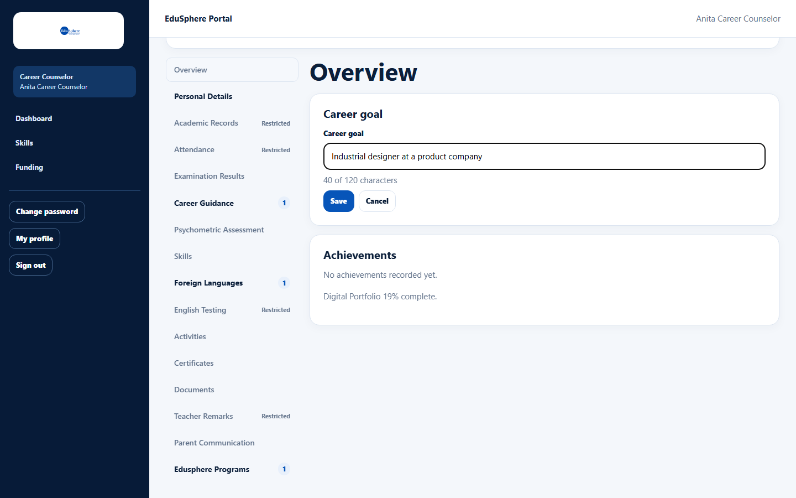
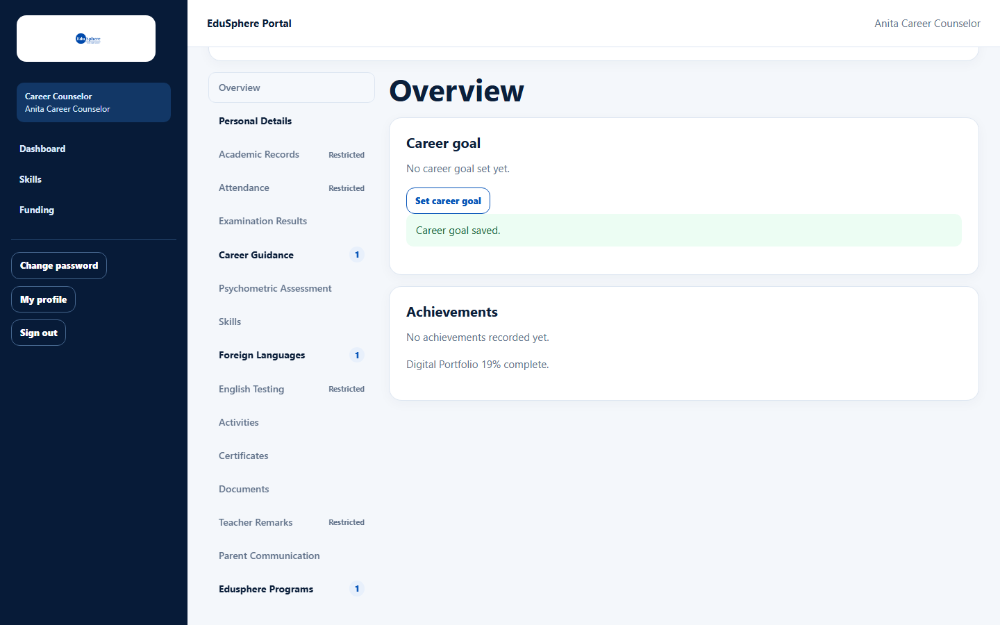
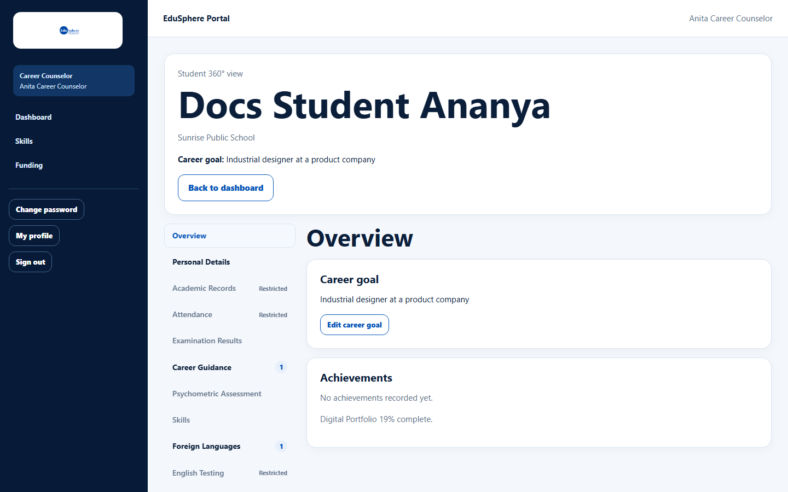

# Set a student's career goal

> Doc ID: DOC-SCH-CAR-004 · Verified on 2026-10-06 against `main` @ `ce1f07c2` · Roles: Career Counselor

## Purpose
Record the student's agreed career goal. It is shown at the top of the student's 360° view for everyone who can see the
student.

## Who Can Use This Feature
**Career Counselor** (the only role that can edit it).

## Prerequisites
The student is in your school portfolio; the school's tier includes Individual counselling (Silver or higher).

## How to Access
Sidebar > **Dashboard** > **Student 360° view** list > the student's name > **Overview** tab > **Career goal**.

## Steps

### Step 1 — Open the career goal
Click **Set career goal** (or **Edit career goal**).

### Step 2 — Save
Type the **Career goal** (up to 120 characters) and click **Save**. The message "Career goal saved." appears.

### Step 3 — Reload to see it
The card may still say "No career goal set yet." until you reload the page. After reloading, the goal shows in the
header ("Career goal: …") and in the card, with **Edit career goal**.

## Fields
| Field | Description | Required | Example |
|---|---|---|---|
| Career goal | One line, up to 120 characters. Saving an empty goal clears it. | No | Industrial designer at a product company |

## Expected Result
Everyone who can open the student's 360° view sees the goal.

## Validation Messages
| Message | When |
|---|---|
| The career goal could not be saved. Please try again. | Saving failed. *(From code.)* |

## Common Errors
**Problem:** The goal does not appear after saving.
**Cause:** The page does not refresh by itself.
**Resolution:** Reload the page.

## Tips
- Agree the goal with the student and parents before recording it.

## Related Features
- [Record career preferences](car-003-career-preferences.md)
- Student 360° view (written in session S9)
