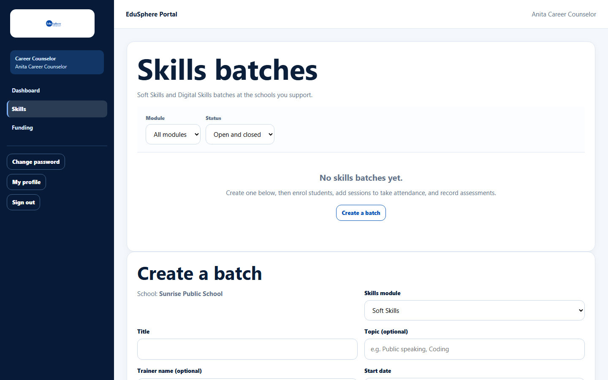
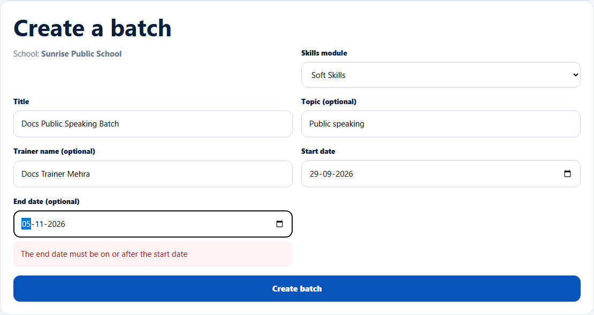
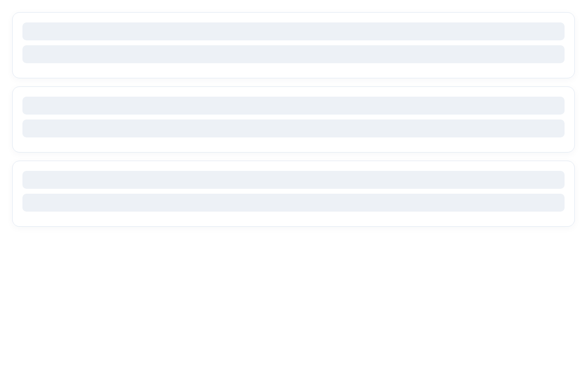
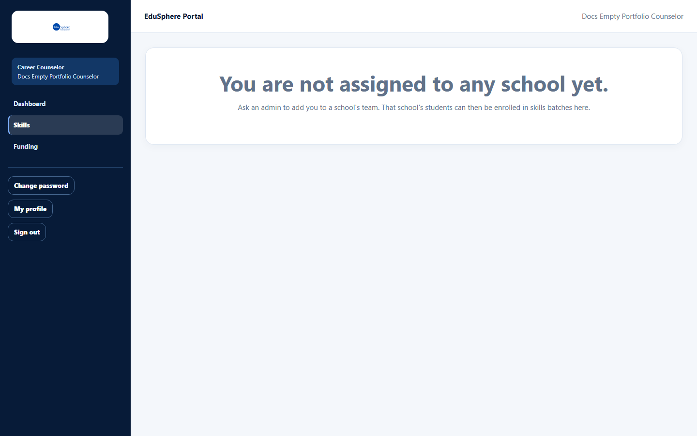

# Find and create skills batches

> Doc ID: DOC-SCH-CAR-005 · Verified on 2026-10-06 against `main` @ `ce1f07c2` · Roles: Career Counselor

## Purpose
Run Soft Skills and Digital Skills programmes for groups of students ("batches") at the schools you support.

## Who Can Use This Feature
**Career Counselor.**

## Prerequisites
- A school in your school portfolio **that has students**.
- The school's tier includes Soft skills (Bronze or higher) or Digital skills (Silver or higher).

## How to Access
Sidebar > **Skills**.

## Steps

### Step 1 — Find batches
**Skills batches** lists batches newest first, each with module, school, dates, number enrolled and **Open** / **Closed**.
Filter by **Module** (All modules, Soft Skills, Digital Skills) and **Status** (Open and closed, Open, Closed). Click **Load
more** for more than 25.

### Step 2 — Create a batch
In **Create a batch**, choose the **School** (shown as text when you support one school), the **Skills module**, and
type the **Title**, **Topic (optional)**, **Trainer name (optional)**, **Start date** and **End date (optional)**.

### Step 3 — Save
Click **Create batch**. The new batch's page opens.

## Fields
| Field | Description | Required | Example |
|---|---|---|---|
| School | A school in your portfolio (with students). | Yes | Sunrise Public School |
| Skills module | Soft Skills or Digital Skills. | Yes | Soft Skills |
| Title | Up to 160 characters. | Yes | Public Speaking Batch |
| Topic (optional) | Up to 120 characters. | No | Public speaking |
| Trainer name (optional) | Up to 120 characters. | No | Ms Mehra |
| Start date / End date (optional) | The end date must be on or after the start date. | Start: Yes | 29-09-2026 / 05-11-2026 |

## Expected Result
The batch exists, open for enrolment.

## Validation Messages
| Message | When |
|---|---|
| The end date must be on or after the start date | End date earlier than start date. *(From code; shown next to the field.)* |
| Enter a title / Choose a start date | Required field missing. *(From code.)* |
| This school's … partnership does not include Digital skills (requires Silver or higher). | Tier too low. *(From code.)* |

## Common Errors
**Problem:** "You are not assigned to any school yet. Ask an admin to add you to a school's team…"
**Cause:** Your school portfolio is empty.
**Resolution:** Ask your Overseas Admin.

**Problem:** A school in your portfolio is missing from **School**.
**Cause:** That school has no students yet.
**Resolution:** Ask the School Coordinator to add students first.

## Related Features
- [Edit, close or reopen a skills batch](car-006-edit-close-reopen-batch.md)
- [Enrol students](car-007-enrolments.md)
