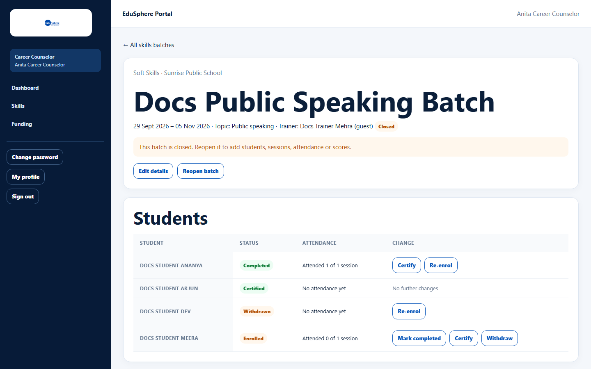

# Edit, close or reopen a skills batch

> Doc ID: DOC-SCH-CAR-006 · Verified on 2026-10-06 against `main` @ `ce1f07c2` · Roles: Career Counselor

## Purpose
Correct a batch's details, close it when the programme ends (it becomes read-only), or reopen it.

## Who Can Use This Feature
**Career Counselor.**

## Prerequisites
The batch exists.

## How to Access
Sidebar > **Skills** > the batch title.

## Steps

### Step 1 — Edit details
Click **Edit details**, change **Title**, **Topic (optional)**, **Trainer name (optional)**, **Start date** or **End date
(optional)**, then **Save details**. The message "Details saved." appears and the header updates.

### Step 2 — Close the batch
Click **Close batch**. The message "Batch closed." appears. **Reload the page** to see the batch marked **Closed** with
"This batch is closed. Reopen it to add students, sessions, attendance or scores." and the **Reopen batch** button.

### Step 3 — Reopen (optional)
Click **Reopen batch**; the message "Batch reopened." appears *(from code)*.

## Fields
See [Find and create skills batches](car-005-skills-batches.md#fields).

## Expected Result
A closed batch keeps its enrolments, attendance and scores, but nothing new can be added until it is reopened.

## Validation Messages
| Message | When |
|---|---|
| title must not be blank | Title emptied. *(From code.)* |
| This batch is closed. Reopen it to make this change. | Changing a closed batch. *(From code.)* |

## Common Errors
**Problem:** After **Close batch**, the header still shows **Open** and **Close batch**.
**Cause:** The page does not refresh by itself after closing.
**Resolution:** Reload the page.

## Tips
- Enrolment status (complete, certify, withdraw) can still be changed on a closed batch *(from code)*.

## Related Features
- [Enrol students and change enrolment status](car-007-enrolments.md)
