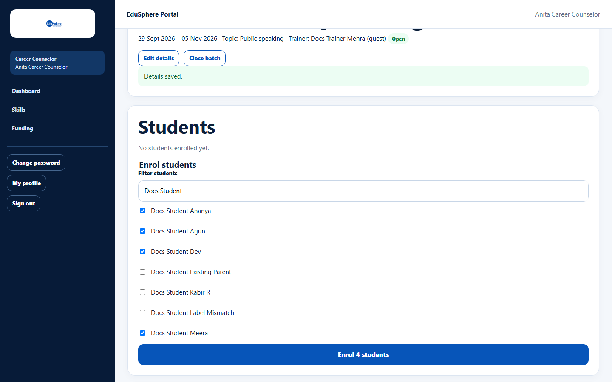
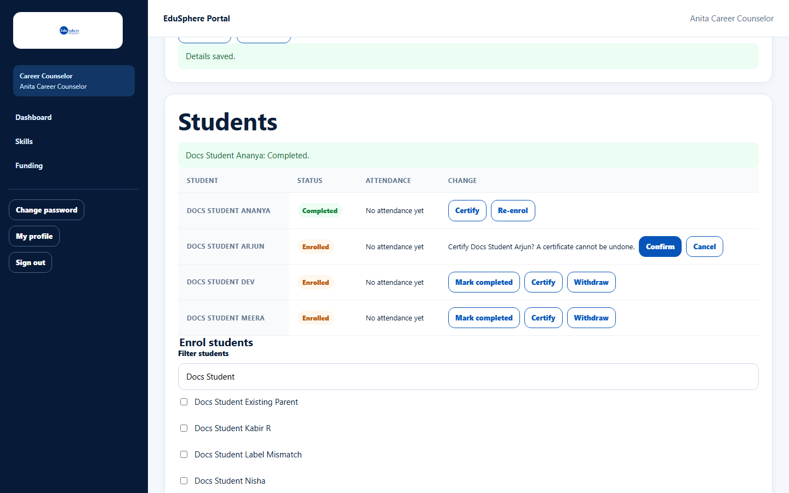
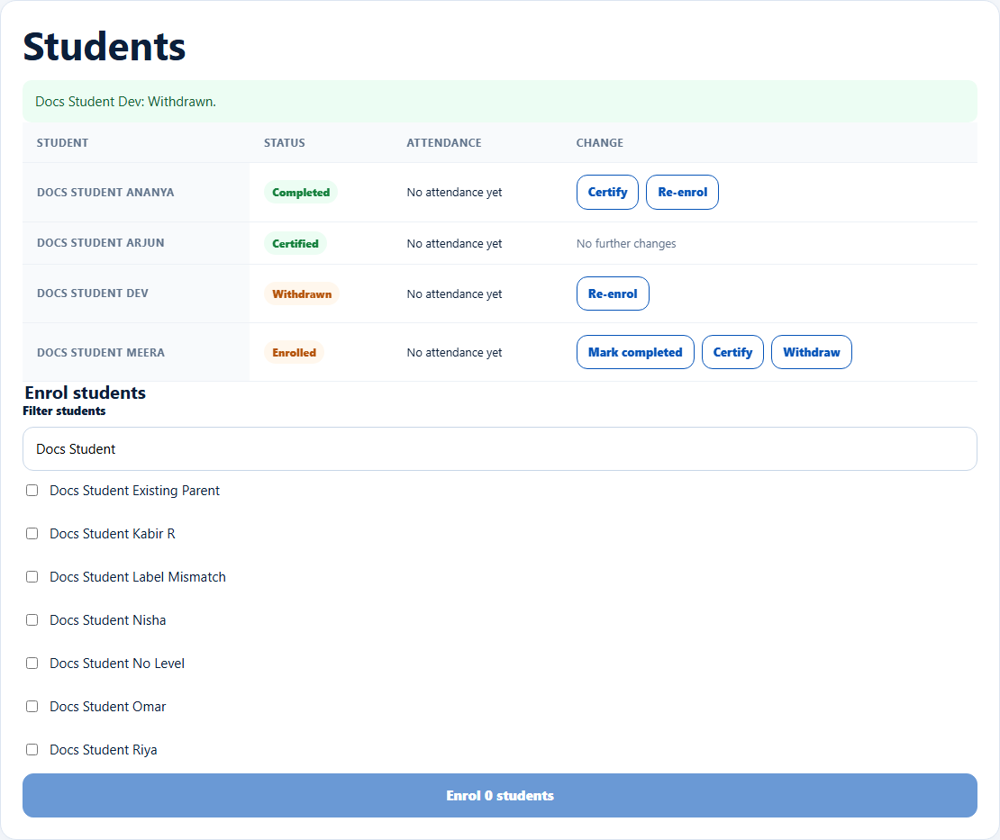

# Enrol students and change their status

> Doc ID: DOC-SCH-CAR-007 · Verified on 2026-10-06 against `main` @ `ce1f07c2` · Roles: Career Counselor

## Purpose
Add students to a skills batch and record how each one finishes: completed, certified or withdrawn.

## Who Can Use This Feature
**Career Counselor.**

## Prerequisites
An open batch; students at the batch's school.

## How to Access
Sidebar > **Skills** > the batch > **Students** and **Enrol students**.

## Steps

### Step 1 — Enrol students
Under **Enrol students**, type in **Filter students** to narrow the list, tick the students and click **Enrol {n}
students**. The message "{n} students enrolled." appears.

### Step 2 — Change a student's status
In **Students**, use the buttons on the student's row:

| Status | Buttons |
|---|---|
| Enrolled | **Mark completed**, **Certify**, **Withdraw** |
| Completed | **Certify**, **Re-enrol** |
| Withdrawn | **Re-enrol** |
| Certified | No further changes |

The message "{name}: {status}." appears.

### Step 3 — Certify (confirm)
**Certify** asks "Certify {name}? A certificate cannot be undone." Click **Confirm** (or **Cancel**).

## Fields
| Field | Description |
|---|---|
| Filter students | Narrows the list of students not yet enrolled. |
| Status / Attendance columns | Current status and "Attended X of Y session(s)". |

## Expected Result
Parents are notified when their child is enrolled, completes or is certified *(from code)*.

## Validation Messages
| Message | When |
|---|---|
| A batch can hold at most 200 students | Batch full. *(From code.)* |
| This batch is closed. Reopen it to make this change. | Enrolling into a closed batch. *(From code.)* |

## Common Errors
**Problem:** "Every student at {school} is already enrolled." *(From code.)*
**Cause:** Nobody left to enrol.
**Resolution:** None needed.

## Tips
- Certification cannot be undone; check before confirming.
- A student who moved to another school shows "Transferred out" and cannot be changed *(from code)*.

## Related Features
- [Add sessions and take batch attendance](car-008-sessions-and-attendance.md)
- [Add assessments and record scores](car-009-assessments-and-scores.md)
