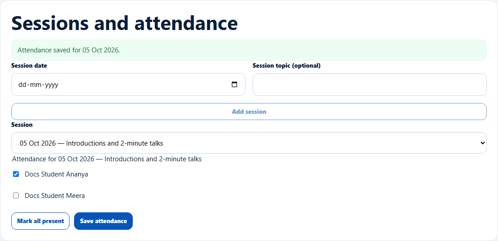

# Add sessions and take batch attendance

> Doc ID: DOC-SCH-CAR-008 · Verified on 2026-10-06 against `main` @ `ce1f07c2` · Roles: Career Counselor

## Purpose
Record each session of a skills batch and which students attended.

## Who Can Use This Feature
**Career Counselor.**

## Prerequisites
An open batch with enrolled students.

## How to Access
Sidebar > **Skills** > the batch > **Sessions and attendance**.

## Steps

### Step 1 — Add a session
Enter the **Session date** (within the batch's dates) and **Session topic (optional)**, then click **Add session**. The
message "Session on {date} added." appears.

### Step 2 — Mark attendance
Choose the **Session**, tick present students (or **Mark all present** and untick absentees), then click **Save
attendance**. The message "Attendance saved for {date}." appears.

## Fields
| Field | Description | Required | Example |
|---|---|---|---|
| Session date | Within the batch's start and end dates. | Yes | 05-10-2026 |
| Session topic (optional) | Up to 160 characters. | No | Introductions and 2-minute talks |
| Session | Which session to mark. | Yes | 05 Oct 2026 |
| One checkbox per student | Ticked = present. | — | ✓ |

## Expected Result
Each student's **Attendance** column shows "Attended X of Y session(s)".

## Validation Messages
| Message | When |
|---|---|
| The session date must be within the batch's dates | Date outside the batch. *(From code.)* |
| This batch already has a session on {date} | Duplicate date. *(From code.)* |
| You have unsaved attendance. Leave this page without saving it? | Leaving with unsaved marks. *(From code.)* |

## Common Errors
**Problem:** A student is missing from the attendance list.
**Cause:** Certified and withdrawn students cannot be marked.
**Resolution:** None needed.

## Tips
- Only Enrolled and Completed students can be marked.

## Related Features
- [Enrol students](car-007-enrolments.md)
