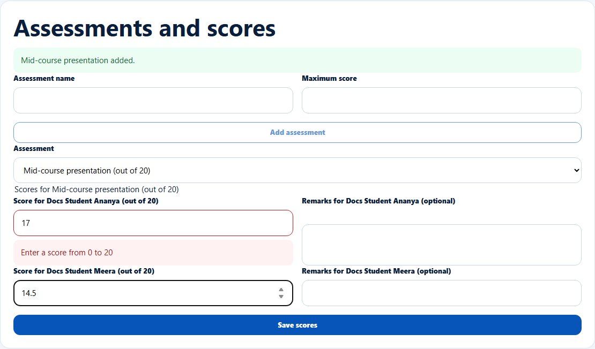

# Add assessments and record scores

> Doc ID: DOC-SCH-CAR-009 · Verified on 2026-10-06 against `main` @ `ce1f07c2` · Roles: Career Counselor

## Purpose
Score students on batch assessments, such as a presentation or a practical test.

## Who Can Use This Feature
**Career Counselor.**

## Prerequisites
An open batch with enrolled students.

## How to Access
Sidebar > **Skills** > the batch > **Assessments and scores**.

## Steps

### Step 1 — Add an assessment
Enter the **Assessment name** and **Maximum score**, then click **Add assessment**. The message "{name} added." appears.

### Step 2 — Enter scores
Choose the **Assessment**, type each student's score (and optional remarks), then click **Save scores**. The message
"Scores saved for {assessment}." appears.

## Fields
| Field | Description | Required | Example |
|---|---|---|---|
| Assessment name | Up to 120 characters; unique in the batch. | Yes | Mid-course presentation |
| Maximum score | 0.01 to 1000. | Yes | 20 |
| Score for {name} (out of {max}) | 0 up to the maximum. | At least one | 17 |
| Remarks for {name} (optional) | Up to 2000 characters. | No | Confident delivery. |

## Expected Result
Scores are stored for each student and appear in their 360° view (Skills).

## Validation Messages
| Message | When |
|---|---|
| Enter a score from 0 to {max} | A score above the maximum. *(From code; on the documentation server a score of 25/20 was not saved.)* |
| This batch already has an assessment with that name | Duplicate name. *(From code.)* |

## Common Errors
**Problem:** **Save scores** is greyed out.
**Cause:** No score has been typed.
**Resolution:** Enter at least one score.

## Related Features
- [Add sessions and take batch attendance](car-008-sessions-and-attendance.md)
