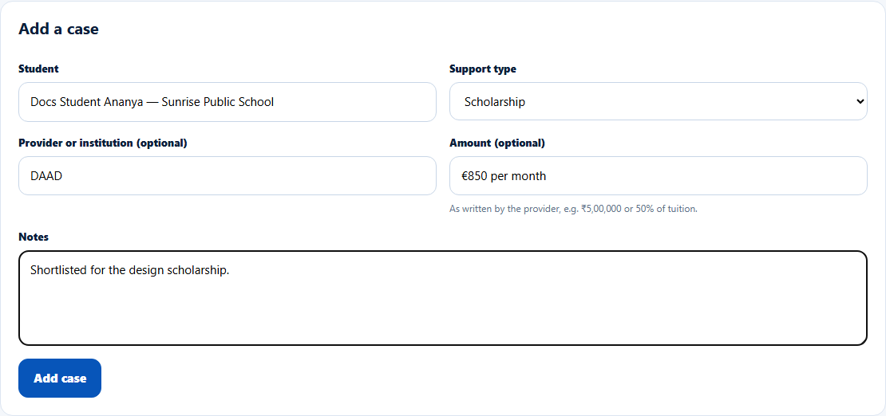
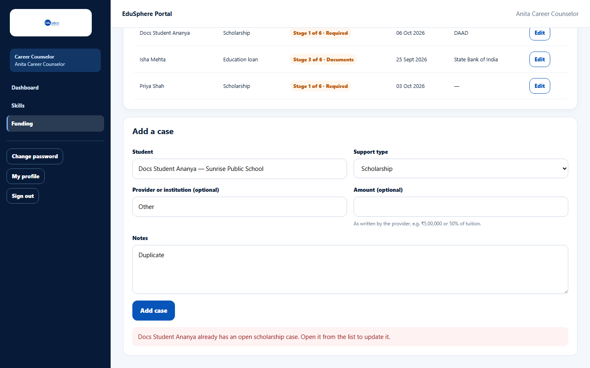

# Open a funding support case

> Doc ID: DOC-SCH-CAR-010 · Verified on 2026-10-06 against `main` @ `ce1f07c2` · Roles: Career Counselor

## Purpose
Track a student's application for an education loan, financial assistance, a scholarship or funding guidance.

## Who Can Use This Feature
**Career Counselor.** School Coordinators, Principals and Parents can see the cases on the student's page; Teachers
cannot.

## Prerequisites
- The student is in your school portfolio.
- Tier: Scholarship needs **Gold** or higher; Education loan, Financial assistance and Funding guidance need
  **Platinum** *(from code)*.

## How to Access
Sidebar > **Funding** > **Add a case**.

## Steps

### Step 1 — Fill in the case
Pick the **Student**, choose the **Support type**, and optionally the **Provider or institution**, **Amount** and
**Notes**.

### Step 2 — Save
Click **Add case**. The message "Case saved." appears and the case is listed in **Open cases** at **Stage 1 of 6 ·
Required**.

## Fields
| Field | Description | Required | Example |
|---|---|---|---|
| Student | Pick from your portfolio. | Yes | Docs Student Ananya |
| Support type | Education loan, Financial assistance, Scholarship, Funding guidance. | Yes | Scholarship |
| Provider or institution (optional) | Up to 200 characters. | No | DAAD |
| Amount (optional) | As written by the provider, up to 120 characters. | No | ₹5,00,000 or 50% of tuition |
| Notes | Up to 4000 characters. | No | Shortlisted for the design scholarship. |

## Expected Result
The case is tracked; the parent is notified "Funding support update for {name}" *(from code)*.

## Validation Messages
| Message | When |
|---|---|
| {Name} already has an open {type} case. Open it from the list to update it. | The student already has an open case of that type. |

## Common Errors
**Problem:** The duplicate-case message.
**Cause:** Only one open case per support type per student.
**Resolution:** Click **Edit** on the existing case in **Open cases**.

## Related Features
- [Move a funding case through its stages or close it](car-011-update-or-close-a-funding-case.md)
