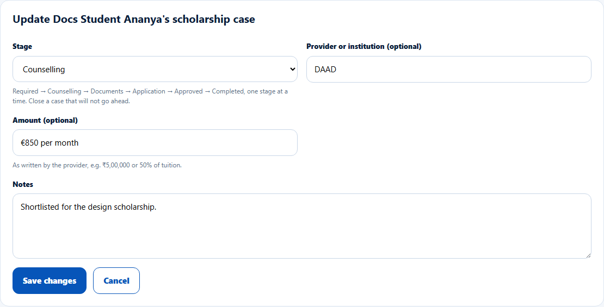
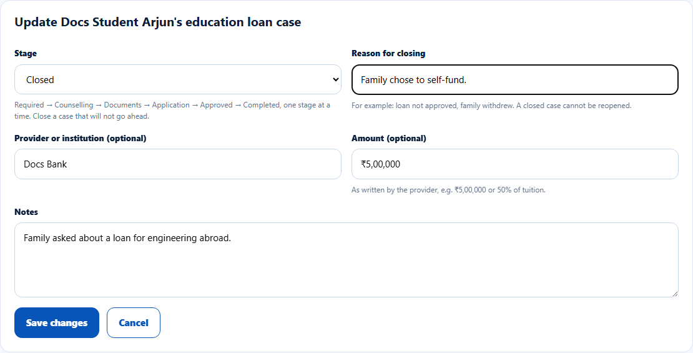
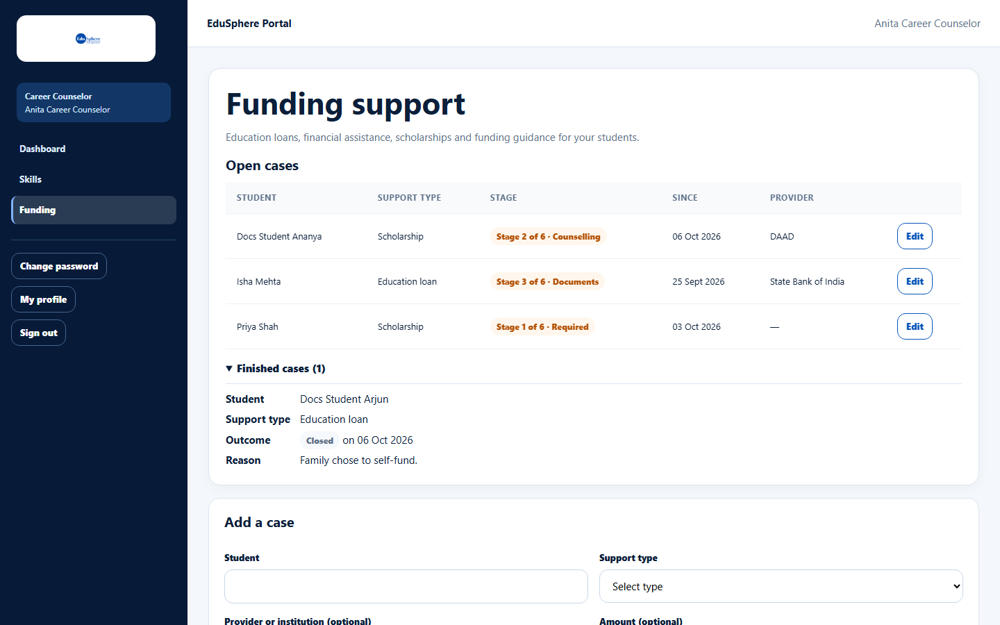

# Move a funding case through its stages or close it

> Doc ID: DOC-SCH-CAR-011 · Verified on 2026-10-06 against `main` @ `ce1f07c2` · Roles: Career Counselor

## Purpose
Record each step of a funding case until it is completed, or close it when it will not go ahead.

## Who Can Use This Feature
**Career Counselor.**

## Prerequisites
An open case.

## How to Access
Sidebar > **Funding** > **Open cases** > **Edit** on the case.

## Steps

### Step 1 — Open the case
Click **Edit**. **Update {student}'s {type} case** opens.

### Step 2 — Choose the next stage
**Stage** offers the current stage, the next stage and **Closed**. Stages go one at a time: Required → Counselling →
Documents → Application → Approved → Completed. Update **Provider**, **Amount** or **Notes** if needed, then click
**Save changes**. The message "Case saved." appears.

### Step 3 — Close a case (when it will not go ahead)
Choose **Closed** and enter the **Reason for closing** (for example "loan not approved, family withdrew"). Click **Save
changes**. A closed case cannot be reopened.

### Step 4 — See finished cases
Completed and closed cases move to **Finished cases ({n})**, which shows the outcome, date and reason.

## Fields
| Field | Description | Required | Example |
|---|---|---|---|
| Stage | Current, next, or Closed. | Yes | Counselling |
| Reason for closing | Up to 500 characters (only for Closed). | When Closed | Family chose to self-fund. |
| Provider, Amount, Notes | As when opening the case. | No | — |

## Expected Result
The case shows "Stage N of 6 · {stage}", or moves to Finished cases. The parent is notified of each stage change *(from
code)*.

## Validation Messages
| Message | When |
|---|---|
| Give a reason for closing this case. | Closed without a reason. *(From code; the field is required on screen.)* |
| This case was changed by someone else (now {stage}). Reload to see the latest. | Saved elsewhere meanwhile. *(From code.)* |
| This case is {Completed/Closed} and can no longer be changed. | Editing a finished case. *(From code.)* |

## Common Errors
**Problem:** You closed a case by mistake.
**Cause:** Closed is final.
**Resolution:** Open a new case of the same type.

## Tips
- A case opened at a student's previous school cannot be changed after a transfer *(from code)*.

## Related Features
- [Open a funding support case](car-010-open-a-funding-case.md)
