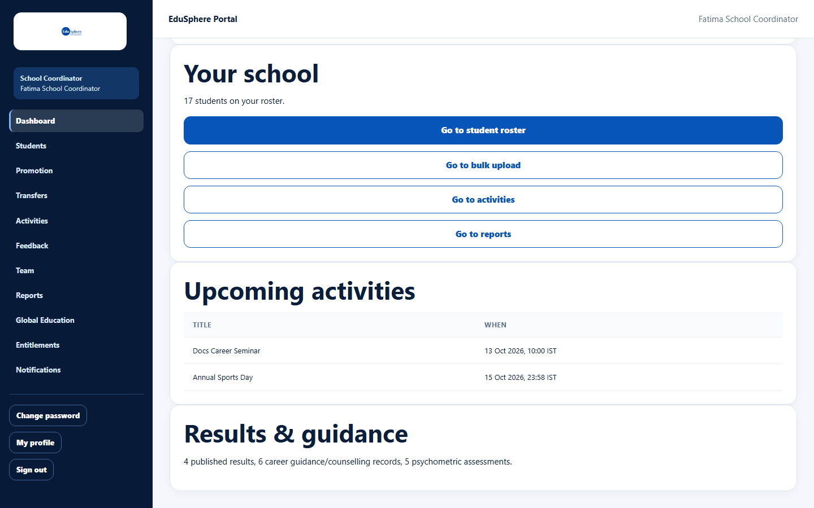

# School Coordinator dashboard

> Doc ID: DOC-SCH-DASH-001 · Verified on 2026-10-06 against `main` @ `ce1f07c2` · Role: School Coordinator

## Purpose
See your school's key figures at a glance and jump to the screens you use most.

## Who Can Use This Feature
**School Coordinator.** The Principal has a similar dashboard (see [Principal dashboard](dash-002-principal-dashboard.md)).

## Prerequisites
You are signed in as a School Coordinator.

## How to Access
The dashboard opens after you sign in. At any time: sidebar > **Dashboard**.

## Steps

### Step 1 — Read "School at a glance"
The card shows 20 figures in four groups: **Students**, **Career & assessment**, **Skills & languages** and **Global
pathway**. The definitions are in the table below.

### Step 2 — Use the lower cards
- **Your school** shows "{n} students on your roster." and four shortcuts: **Go to student roster**, **Go to bulk
  upload**, **Go to activities**, **Go to reports**.
- **Upcoming activities** lists the next 10 scheduled activities (Title, When in IST), soonest first.
- **Results & guidance** counts published results, career guidance/counselling records and psychometric assessments.

## Fields
| Figure | What it counts |
|---|---|
| Total Students | Every student on your roster. |
| Grade 8 … Grade 12 | Students in that grade (taken from the grade level, or from the Grade/Class text such as "Grade 9" or "Class 9"). Grades below 8 have no tile. |
| Career Guidance Completed | Students with a guidance session marked Completed or Follow-up Required (or recorded before statuses were tracked). |
| Psychometric Tests Completed | Students with a completed psychometric assessment. |
| Individual Counselling Completed | Students with a counselling note marked Completed or Follow-up Required (or recorded before statuses were tracked). |
| IELTS Training / SAT Preparation | Students with any IELTS / SAT test-preparation record. |
| Foreign Language Students | Students with any language-class record. |
| Digital Portfolios Created | Students whose Digital Portfolio has been started. |
| Students in Global Education Pathway | Students with at least one overseas application. |
| University Shortlisting | Students whose application has reached university selection or later. |
| Applications in Progress | **Applications** (not students) that are not withdrawn, rejected or enrolled. |
| Offers Received | **Applications** with an offer. |
| Visa Applications | Students with a visa case. |
| Students Admitted | Students whose application is at "enrolled". |
| Internships | Students with an internship entry in their portfolio. |

*(Definitions are from code; the figures were checked against the documentation data.)*

## Expected Result
You see up-to-date figures every time you open the page.

## Validation Messages
None. The page is read-only.

## Common Errors
**Problem:** The whole page shows "Access unavailable" with an error message. *(From code.)*
**Cause:** The dashboard figures could not be fetched.
**Resolution:** Refresh the page. If it keeps happening, contact your EduSphere Overseas Admin.

**Problem:** The **Results & guidance** card is missing.
**Cause:** It is hidden when all three counts are 0, or when one of them could not be loaded *(from code)*.
**Resolution:** None needed for a new school; otherwise refresh.

## Tips
- Most figures count **students**, but **Applications in Progress** and **Offers Received** count **applications**. A
  student with two applications counts twice there.
- The grade tiles can differ from the **Students by grade** chart on the Reports page, which groups by the Grade/Class
  text exactly as typed (see [School summary](../reports/rpt-002-school-summary.md)).
- A new school sees "No students yet. Add your first student, or upload your roster in bulk." *(from code)*.

## Related Features
- [View the student roster](../students/stu-001-view-the-roster.md)
- [Schedule an activity](../activities/act-001-schedule-an-activity.md)
- [School summary](../reports/rpt-002-school-summary.md)
