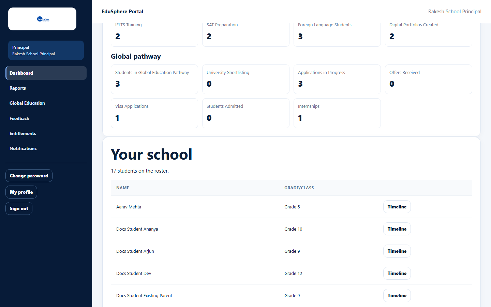

# Principal dashboard

> Doc ID: DOC-SCH-DASH-002 · Verified on 2026-10-06 against `main` @ `ce1f07c2` · Role: Principal

## Purpose
See your school's key figures and open any student's profile.

## Who Can Use This Feature
**Principal** (read only).

## Prerequisites
You are signed in as a Principal.

## How to Access
The dashboard opens after you sign in. At any time: sidebar > **Dashboard**.

## Steps

### Step 1 — Read "School at a glance"
The same 20 figures as the School Coordinator sees, in four groups. See the definitions in
[School Coordinator dashboard](dash-001-coordinator-dashboard.md#fields).

### Step 2 — Open a student
**Your school** shows "{n} students on the roster." and a table of every student (Name, Grade/Class), sorted by name.
Click **Timeline** to open the student's profile and journey timeline.

### Step 3 — Go to reports
Below the roster, **View full reports** opens the Reports page *(from code)*. **Results & guidance** shows the same
counts as on the Coordinator dashboard.

## Fields
See [School Coordinator dashboard](dash-001-coordinator-dashboard.md#fields).

## Expected Result
Clicking **Timeline** opens `/school/principal/students/{id}`, the student's profile (verified in S10).

## Validation Messages
None. The page is read-only.

## Common Errors
**Problem:** "This section couldn't load. Refresh to try again." *(From code.)*
**Cause:** The figures could not be fetched.
**Resolution:** Refresh the page.

## Tips
- The Principal sidebar has no **Students** item. The dashboard roster (or the scorecards on the Reports page) is the
  way to reach a student.
- The roster has no search or paging; use your browser's find (Ctrl+F) on a large school.
- With no students you see "No students yet. Ask your School Coordinator to add your first student." *(from code)*.

## Related Features
- [Student profile and journey timeline](../students/stu-006-student-profile-and-timeline.md)
- [Download the school report](../reports/rpt-001-school-report-pdf.md)
