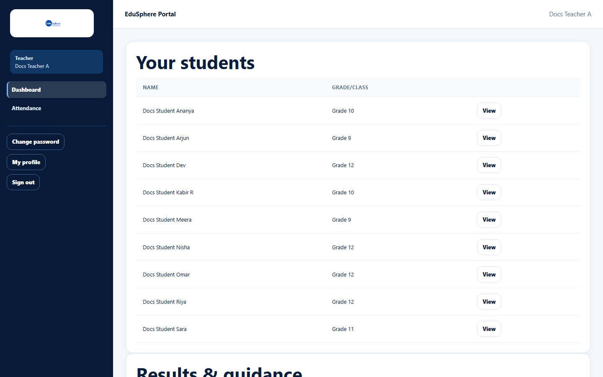

# Teacher dashboard

> Doc ID: DOC-SCH-DASH-003 · Verified on 2026-10-06 against `main` @ `ce1f07c2` · Role: Teacher

## Purpose
See the students assigned to you and open their profiles.

## Who Can Use This Feature
**Teacher.**

## Prerequisites
Your School Coordinator has assigned students to you (in the student's **Class teacher** field).

## How to Access
The dashboard opens after you sign in. At any time: sidebar > **Dashboard**.

## Steps

### Step 1 — Find your student
**Your students** lists your assigned students (Name, Grade/Class), sorted by name.

### Step 2 — Open the student
Click **View** to open the student's profile and journey timeline.

### Step 3 — Check results and guidance
**Results & guidance**, below the list, counts published results, career guidance/counselling records and
psychometric assessments for **your** students only.

## Fields
| Column | Description |
|---|---|
| Name | Student's full name. |
| Grade/Class | As entered by the School Coordinator. |

## Expected Result
**View** opens `/school/teacher/students/{id}` (verified in S10).

## Validation Messages
None. The page is read-only.

## Common Errors
**Problem:** "No students assigned to you yet." *(From code.)*
**Cause:** No student has you as class teacher.
**Resolution:** Ask your School Coordinator to assign your students.

## Tips
- The list has no search or paging.
- To mark daily attendance, use sidebar > **Attendance** (see [Daily class attendance](../activities/act-005-daily-class-attendance.md)).

## Related Features
- [Student profile and journey timeline](../students/stu-006-student-profile-and-timeline.md)
- [Daily class attendance](../activities/act-005-daily-class-attendance.md)
