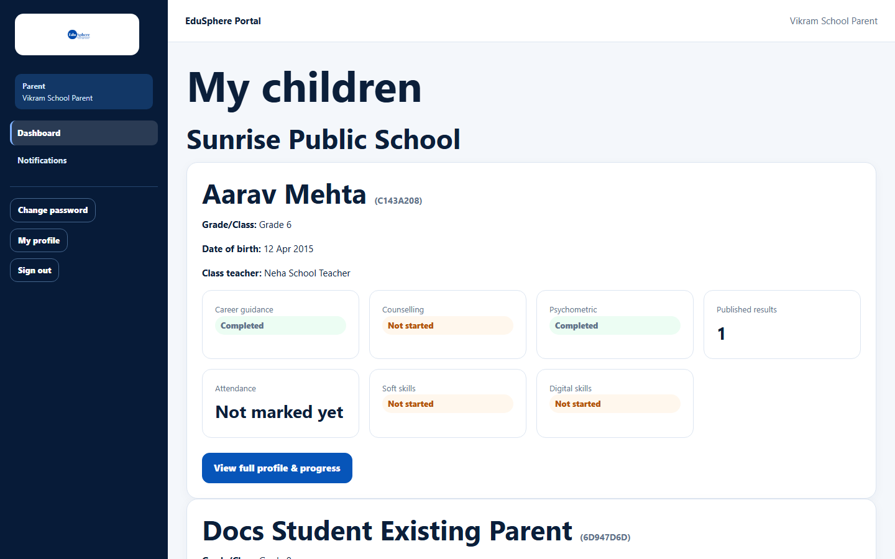
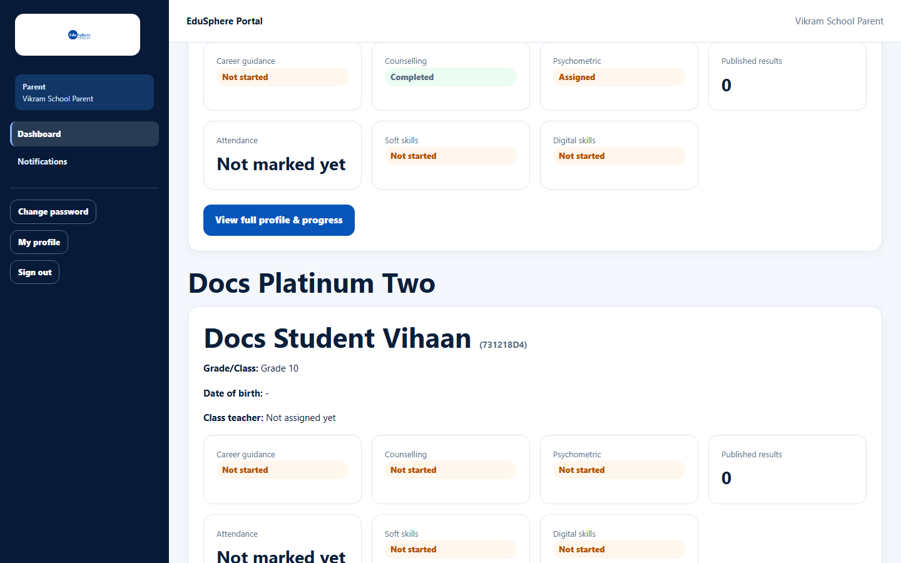
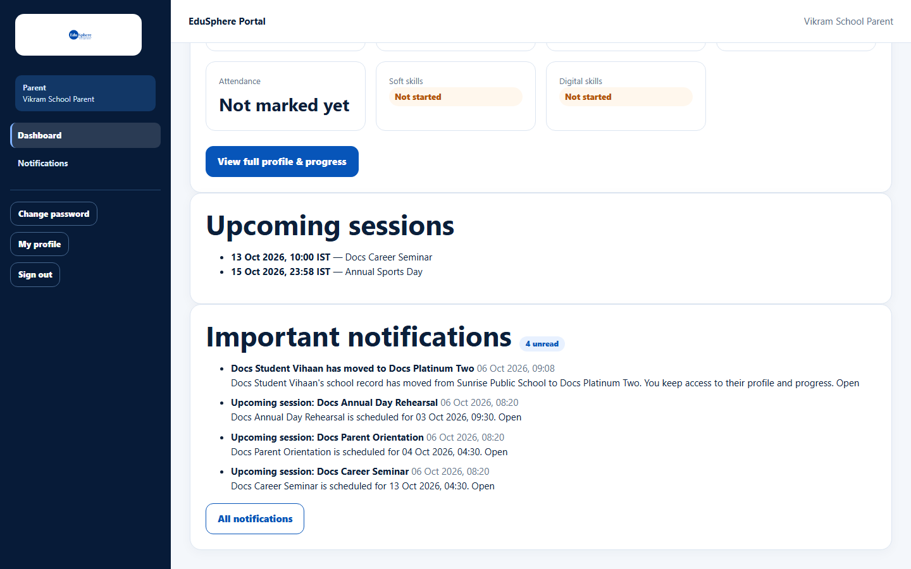

# Parent dashboard

> Doc ID: DOC-SCH-DASH-004 · Verified on 2026-10-06 against `main` @ `ce1f07c2` · Role: Parent

## Purpose
See all your children's progress, upcoming school sessions and your latest notifications on one page.

## Who Can Use This Feature
**Parent.**

## Prerequisites
Your child's school has linked you to your child.

## How to Access
The dashboard opens after you sign in. At any time: sidebar > **Dashboard**.

## Steps

### Step 1 — Find your child
**My children** shows one card per child: name and Student ID, **Grade/Class**, **Date of birth** and **Class
teacher**, then a row of status tiles.

### Step 2 — Children at more than one school
When your children are at different schools, the cards are grouped under each school's name. There is no school
switcher; every child is shown at once.

### Step 3 — Open the full profile
Click **View full profile & progress** on a child's card (see [Your child's profile and progress](../parent/par-001-child-profile-and-progress.md)).

### Step 4 — Check sessions and notifications
- **Upcoming sessions** lists the school's upcoming activities with date and time (IST).
- **Important notifications** shows your latest 5 notifications and an "{n} unread" badge. **All notifications** opens
  the full list.

## Fields
| Tile | Meaning |
|---|---|
| Career guidance, Counselling, Psychometric | Not started, In progress, Assigned or Completed. |
| Published results | Number of results the school has published. |
| Attendance | Daily class attendance over the last marked days, or "Not marked yet". |
| Soft skills, Digital skills | Status of the child's skills batch. |

## Expected Result
You see every linked child with their current status.

## Validation Messages
None. The page is read-only.

## Common Errors
**Problem:** "No child linked to your account yet. Contact your school to get set up." *(From code.)*
**Cause:** The school has not linked you to a child.
**Resolution:** Contact the School Coordinator.

**Problem:** The "{n} unread" number never goes down.
**Cause:** Opening a notification from the parent pages does not mark it read (confirmed in S10; U8).
**Resolution:** None at present. The number counts every notification you have received.

## Tips
- **Attendance** is the teacher's daily class attendance. Activity attendance (for example a career seminar) is shown
  in the **Activities** table on the child's full profile instead.
- **Upcoming sessions** lists all upcoming activities at the school, not only those your child is enrolled in.
- The time written inside "Upcoming session: …" notifications is in UTC (for example 04:30 for a 10:00 IST session);
  the **Upcoming sessions** list shows the correct IST time (U9).
- **Recommended careers** badges appear on the card once the Career Counselor records a recommendation *(from code)*.

## Related Features
- [Your child's profile and progress](../parent/par-001-child-profile-and-progress.md)
- [Notifications for parents](../notifications/notif-002-parent-notifications.md)
