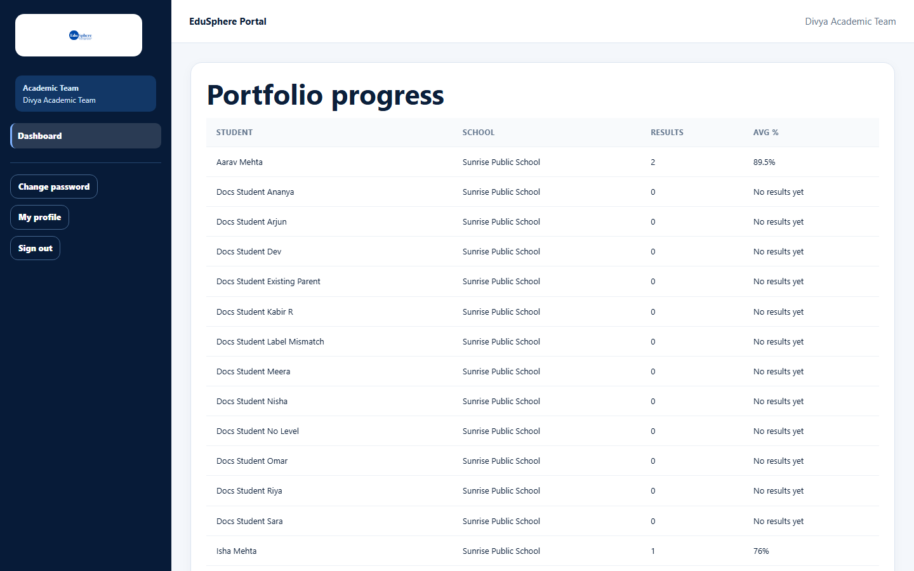

# Academic Team dashboard

> Doc ID: DOC-SCH-DASH-005 · Verified on 2026-10-06 against `main` @ `ce1f07c2` · Role: Academic Team

## Purpose
Your single workspace: every Academic Team task is done on this page.

## Who Can Use This Feature
**Academic Team** members, for the schools in their portfolio.

## Prerequisites
The Overseas Admin has assigned schools to your portfolio.

## How to Access
The dashboard opens after you sign in. It is the only sidebar item.

## Steps

### Step 1 — Know the sections
From top to bottom:

| Section | What you do there | Guide |
|---|---|---|
| Portfolio progress | Results count and average per student | [Portfolio progress](../academic-team/acad-001-portfolio-progress.md) |
| Results + Upload a result | Enter, verify and publish results | [Upload a result](../academic-team/acad-002-upload-a-result.md), [Verify and publish](../academic-team/acad-003-verify-and-publish-results.md) |
| Bulk entry — results (CSV) | Upload many results | [Bulk results](../academic-team/acad-004-bulk-results.md) |
| Test preparation | IELTS / SAT preparation | [Test preparation](../academic-team/acad-005-test-preparation.md) |
| Foreign language classes | Language classes and certification | [Foreign language classes](../academic-team/acad-006-foreign-language-classes.md) |
| Bulk entry — test preparation / language classes | Upload many records | [Bulk test prep and language](../academic-team/acad-007-bulk-test-prep-and-language.md) |
| Students | Open a student's page (Digital Portfolio, 360° view) | [Digital Portfolio](../portfolio/port-001-digital-portfolio-overview.md) |

## Fields
See each linked guide.

## Expected Result
You find every task on one page.

## Validation Messages
See each linked guide.

## Common Errors
**Problem:** "No students in your portfolio yet. Contact your Overseas Admin."
**Cause:** No school is assigned to your portfolio.
**Resolution:** Contact your Overseas Admin.

## Tips
- The bulk-entry sections are collapsed; click their heading to open them.

## Related Features
- [Student 360° view](../student-360/s360-001-student-360-view.md)
