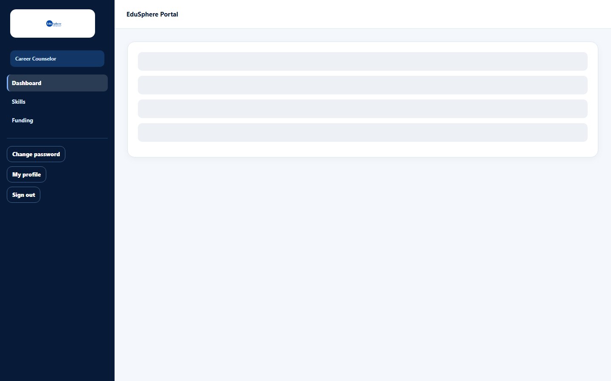

# Career Counselor dashboard

> Doc ID: DOC-SCH-DASH-006 · Verified on 2026-10-06 against `main` @ `ce1f07c2` · Role: Career Counselor

## Purpose
Your main workspace for career guidance and counselling records.

## Who Can Use This Feature
**Career Counselor**, for the schools in their portfolio.

## Prerequisites
The Overseas Admin has assigned schools to your portfolio.

## How to Access
The dashboard opens after you sign in. Sidebar: **Dashboard**, **Skills**, **Funding**.

## Steps

### Step 1 — Know the sections
| Section | What you do there | Guide |
|---|---|---|
| Records | Every guidance session, counselling note and recommendation for students in your portfolio, including other counselors' records; **Edit** a record | [Edit a record](../career-counselor/car-002-edit-a-record.md) |
| Add a record | Record a session, note or recommendation | [Add a record](../career-counselor/car-001-add-a-record.md) |
| Career preferences | A student's interests, countries and courses | [Career preferences](../career-counselor/car-003-career-preferences.md) |
| Student 360° view | Open a student's 360° view (and set their career goal) | [Career goal](../career-counselor/car-004-career-goal.md) |

### Step 2 — Use the other sidebar pages
- **Skills**: Soft Skills and Digital Skills batches (see [Skills batches](../career-counselor/car-005-skills-batches.md)).
- **Funding**: education-loan and funding cases (see [Open a funding case](../career-counselor/car-010-open-a-funding-case.md)).

## Fields
See each linked guide.

## Expected Result
You find every task from this page or the sidebar.

## Validation Messages
See each linked guide.

## Common Errors
**Problem:** The dashboard is empty and the student pickers have no names.
**Cause:** No school is assigned to your portfolio.
**Resolution:** Contact your Overseas Admin.

## Tips
- The Records table has no search; the newest records are at the top.

## Related Features
- [Student 360° view](../student-360/s360-001-student-360-view.md)
