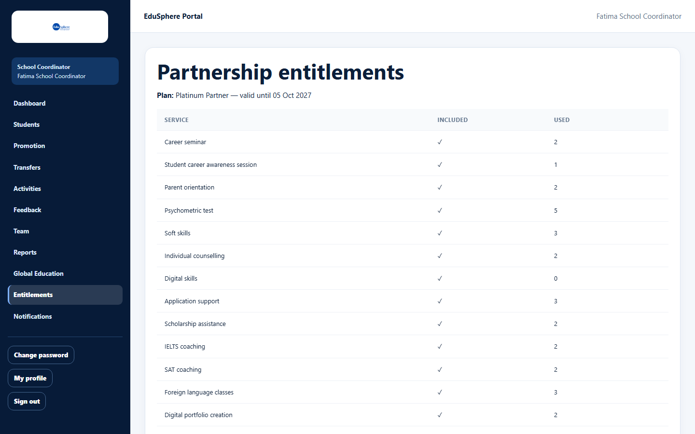
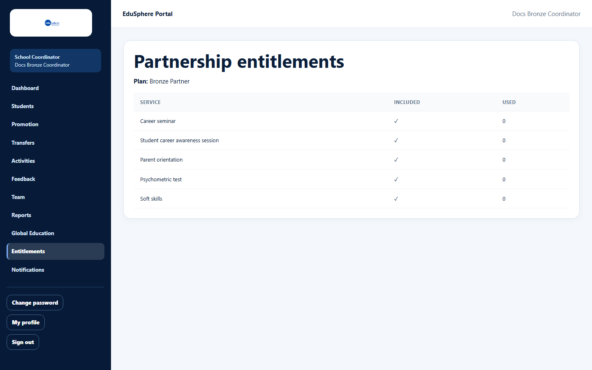
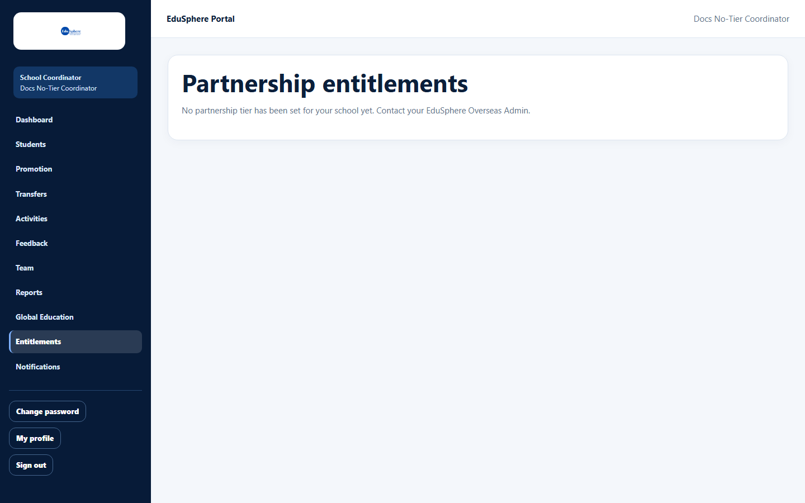
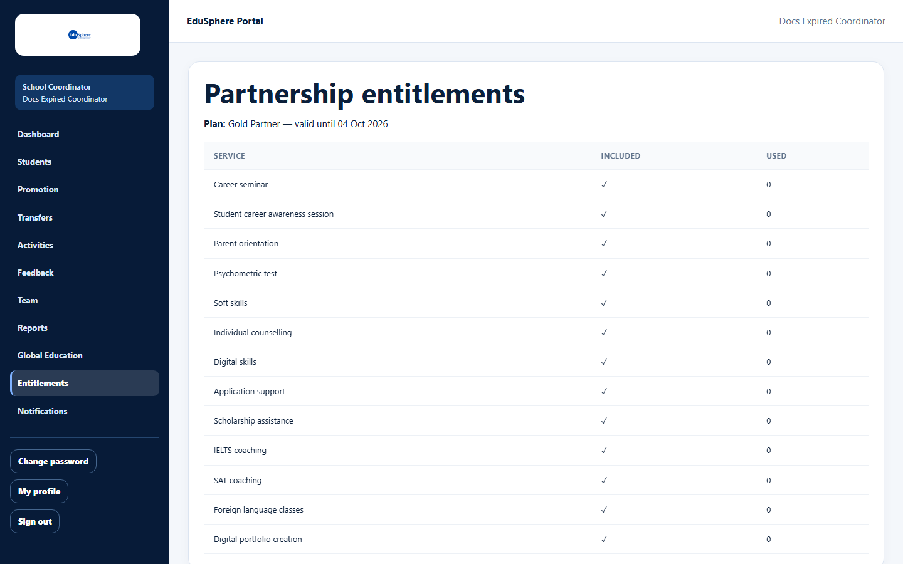
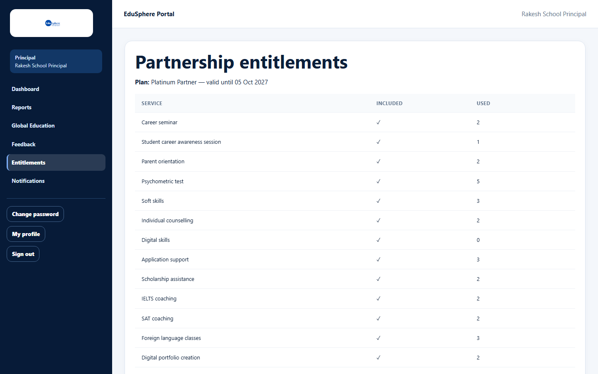

# View your school's partnership entitlements

> Doc ID: DOC-SCH-ENT-001 · Verified on 2026-10-06 against `main` @ `ce1f07c2` · Roles: School Coordinator, Principal

## Purpose
See which EduSphere services your school's partnership includes, until when, and how much of each you have used.

## Who Can Use This Feature
**School Coordinator** and **Principal** (read only).

## Prerequisites
None.

## How to Access
Sidebar > **Entitlements**.

## Steps

### Step 1 — Read your plan
The line under **Partnership entitlements** reads "Plan: {Tier} Partner — valid until {date}".

### Step 2 — Read the services table
**Service** lists every service your tier includes, **Included** is always ✓, and **Used** shows how much has been
used.

A lower tier lists fewer services. Services of higher tiers are not shown at all.

## Fields
| Column | Description |
|---|---|
| Service | A service included in your tier. |
| Included | Always ✓. |
| Used | A count (activities of that type, students or records); **Assigned** / **Not assigned** for Dedicated EduSphere counselor; **Not tracked** for Alumni network and Parent help desk. |

## Expected Result
You know what your school can ask EduSphere for.

## Validation Messages
| Message | When |
|---|---|
| No partnership tier has been set for your school yet. Contact your EduSphere Overseas Admin. | Your school has no tier. |

## Common Errors
**Problem:** The page lists services, but scheduling an activity fails with "This school's partnership expired on …".
**Cause:** The partnership has expired. The page still lists the services and shows only the past date (for example
"valid until 04 Oct 2026"), with no warning.
**Resolution:** Check the **valid until** date. Contact your EduSphere Overseas Admin to renew.

## Tips
- The Principal sees the same page.

- When the tier changes you get a notification (see [Notifications for school staff](../notifications/notif-001-staff-notifications.md)).

## Related Features
- [Partnership tiers explained](ent-002-partnership-tiers-explained.md)
- Admin manual: [Edit a school profile and its partnership tier](../../admin-manual/sadm-003-edit-school-and-tier.md)
