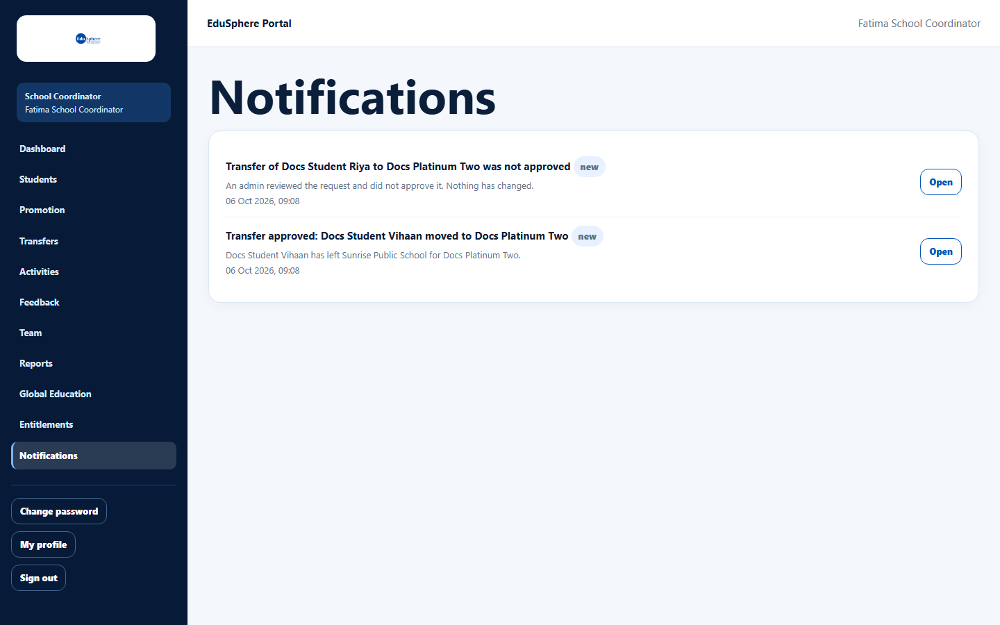
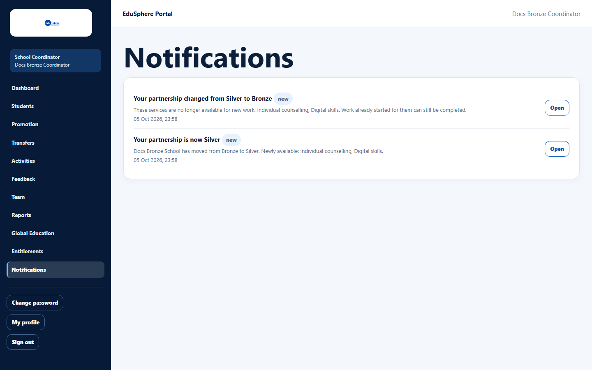

# Notifications for school staff

> Doc ID: DOC-SCH-NOTIF-001 · Verified on 2026-10-06 against `main` @ `ce1f07c2` · Roles: School Coordinator, Principal

## Purpose
Read messages from EduSphere about transfer decisions and partnership changes.

## Who Can Use This Feature
**School Coordinator** and **Principal**.

## Prerequisites
None.

## How to Access
Sidebar > **Notifications**.

## Steps

### Step 1 — Read the list
Each notification shows a title, a **new** badge while unread, the message and the date and time (IST). Newest is at
the top.

### Step 2 — Open a notification
Click **Open** to go to the related page. The notification is marked read: on the documentation server, opening a
transfer notice took the coordinator to **Transfers** and the unread count went from 2 to 1.

## Fields
| Notification | Who gets it | Open goes to |
|---|---|---|
| Transfer approved: {student} moved to {school} | Coordinator of the student's school | Transfers |
| Transfer of {student} to {school} was not approved ("Transfer request for Student ID {code} was not approved" when your school asked for the student) | The coordinator who filed the request | Transfers |
| {student} has joined {school} *(from code)* | Coordinators of the receiving school | The student's page |
| Your partnership is now {Tier} / "… Newly available: …" | Coordinators and Principals | Entitlements |
| Your partnership changed from {A} to {B} / "These services are no longer available for new work: … Work already started for them can still be completed." | Coordinators and Principals | Entitlements |

## Expected Result
You see what changed and can go straight to it.

## Validation Messages
None.

## Common Errors
**Problem:** "No notifications yet. You will be told here when your school's partnership changes." (Principal) *(seen
in S10)*.
**Cause:** Nothing has happened that the Principal is told about.
**Resolution:** None needed.

## Tips
- There is no "mark all as read" and no unread badge in the sidebar.
- The list keeps your newest 100 notifications *(from code)*.
- Notifications may also be sent by email *(from code)*.

## Related Features
- [Track and cancel transfers](../transfers/xfer-003-track-and-cancel-transfers.md)
- [View your school's partnership entitlements](../entitlements/ent-001-view-entitlements.md)
