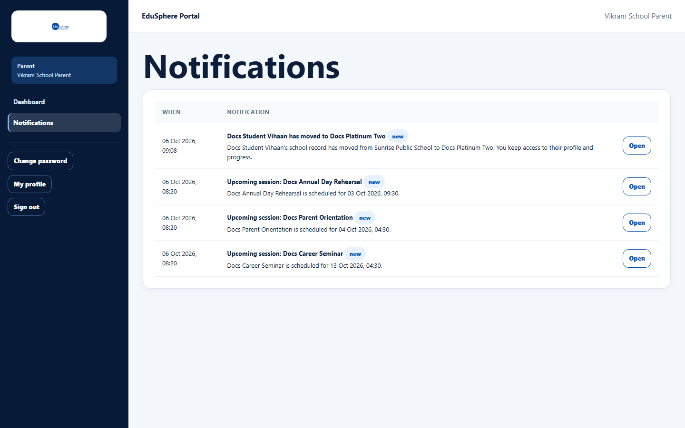

# Notifications for parents

> Doc ID: DOC-SCH-NOTIF-002 · Verified on 2026-10-06 against `main` @ `ce1f07c2` · Role: Parent

## Purpose
Be told when something is scheduled or recorded for your child.

## Who Can Use This Feature
**Parent.**

## Prerequisites
You are linked to at least one child.

## How to Access
- Sidebar > **Notifications** (full list).
- Dashboard > **Important notifications** (latest 5) > **All notifications**.

## Steps

### Step 1 — Read the list
The table shows **When** (IST) and **Notification** (title, a **new** badge, the message), with **Open** on the right.

### Step 2 — Open
**Open** goes to your child's page (or to the dashboard for "Upcoming session" notices).

## Fields
You are notified when *(list from code; the first and last rows were seen in the browser)*:

| Event | Example title |
|---|---|
| The school schedules an activity | Upcoming session: {activity} |
| A Career Counselor adds a guidance session, counselling note or recommendation, or changes its status | Career guidance session recorded for {child} |
| A psychometric assessment is assigned, or its report is ready | Psychometric report ready for {child} |
| IELTS/SAT preparation starts or a score is recorded | — |
| Language classes start, or a certification is recorded | — |
| A result is published | — |
| EduSphere starts an overseas application for your child | Overseas application started for {child} |
| A funding-support case changes | — |
| A skills batch event (enrolment, certification) | — |
| Your child moves school | {child} has moved to {school} |

## Expected Result
You see each event once, newest first.

## Validation Messages
None.

## Common Errors
**Problem:** The **new** badges and the "{n} unread" count never clear.
**Cause:** Opening a notification from the parent pages does not mark it read. Seen in S10: the count stayed at 4
after **Open** (U8).
**Resolution:** None at present. Report it to the school if it causes confusion.

**Problem:** An "Upcoming session" message shows an odd time, for example "scheduled for 13 Oct 2026, 04:30" for a
10:00 session.
**Cause:** The time inside that message is in UTC, not IST (U9).
**Resolution:** Use the time in **Upcoming sessions** on the dashboard, which is IST.

## Tips
- If your children are at different schools, you get notices from all of them in the same list.
- After a transfer you keep access to your child's profile and progress.

## Related Features
- [Parent dashboard](../dashboards/dash-004-parent-dashboard.md)
- [Your child's profile and progress](../parent/par-001-child-profile-and-progress.md)
