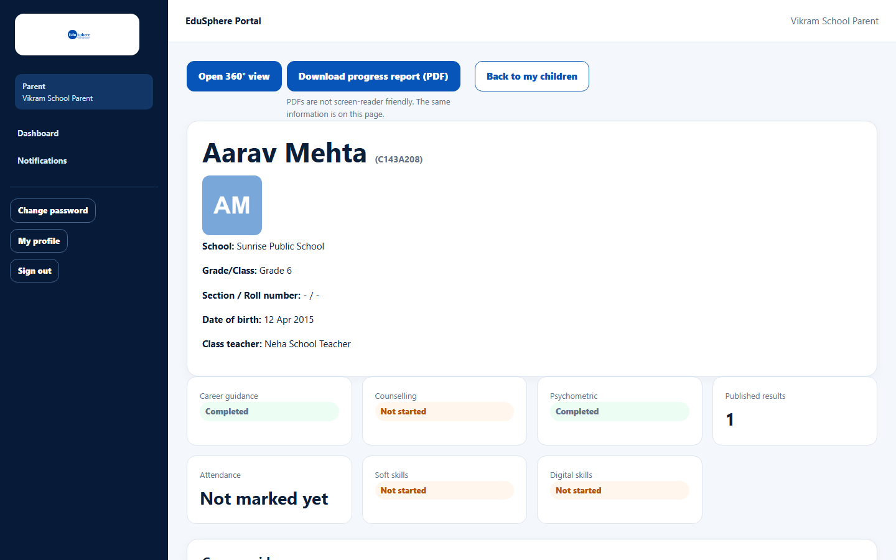
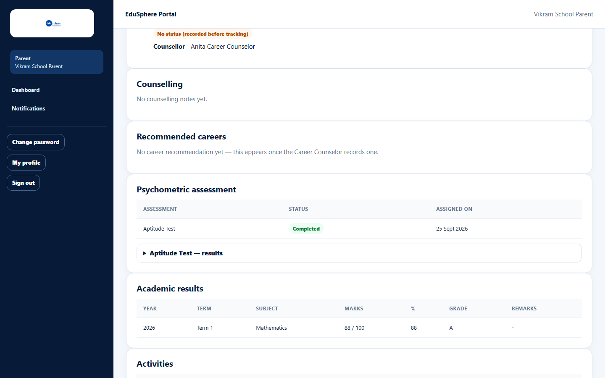
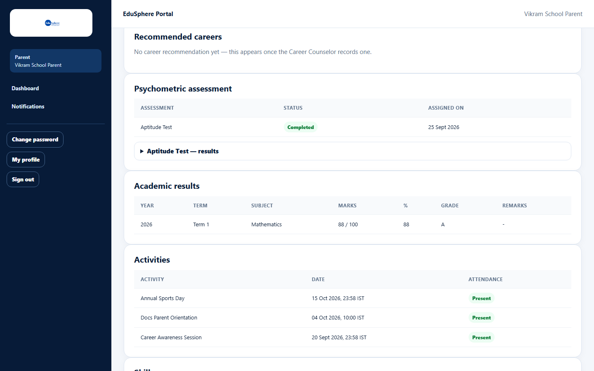
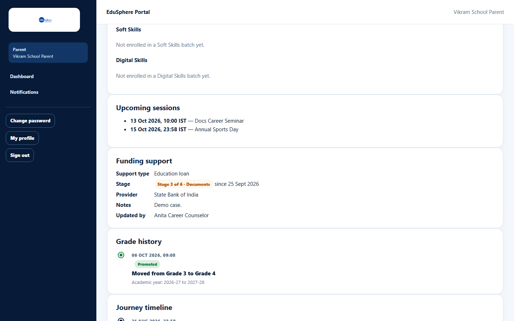
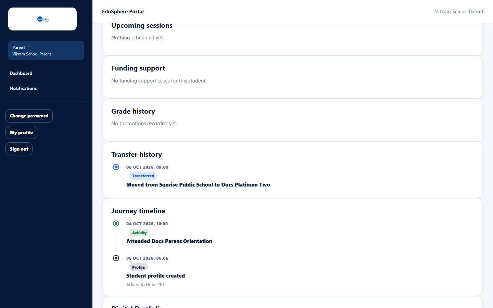
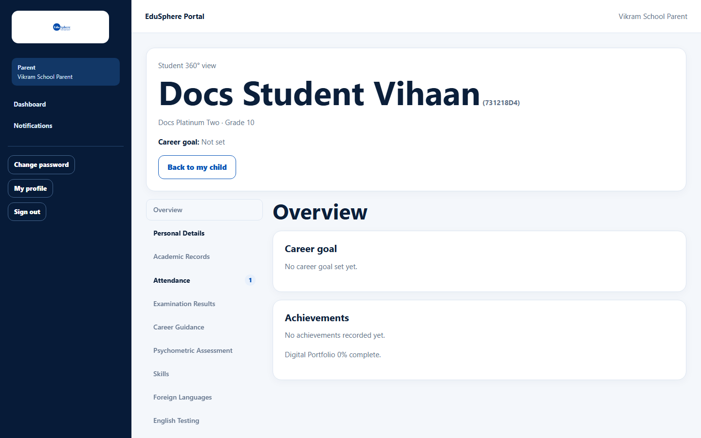

# Your child's profile and progress

> Doc ID: DOC-SCH-PAR-001 · Verified on 2026-10-06 against `main` @ `ce1f07c2` · Role: Parent

## Purpose
See everything the school and EduSphere have recorded for your child: guidance, assessments, results, activities,
skills, funding support, grade and school moves, and the journey timeline.

## Who Can Use This Feature
**Parent**, for children linked to their account.

## Prerequisites
The school has linked you to the child.

## How to Access
Dashboard > the child's card > **View full profile & progress**.

## Steps

### Step 1 — Read the header and status tiles
At the top: **Open 360° view**, **Download progress report (PDF)** and **Back to my children**. Then the child's
photo (or initials), **School**, **Grade/Class**, **Section / Roll number**, **Date of birth** and **Class teacher**,
and the same status tiles as on the dashboard.

### Step 2 — Guidance and assessments
**Career guidance** and **Counselling** show the Career Counselor's records. **Recommended careers** appears once a
recommendation is recorded. **Psychometric assessment** lists each assessment (Assessment, Status, Assigned on); open
"{Assessment} — results" to see the findings.

### Step 3 — Results and activities
**Academic results** lists published results only (Year, Term, Subject, Marks, %, Grade, Remarks). **Activities** lists
the school activities your child attended (Activity, Date, Attendance).

### Step 4 — Skills, sessions and funding
**Skills** shows Soft Skills and Digital Skills batches. **Upcoming sessions** lists the school's upcoming activities.
**Funding support** shows each funding case: Support type, Stage ("Stage 3 of 6 · Documents" and since when),
Provider, Notes and Updated by.

### Step 5 — History
**Grade history** lists promotions ("Moved from Grade 3 to Grade 4", with the academic years). **Transfer history**
appears only if your child changed school ("Moved from {A} to {B}"). **Journey timeline** lists every recorded event,
and **Digital Portfolio** is at the bottom.

### Step 6 — Open the 360° view
Click **Open 360° view** to see the same information in 16 tabs. **Back to my child** returns here.

## Fields
Read only. See the steps.

## Expected Result
You see your child's complete progress. After a transfer you keep access (seen for a child who moved to another
school).

## Validation Messages
None.

## Common Errors
**Problem:** "Access unavailable — This student is not linked to your account" *(from code)*.
**Cause:** You opened a link to a child you are not linked to.
**Resolution:** Use **Back to my children**. Ask the school to link you if this is your child.

## Tips
- A result appears only once the school has published it.
- The **Attendance** tile is daily class attendance; the **Activities** table is activity attendance. A child can be
  "Present" at activities and still show "Not marked yet" on the tile.
- IELTS/SAT preparation, foreign-language classes and the overseas pathway are not on this page; open the **360° view**
  to see them *(from code)*.
- PDFs are not screen-reader friendly; the same information is on this page.

## Related Features
- [Parent dashboard](../dashboards/dash-004-parent-dashboard.md)
- [Student 360° view](../student-360/s360-001-student-360-view.md)
- [Download a student's progress report](../students/stu-008-progress-report-pdf.md)
