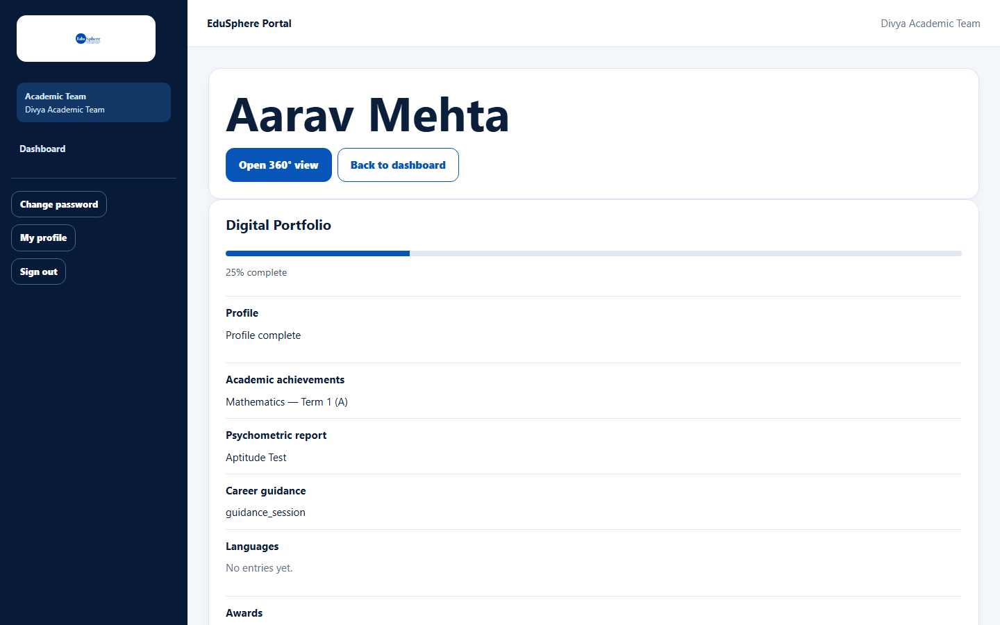
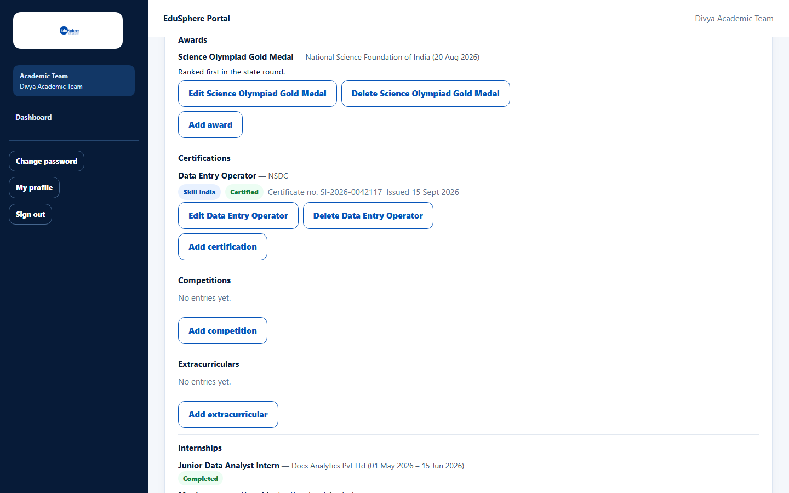

# Digital Portfolio overview

> Doc ID: DOC-SCH-PORT-001 · Verified on 2026-10-06 against `main` @ `ce1f07c2` · Roles: all school roles (read); School Coordinator, assigned Teacher, Academic Team (edit)

## Purpose
The Digital Portfolio collects a student's achievements — results, assessments, certifications, internships, projects,
awards and a personal statement — in one place, and shows how complete it is.

## Who Can Use This Feature
| Role | Can see | Can edit |
|---|---|---|
| School Coordinator | ✔ | ✔ |
| Teacher (students assigned to them) | ✔ | ✔ |
| Academic Team | ✔ | ✔ |
| Principal, Parent, Career Counselor, Psychometric Team | ✔ | — |

## Prerequisites
Adding entries needs a **Gold** or **Platinum** partnership; internships need **Platinum**.

## How to Access
- **School Coordinator / Principal / Teacher:** the student's profile page > **Digital Portfolio**.
- **Academic Team:** Dashboard > **Students** > the student's name.
- **Parent:** the child's page > **Digital Portfolio** *(verified in S10)*.

## Steps

### Step 1 — Read the completion bar
The card shows "{N}% complete". Completion counts: a complete profile (date of birth and grade), a published result, a
psychometric assessment, a career record, a language, at least one entry in each of the ten sections, and a personal
statement *(the weighting is from code)*.

### Step 2 — Read the automatic sections
These fill themselves from other work and cannot be edited here: **Profile**, **Academic achievements** (published
results), **Psychometric report**, **Career guidance** and **Languages**.

### Step 3 — Read the entry sections
Awards, Certifications, Competitions, Extracurriculars, Internships, Leadership, Projects, Skills, Sports and
Volunteering, followed by the **Personal statement**. Each shows "No entries yet." until something is added.

## Fields
See [Add, edit or delete portfolio entries](port-002-portfolio-entries.md).

## Expected Result
You can see what the student has achieved and what is still missing.

## Validation Messages
None.

## Common Errors
**Problem:** "Portfolio is unavailable right now." *(From code.)*
**Cause:** A temporary loading problem.
**Resolution:** Reload the page.

## Tips
- The **Career guidance** list shows the record type as a code, for example `guidance_session`.
- The same achievements appear in the student's **360° view** (Certificates, Activities and Overview tabs).

## Related Features
- [Add, edit or delete portfolio entries](port-002-portfolio-entries.md)
- [Record a Skill India certification](port-003-skill-india-certification.md)
- [Internship tracking and certificates](port-004-internships-and-certificates.md)
- [Write the personal statement](port-005-personal-statement.md)
