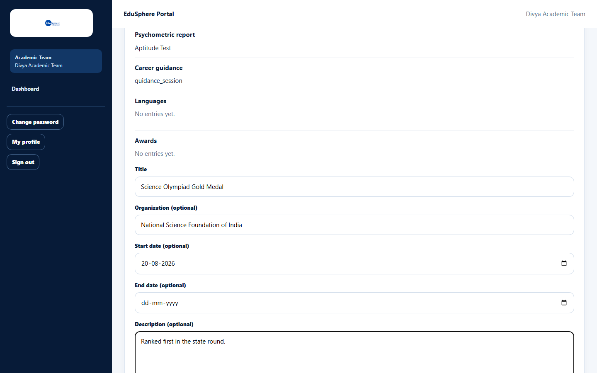
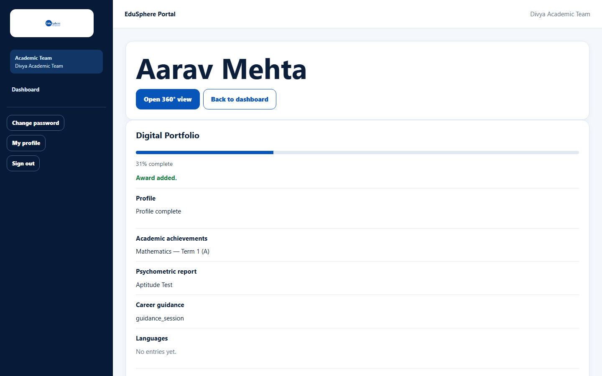
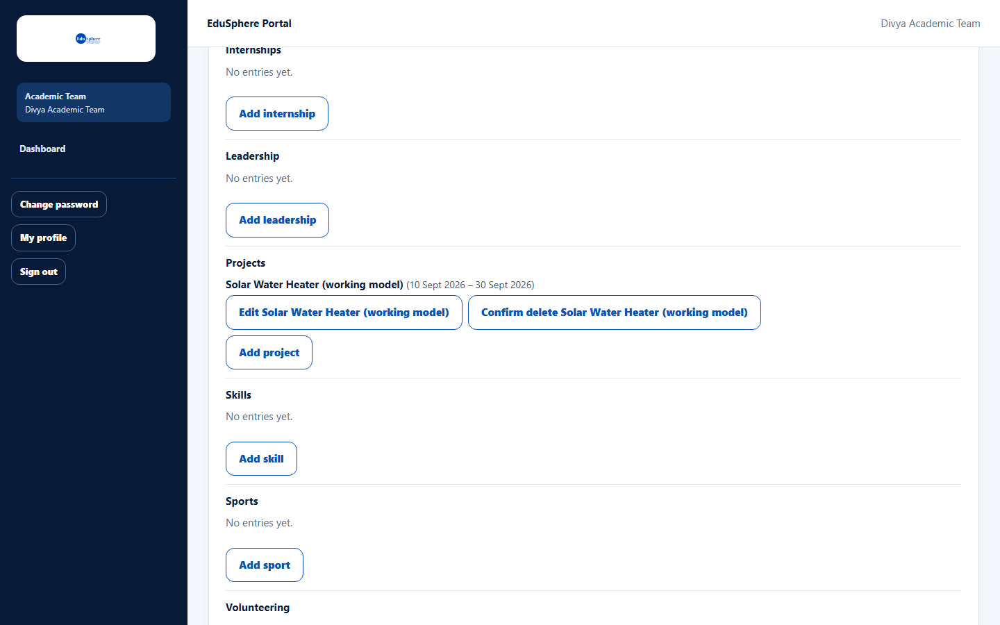
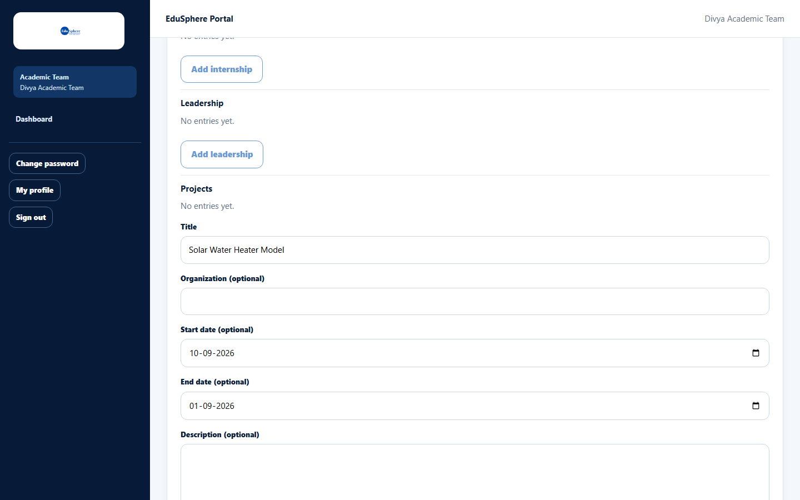
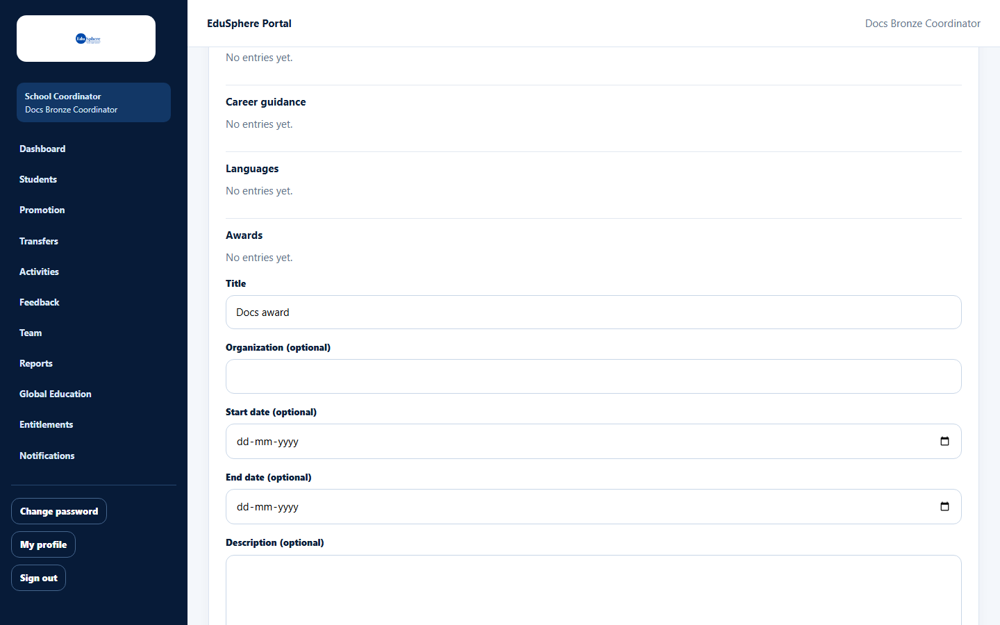
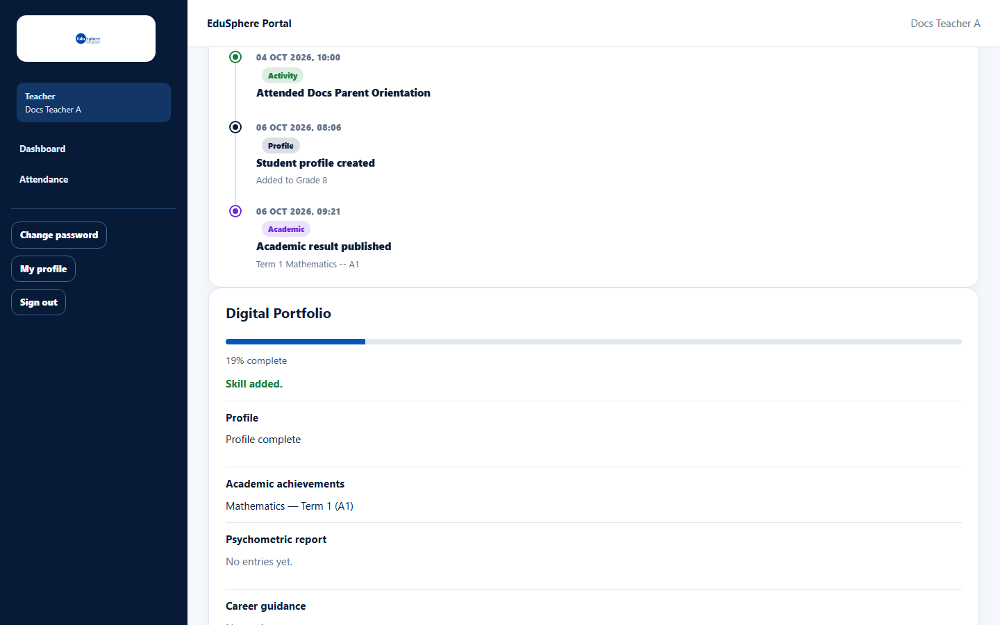

# Add, edit or delete portfolio entries

> Doc ID: DOC-SCH-PORT-002 · Verified on 2026-10-06 against `main` @ `ce1f07c2` · Roles: School Coordinator, Teacher (assigned students), Academic Team

## Purpose
Record a student's achievements — awards, projects, competitions, sports, leadership, volunteering, extracurriculars,
skills and certifications — in their Digital Portfolio.

## Who Can Use This Feature
**School Coordinator**, **Teacher** (only students assigned to them) and **Academic Team** (students in their school
portfolio).

## Prerequisites
The student's school has a **Gold** or **Platinum** partnership (Digital portfolio creation).

## How to Access
The student's page > **Digital Portfolio** > the section (for example **Awards**).

## Steps

### Step 1 — Add an entry
Click **Add {entry}** under the section (for example **Add award**). Fill in **Title** and, if you want, **Organization
(optional)**, **Start date (optional)**, **End date (optional)** and **Description (optional)**.

### Step 2 — Save
Click **Save**. The message "{Section} added." (for example "Award added.") appears and the entry is listed with its
organisation and date.

### Step 3 — Edit (optional)
Click **Edit {title}**, change the details and click **Save**. The message "{Section} updated." appears.

### Step 4 — Delete (optional)
Click **Delete {title}**; the button changes to **Confirm delete {title}**. Click it to delete. The message "{Section}
deleted." appears.

## Fields
| Field | Description | Required | Example |
|---|---|---|---|
| Title | Name of the achievement (up to 200 characters). | Yes | Science Olympiad Gold Medal |
| Organization (optional) | Who awarded or ran it. | No | National Science Foundation |
| Start date / End date (optional) | When it happened. | No | 20-08-2026 |
| Description (optional) | Up to 2000 characters. | No | Ranked first in the state round. |

## Expected Result
The entry appears in the portfolio for everyone who can see the student, and the completion percentage may rise.

## Validation Messages
| Message | When |
|---|---|
| End date must not be before start date | The end date is earlier than the start date. |
| This school's Bronze partnership does not include Digital portfolio creation (requires Gold or higher). | The student's school tier is below Gold. |

## Common Errors
**Problem:** The tier message above.
**Cause:** The school's partnership does not include Digital portfolio creation.
**Resolution:** The School Coordinator can ask the Overseas Admin about the partnership.

## Tips
- Only one entry form can be open at a time; save or cancel before starting another.
- Teachers can edit the portfolio only of students assigned to them (a Teacher adding a skill sees "Skill added.").

## Related Features
- [Digital Portfolio overview](port-001-digital-portfolio-overview.md)
- [Record a Skill India certification](port-003-skill-india-certification.md)
- [Internship tracking and certificates](port-004-internships-and-certificates.md)
