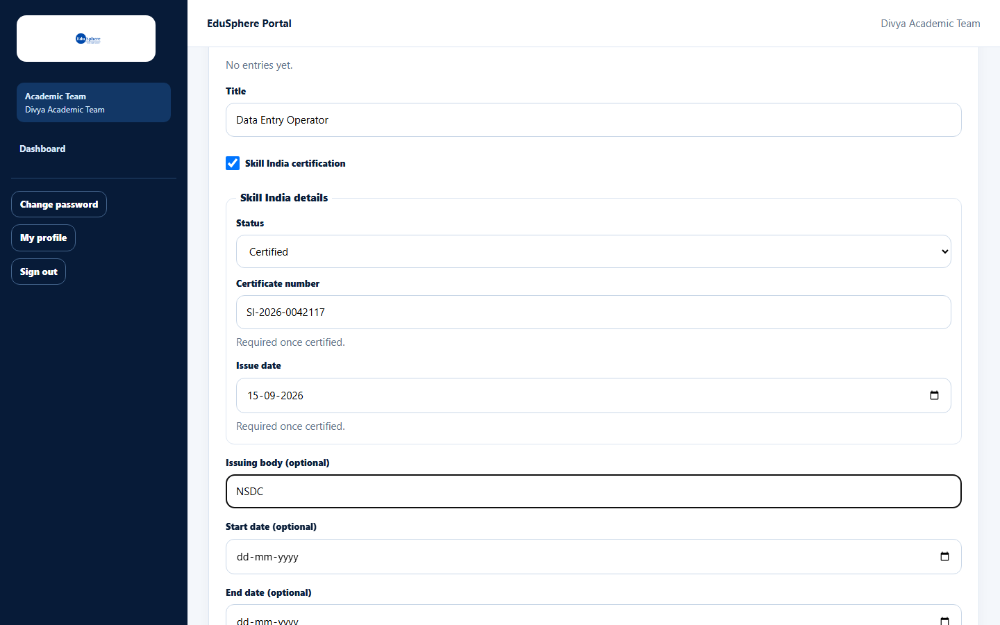
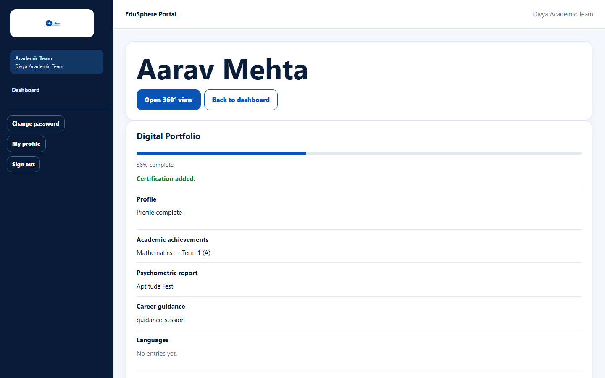
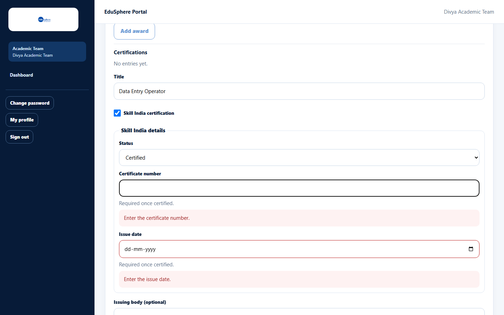

# Record a Skill India certification

> Doc ID: DOC-SCH-PORT-003 · Verified on 2026-10-06 against `main` @ `ce1f07c2` · Roles: School Coordinator, Teacher (assigned students), Academic Team

## Purpose
Record a government Skill India certification with its status, certificate number and issue date, so it shows as a Skill
India badge in the portfolio and 360° view.

## Who Can Use This Feature
**School Coordinator**, **Teacher** (assigned students), **Academic Team**.

## Prerequisites
The student's school has a **Gold** or **Platinum** partnership.

## How to Access
The student's page > **Digital Portfolio** > **Certifications** > **Add certification**.

## Steps

### Step 1 — Mark it as Skill India
Type the **Title** and tick **Skill India certification**. A **Skill India details** box appears.

### Step 2 — Fill in the details
Choose the **Status** (Enrolled, In progress or Certified). When the status is **Certified**, the **Certificate number**
and **Issue date** are required. **Issuing body (optional)** can name the awarding body.

### Step 3 — Save
Click **Save**. The message "Certification added." appears.

## Fields
| Field | Description | Required | Example |
|---|---|---|---|
| Title | Name of the certification. | Yes | Data Entry Operator |
| Skill India certification | Tick for Skill India. Can only be set when adding. | No | ✓ |
| Status | Enrolled, In progress or Certified. | Yes (when ticked) | Certified |
| Certificate number | Up to 100 characters. | When Certified | SI-2026-0042117 |
| Issue date | Date of the certificate. | When Certified | 15-09-2026 |
| Issuing body (optional) | Who issued it. | No | NSDC |

## Expected Result
The certification appears in **Certifications** with its Skill India details, and in the 360° view **Certificates** tab.

## Validation Messages
| Message | When |
|---|---|
| Enter the certificate number. | Status is Certified and the number is empty. |
| Enter the issue date. | Status is Certified and the date is empty. |
| Choose a status. | Skill India is ticked but no status chosen. *(From code.)* |

## Common Errors
**Problem:** You cannot tick or untick **Skill India certification** when editing.
**Cause:** The Skill India mark is fixed once the entry is created.
**Resolution:** Delete the entry and add it again.

## Tips
- Skill India certifications have no file upload; record the certificate number instead. Certificate files can be
  uploaded only for completed internships.

## Related Features
- [Add, edit or delete portfolio entries](port-002-portfolio-entries.md)
- [Internship tracking and certificates](port-004-internships-and-certificates.md)
