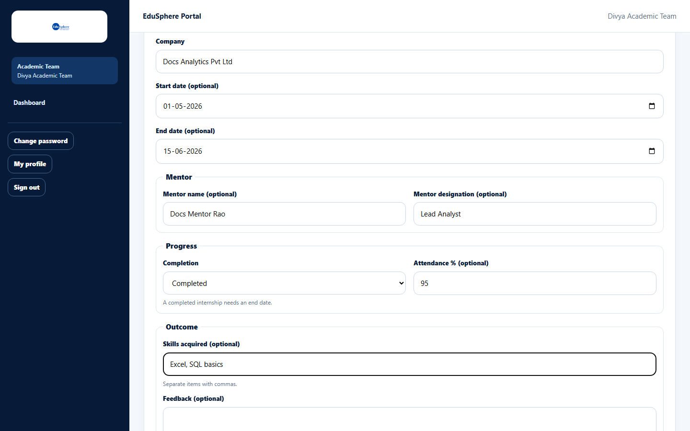
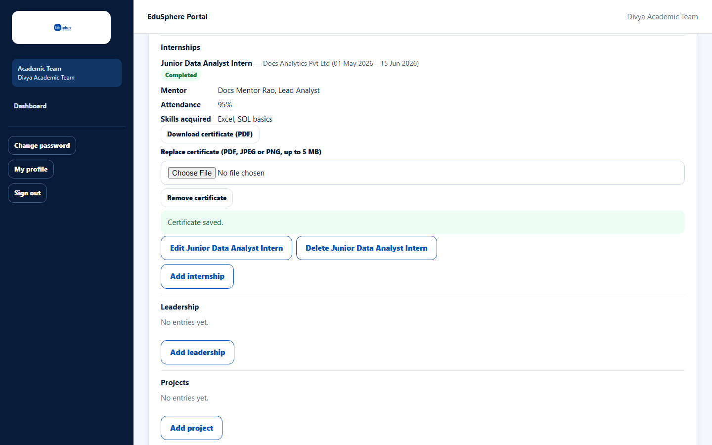
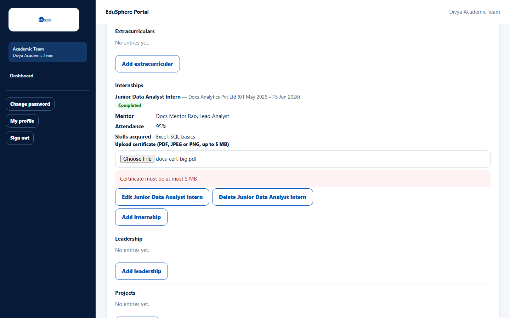
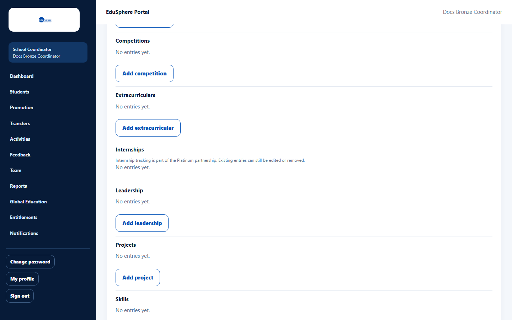

# Internship tracking and certificates

> Doc ID: DOC-SCH-PORT-004 · Verified on 2026-10-06 against `main` @ `ce1f07c2` · Roles: School Coordinator, Teacher (assigned students), Academic Team

## Purpose
Record a student's internship with mentor, completion, attendance and skills, and attach the internship certificate.

## Who Can Use This Feature
**School Coordinator**, **Teacher** (assigned students), **Academic Team**.

## Prerequisites
The student's school has a **Platinum** partnership (Internships).

## How to Access
The student's page > **Digital Portfolio** > **Internships** > **Add internship**.

## Steps

### Step 1 — Add the internship
Fill in **Role** (the title), **Company**, dates and the tracking fields: **Mentor name (optional)**, **Mentor designation
(optional)**, **Completion**, **Attendance % (optional)**, **Skills acquired (optional)** and **Feedback (optional)**.
Click **Save**; "Internship added." appears.

### Step 2 — Upload the certificate
When **Completion** is **Completed** (with an end date), the entry offers **Upload certificate (PDF, JPEG or PNG, up to
5 MB)**. Choose the file; the message "Certificate saved." appears, with **Download certificate**, **Replace
certificate** and **Remove certificate**.

### Step 3 — Remove the certificate (optional)
Click **Remove certificate**, then **Confirm remove** *(from code)*.

## Fields
| Field | Description | Required | Example |
|---|---|---|---|
| Role | The intern's role. | Yes | Junior Data Analyst Intern |
| Company | The organisation. | Yes | Docs Analytics Pvt Ltd |
| Start date / End date | Dates of the internship; an end date is needed for Completed. | No / When Completed | 01-05-2026 / 15-06-2026 |
| Mentor name, Mentor designation | Supervisor. | No | Mr Rao, Lead Analyst |
| Completion | No status, Not started, In progress, Completed, Discontinued. | No | Completed |
| Attendance % | Whole number 0–100. | No | 95 |
| Skills acquired | Comma-separated. | No | Excel, SQL basics |
| Feedback | Up to 2000 characters. | No | — |

## Expected Result
The internship is listed with a **Completed** badge, mentor, attendance and skills, and the certificate can be downloaded.

## Validation Messages
| Message | When |
|---|---|
| Certificate must be at most 5 MB | The file is too large. |
| Certificate must be a PDF, JPEG or PNG file | Another file type. *(From code.)* |
| An internship marked completed needs an end date | Completion is Completed without an end date (the hint "A completed internship needs an end date." is always shown under **Completion**). *(From code.)* |
| Enter the company. | Company is empty. *(From code.)* |
| Attendance must be a whole number from 0 to 100. | Invalid attendance. *(From code.)* |

## Common Errors
**Problem:** "Internship tracking is part of the Platinum partnership. Existing entries can still be edited or removed."
and no **Add internship** button.
**Cause:** The school's tier is below Platinum.
**Resolution:** Ask your Overseas Admin about upgrading the partnership.

## Tips
- Location and camera details inside image certificates are removed when they are uploaded *(from code)*.

## Related Features
- [Add, edit or delete portfolio entries](port-002-portfolio-entries.md)
