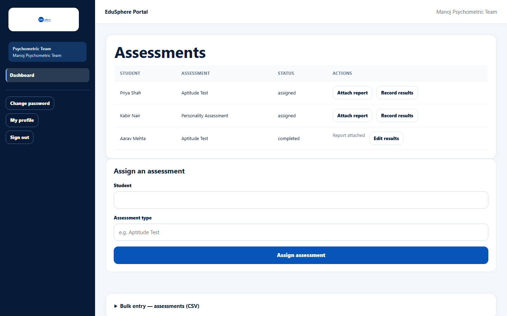
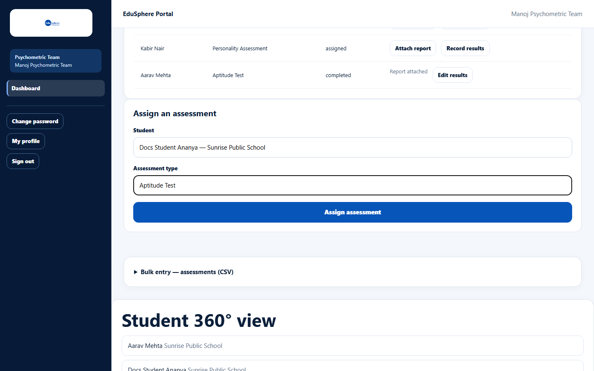
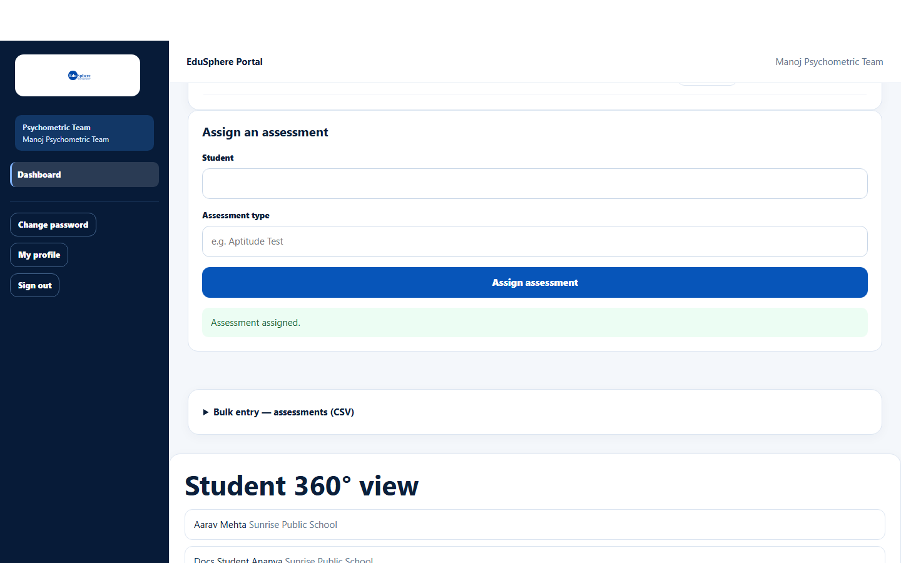

# Assign a psychometric assessment

> Doc ID: DOC-SCH-PSY-001 · Verified on 2026-10-06 against `main` @ `ce1f07c2` · Roles: Psychometric Team

## Purpose
Record that a student has been given a psychometric assessment (for example an aptitude test), so the school and parents
know it is under way.

## Who Can Use This Feature
**Psychometric Team.**

## Prerequisites
The student is at a school in your school portfolio; the school's tier includes Psychometric test (Bronze or higher).

## How to Access
Sidebar > **Dashboard** > **Assign an assessment**.

## Steps

### Step 1 — Open your dashboard
The Psychometric Team dashboard has **Assessments** (all assessments in your portfolio, newest first), **Assign an
assessment**, **Bulk entry — assessments (CSV)** and a **Student 360° view** list.

### Step 2 — Assign
Pick the **Student**, type the **Assessment type**, and click **Assign assessment**. The message "Assessment assigned."
appears and the assessment is listed with status `assigned`.

## Fields
| Field | Description | Required | Example |
|---|---|---|---|
| Student | Pick from your portfolio. | Yes | Docs Student Ananya |
| Assessment type | Name of the test. | Yes | Aptitude Test |

## Expected Result
The parent is notified "Psychometric assessment assigned to {name}" *(from code; the documentation parent did not receive one, so it was not seen)*. The assessment appears in the student's 360° view.

## Validation Messages
| Message | When |
|---|---|
| Your browser asks you to choose a student / fill in the field | A field is empty. |

## Common Errors
**Problem:** "No students in your portfolio yet. Contact your Overseas Admin." *(From code.)*
**Cause:** No school is assigned to you.
**Resolution:** Ask your Overseas Admin.

## Tips
- To assign many assessments at once, use [Bulk entry: assessments](psy-004-bulk-assessments.md).
- The status changes to `completed` when you attach the report.

## Related Features
- [Attach an assessment report](psy-002-attach-a-report.md)
- [Record or edit assessment results](psy-003-record-results.md)
