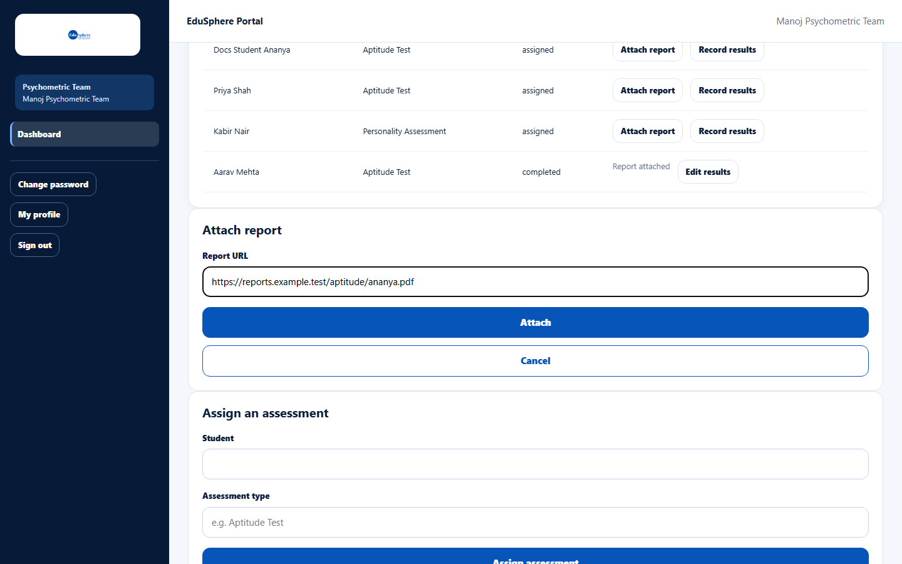

# Attach an assessment report

> Doc ID: DOC-SCH-PSY-002 · Verified on 2026-10-06 against `main` @ `ce1f07c2` · Roles: Psychometric Team

## Purpose
Link the finished assessment report to the student's record. Attaching the report marks the assessment completed.

## Who Can Use This Feature
**Psychometric Team.**

## Prerequisites
An assessment with status `assigned`, and the report stored somewhere it can be opened by web address.

## How to Access
Sidebar > **Dashboard** > **Assessments** > **Attach report** on the row.

## Steps

### Step 1 — Enter the report address
Click **Attach report**. In **Report URL**, enter the web address of the report.

### Step 2 — Attach
Click **Attach**. The message "Report attached." appears, the status becomes `completed` and the row shows "Report
attached".

## Fields
| Field | Description | Required | Example |
|---|---|---|---|
| Report URL | The report's web address (https://…). | Yes | https://reports.example/aptitude/ananya.pdf |

## Expected Result
The report link appears in the student's 360° view (Documents tab). The parent is notified "Psychometric report ready for
{name}" *(from code)*.

## Validation Messages
None seen on this form.

## Common Errors
**Problem:** You attached the wrong address.
**Cause:** The report address cannot be changed after attaching.
**Resolution:** Contact EduSphere support.

## Tips
- This is a link, not a file upload. Use an address that starts with `https://` — only those (or addresses on the
  EduSphere site) become clickable in the 360° view *(from code)*.

## Related Features
- [Record or edit assessment results](psy-003-record-results.md)
