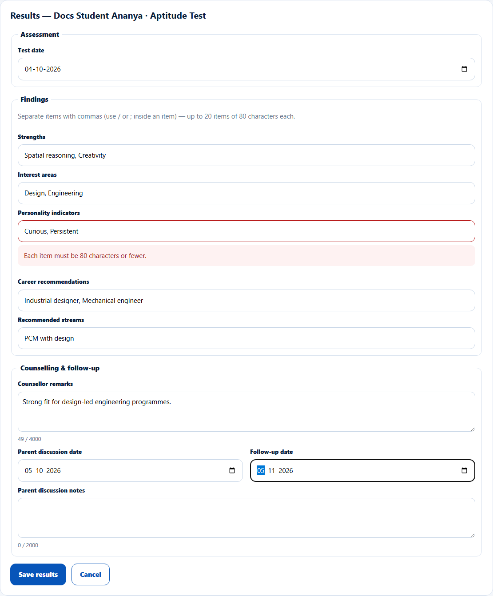
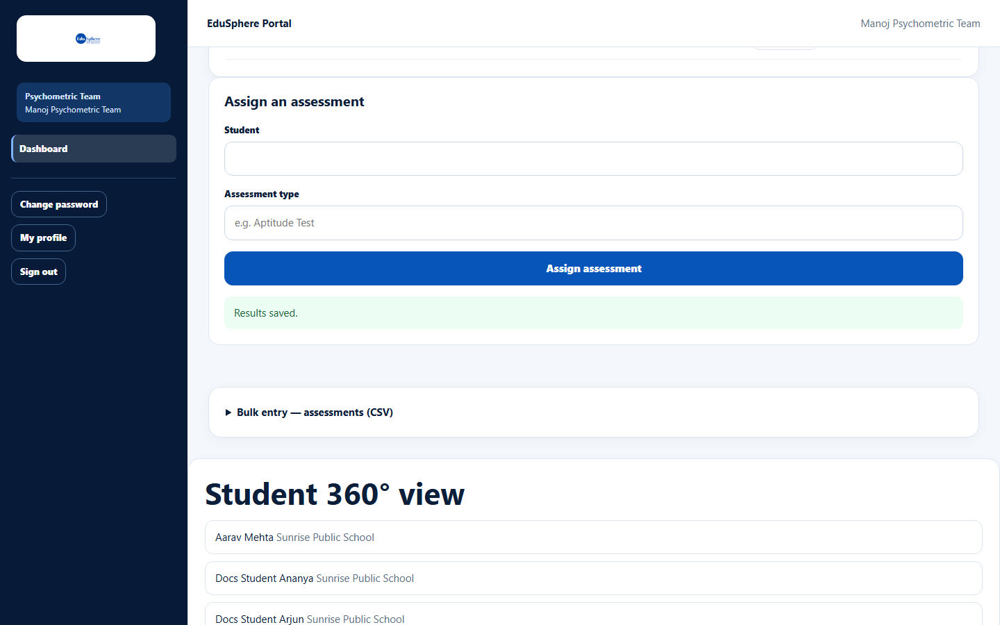
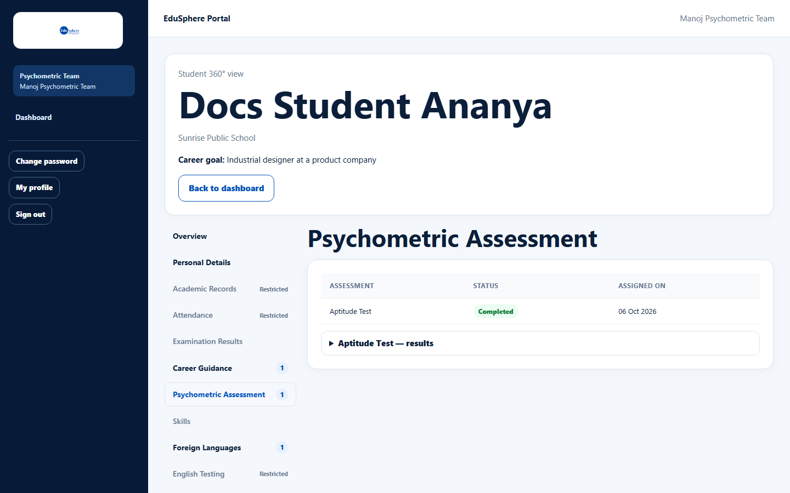
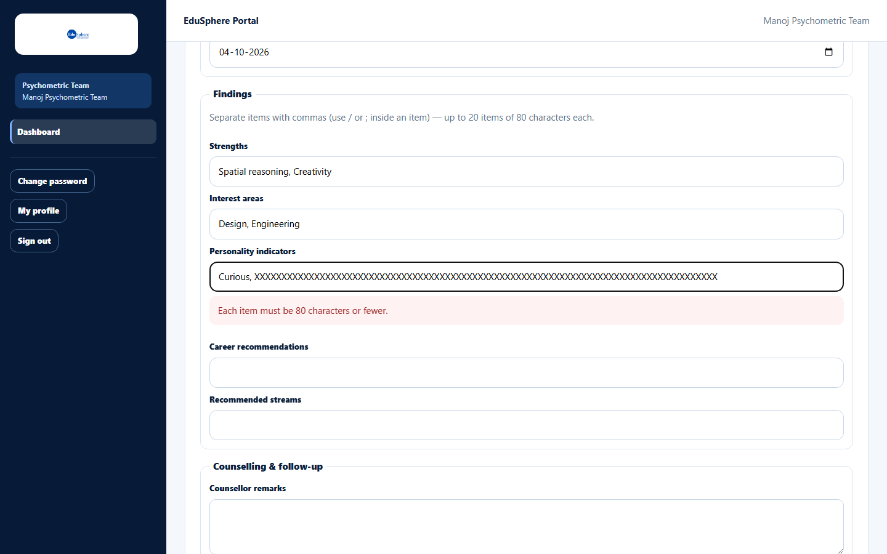

# Record or edit assessment results

> Doc ID: DOC-SCH-PSY-003 · Verified on 2026-10-06 against `main` @ `ce1f07c2` · Roles: Psychometric Team

## Purpose
Record what the assessment found — strengths, interests, personality, recommended careers and streams — and the
follow-up with the family.

## Who Can Use This Feature
**Psychometric Team.**

## Prerequisites
An assessment in **Assessments**.

## How to Access
Sidebar > **Dashboard** > **Assessments** > **Record results** (or **Edit results**) on the row.

## Steps

### Step 1 — Fill in the results
**Results — {student} · {assessment}** opens. Fill in the **Test date**, the **Findings** lists (separate items with
commas), **Counsellor remarks**, **Parent discussion date**, **Follow-up date** and **Parent discussion notes**.

### Step 2 — Save
Click **Save results**. The message "Results saved." appears and the button on the row becomes **Edit results**.

## Fields
| Field | Description | Required | Example |
|---|---|---|---|
| Test date | When the test was taken. | No | 04-10-2026 |
| Strengths, Interest areas, Personality indicators, Career recommendations, Recommended streams | Comma-separated lists: up to 20 items of 80 characters each. | No | Spatial reasoning, Creativity |
| Counsellor remarks | Up to 4000 characters. | No | Strong fit for design-led engineering. |
| Parent discussion date / Follow-up date | Dates. | No | 05-10-2026 / 05-11-2026 |
| Parent discussion notes | Up to 2000 characters. | No | — |

## Expected Result
The results appear in the student's 360° view (Psychometric Assessment tab).

## Validation Messages
| Message | When |
|---|---|
| Each item must be 80 characters or fewer. | A list item is too long. |
| Up to 20 items. | More than 20 items. *(From code.)* |
| Enter a complete date, or clear the field. | Incomplete date. *(From code.)* |
| No changes to save. | Nothing was changed. *(From code.)* |

## Common Errors
**Problem:** "Your session has ended. Sign in again in a new tab, then press Save here — your entry is kept." *(From code.)*
**Cause:** Your sign-in ended while typing.
**Resolution:** Sign in again in a new tab, then click **Save results** here.

## Tips
- Use / or ; inside an item if it needs a comma.
- Saving results does not notify the parent *(from code)*.

## Related Features
- [Attach an assessment report](psy-002-attach-a-report.md)
- [Bulk entry: assessments](psy-004-bulk-assessments.md)
