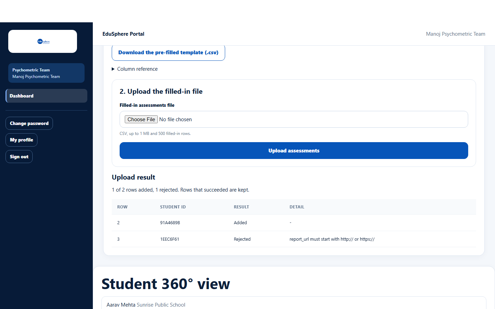

# Bulk entry: assessments (CSV)

> Doc ID: DOC-SCH-PSY-004 · Verified on 2026-10-06 against `main` @ `ce1f07c2` · Roles: Psychometric Team

## Purpose
Assign assessments (and optionally record their results) for many students at once from a spreadsheet.

## Who Can Use This Feature
**Psychometric Team.**

## Prerequisites
At least one school in your school portfolio. Each student's school needs an active partnership (Psychometric test is
in every tier from Bronze); rows for other schools are rejected with the partnership message.

## How to Access
Sidebar > **Dashboard** > **Bulk entry — assessments (CSV)**.

## Steps

### Step 1 — Download the pre-filled template
Open the panel and click **Download the pre-filled template (.csv)** (one row per student in your portfolio).

### Step 2 — Fill in and upload
Fill in the rows you need, choose the file in **Filled-in assessments file** and click **Upload assessments**. The
**Upload result** shows each row as Added or Rejected with the reason.

## Fields
| Column | Required | Format |
|---|---|---|
| student_code | Yes (pre-filled) | 8-character Student ID |
| assessment_type | Yes | Up to 120 characters |
| report_url | No | Must start with http:// or https://; filling it marks the assessment completed |
| test_date, parent_discussion_on, follow_up_on | No | YYYY-MM-DD |
| strengths, interest_areas, personality_indicators, recommended_careers, recommended_stream | No | Items separated by `;` (up to 20) |
| counsellor_remarks / parent_discussion_notes | No | Up to 4000 / 2000 characters |

Limits: 1 MB and 500 filled-in rows. Row numbers count the header as row 1.

## Expected Result
Each added row is an assessment; parents are notified after the upload *(from code)*.

## Validation Messages
| Message | Meaning |
|---|---|
| report_url must start with http:// or https:// | The report address is not a web address. |

## Common Errors
See the results page: [Bulk entry: results](../academic-team/acad-004-bulk-results.md#common-errors).

## Tips
- In the CSV, separate list items with `;`, not commas.
- Rows that were added are kept even when other rows are rejected; fix the rejected rows and upload only those again.

## Related Features
- [Assign a psychometric assessment](psy-001-assign-an-assessment.md)
