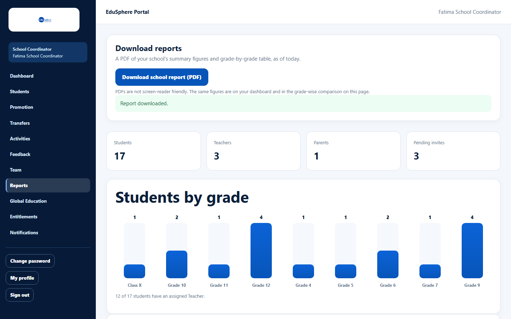
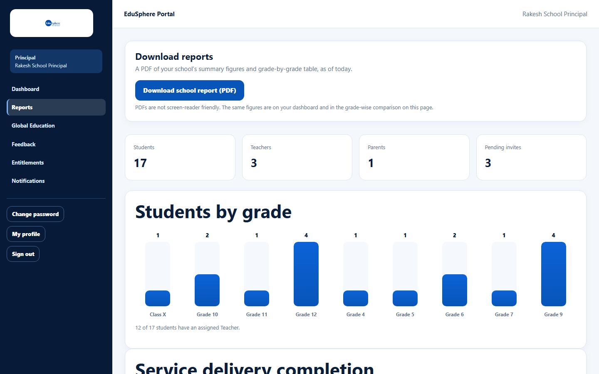

# Download the school report (PDF)

> Doc ID: DOC-SCH-RPT-001 · Verified on 2026-10-06 against `main` @ `ce1f07c2` · Roles: School Coordinator, Principal

## Purpose
Get a PDF of your school's summary figures and grade-by-grade table, as of today, to share or print.

## Who Can Use This Feature
**School Coordinator** and **Principal**.

## Prerequisites
None.

## How to Access
Sidebar > **Reports**. The School Coordinator can also use **Go to reports** on the dashboard.

## Steps

### Step 1 — Download
At the top of the Reports page, under **Download reports**, click **Download school report (PDF)**.

### Step 2 — Find the file
The browser saves `school-report.pdf` and the page shows "Report downloaded."

## Fields
None.

## Expected Result
`school-report.pdf` is in your downloads folder.

## Validation Messages
| Message | When |
|---|---|
| Report downloaded. | The file was saved. |

## Common Errors
**Problem:** The download fails. *(Not seen on the documentation server.)*
**Cause:** A network problem or an expired session.
**Resolution:** Sign in again and retry.

## Tips
- PDFs are not screen-reader friendly. The same figures are on your dashboard and in the grade-wise comparison on the
  Reports page.
- The figures are as of the moment you download. Download again for fresh numbers.
- The Principal's Reports page is the same as the Coordinator's.

## Related Features
- [School summary](rpt-002-school-summary.md)
- [Grade-wise comparison](rpt-003-grade-wise-comparison.md)
- [Download a student's progress report](../students/stu-008-progress-report-pdf.md)
