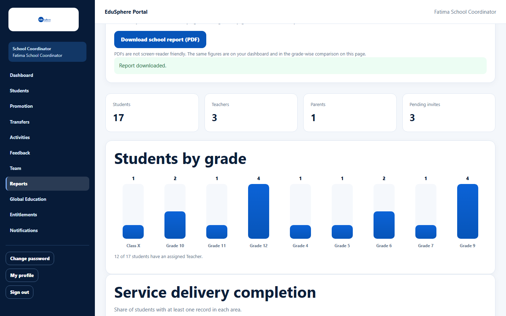
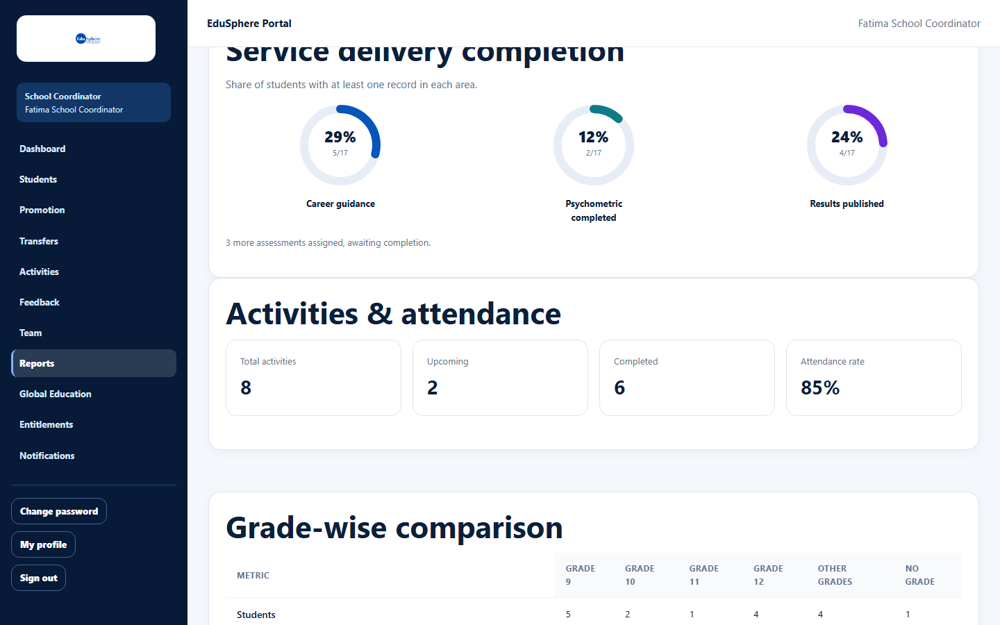

# School summary

> Doc ID: DOC-SCH-RPT-002 · Verified on 2026-10-06 against `main` @ `ce1f07c2` · Roles: School Coordinator, Principal

## Purpose
See the size of your school community, how students are spread across grades, how many students have received
EduSphere services, and how activities and attendance are going.

## Who Can Use This Feature
**School Coordinator** and **Principal** (read only).

## Prerequisites
None.

## How to Access
Sidebar > **Reports**. The summary is below **Download reports**.

## Steps

### Step 1 — Read the tiles and the grade chart
Four tiles show **Students**, **Teachers**, **Parents** and **Pending invites**. **Students by grade** is a bar chart with
one bar per Grade/Class value, followed by "{x} of {y} students have an assigned Teacher."

### Step 2 — Read service delivery, activities and attendance
**Service delivery completion** ("Share of students with at least one record in each area.") shows three rings: **Career
guidance**, **Psychometric completed** and **Results published**, each as a percentage and "n/total". A line below
counts assessments that are assigned but not completed yet.

**Activities & attendance** shows **Total activities**, **Upcoming**, **Completed** and **Attendance rate**.

## Fields
| Figure | What it counts |
|---|---|
| Pending invites | Team invitations not yet accepted. |
| Students by grade | Students per Grade/Class value, exactly as typed ("Unspecified" when blank *(from code)*). |
| Career guidance ring | Students with **any** career record (guidance, counselling or recommendation). |
| Psychometric completed ring | Students with a completed psychometric assessment. |
| Results published ring | Students with at least one published result. |
| Completed (activities) | Activities whose date has passed. |
| Attendance rate | Present ÷ marked, across all activity attendance ("-" when nothing is marked *(from code)*). |

## Expected Result
You see the figures as of now.

## Validation Messages
None.

## Common Errors
**Problem:** "No students on the roster yet." in place of the chart *(from code)*.
**Cause:** The school has no students.
**Resolution:** Add students (School Coordinator).

## Tips
- The chart groups by the text in **Grade/Class**, so "Class X" and "Grade 10" are separate bars. The dashboard grade
  tiles and the grade-wise comparison use the student's grade level instead, so their numbers can differ from the chart
  (on the documentation server: Grade 9 = 4 in the chart, 5 on the dashboard). Use the same wording for every student
  to keep them consistent.
- The **Career guidance** ring (any career record: 5/17 on the documentation server) is not the same as the dashboard's
  **Career Guidance Completed** (completed guidance sessions: 2).
- **Completed** activities means past activities, whether or not attendance was marked.

## Related Features
- [School Coordinator dashboard](../dashboards/dash-001-coordinator-dashboard.md)
- [Grade-wise comparison](rpt-003-grade-wise-comparison.md)
- [Mark activity attendance](../activities/act-002-mark-activity-attendance.md)
