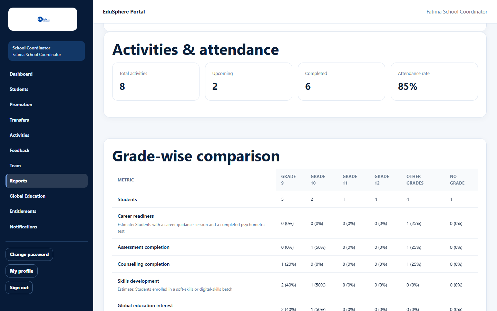
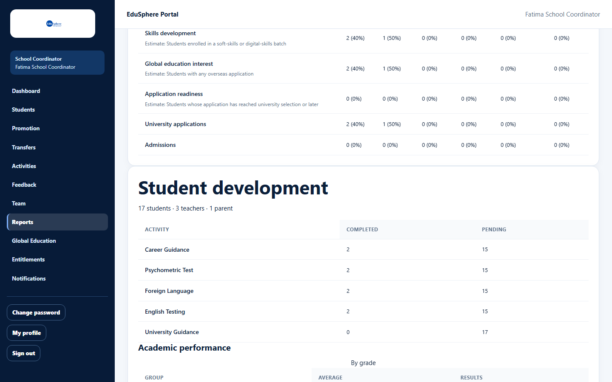

# Grade-wise comparison

> Doc ID: DOC-SCH-RPT-003 · Verified on 2026-10-06 against `main` @ `ce1f07c2` · Roles: School Coordinator, Principal

## Purpose
Compare grades 8 to 12 (and the rest of the school) on readiness, assessments, counselling, skills and overseas
applications.

## Who Can Use This Feature
**School Coordinator** and **Principal** (read only).

## Prerequisites
None.

## How to Access
Sidebar > **Reports** > section **Grade-wise comparison**.

## Steps

### Step 1 — Read the table
Each column is a grade group; each row is a metric. Cells show "count (percentage of the grade)". The first row,
**Students**, is the number of students in each group.

### Step 2 — Read the estimates
Rows marked with an "Estimate:" line are approximations; the line says how they are calculated.

## Fields
| Metric | Definition shown or used |
|---|---|
| Career readiness | Estimate: Students with a career guidance session and a completed psychometric test. |
| Assessment completion | Students with a completed psychometric assessment. |
| Counselling completion | Students with a completed counselling record. |
| Skills development | Estimate: Students enrolled in a soft-skills or digital-skills batch. |
| Global education interest | Estimate: Students with any overseas application. |
| Application readiness | Estimate: Students whose application has reached university selection or later. |
| University applications | Students with an overseas application that is not withdrawn or rejected. |
| Admissions | Students admitted to a university. |

| Column | Students included |
|---|---|
| Grade 8 … Grade 12 | Students at that grade level. A column appears only when the school has students in it (the documentation school had no Grade 8). |
| Other grades | Students at any other grade level (for example Grade 4–7). |
| No grade | Students whose grade could not be worked out from Grade/Class. |

*(Column grouping from code.)*

## Expected Result
You can see which grades are behind on each service.

## Validation Messages
None.

## Common Errors
None seen.

## Tips
- The same table is in the downloadable school report (see [Download the school report](rpt-001-school-report-pdf.md)).
- Percentages are of the students in that column, not of the whole school.

## Related Features
- [School summary](rpt-002-school-summary.md)
- [Student development, at-risk students and top performers](rpt-004-student-development.md)
