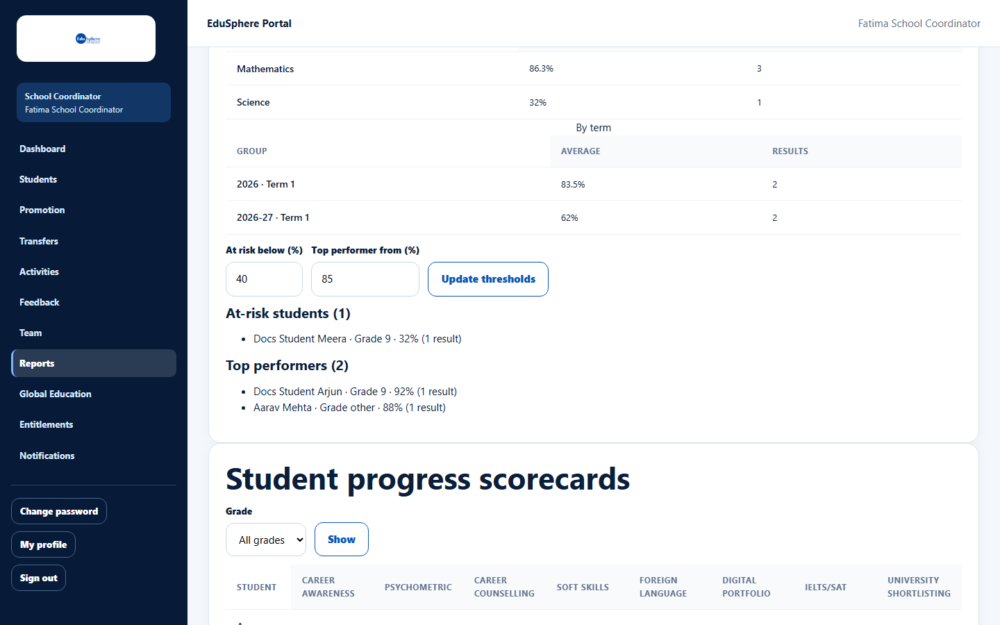
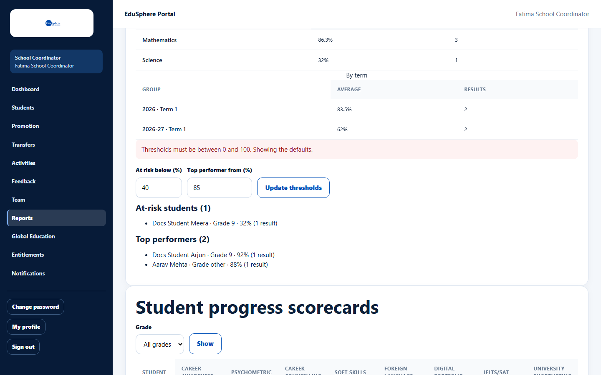

# Student development, at-risk students and top performers

> Doc ID: DOC-SCH-RPT-004 · Verified on 2026-10-06 against `main` @ `ce1f07c2` · Roles: School Coordinator, Principal

## Purpose
See how many students have completed each development activity, how published results compare by grade, subject and
term, and which students are at risk or performing at the top.

## Who Can Use This Feature
**School Coordinator** and **Principal**.

## Prerequisites
For **Academic performance** and the two lists, the Academic Team has published results.

## How to Access
Sidebar > **Reports** > section **Student development**.

## Steps

### Step 1 — Read the activity table
The heading line shows the number of students, teachers and parents. The table shows, for **Career Guidance**,
**Psychometric Test**, **Foreign Language**, **English Testing** and **University Guidance**, how many students have
**Completed** it and how many are **Pending**.

### Step 2 — Read academic performance
**Academic performance** shows the average percentage and number of results **By grade**, **By subject** and **By
term**. Only published results count.

### Step 3 — Set the thresholds
Enter **At risk below (%)** (default 40) and **Top performer from (%)** (default 85), then click **Update thresholds**.

### Step 4 — Read the lists
**At-risk students ({n})** and **Top performers ({n})** list each student as "Name · Grade · average% (number of
results)".

## Fields
| Field | Description | Required | Example |
|---|---|---|---|
| At risk below (%) | Students whose average is below this are listed as at risk. | Yes | 40 |
| Top performer from (%) | Students whose average is at or above this are top performers. | Yes | 85 |

## Expected Result
The lists update for the thresholds you entered. The thresholds are in the page address, so you can bookmark them.

## Validation Messages
| Message | When |
|---|---|
| Thresholds must be between 0 and 100. Showing the defaults. | A value is below 0 or above 100 (seen with 150). |
| At-risk must be below the top-performer threshold. Showing the defaults. | At-risk is not lower than top-performer *(from code)*. |

## Common Errors
**Problem:** **Academic performance** shows "No published results yet." and the lists show "No students below 40%." /
"No students at or above 85% yet." *(from code)*.
**Cause:** No results have been published.
**Resolution:** Ask the Academic Team to verify and publish results.

## Tips
- In the lists, "Grade other" means a grade outside 8–12 (for example a Grade 6 student); "Grade unspecified" means no
  grade could be worked out *(from code)*.
- Each list names at most 50 students ("Showing the first N." *(from code)*).
- The thresholds are not saved. They reset to 40 and 85 when you open Reports from the sidebar.

## Related Features
- [Verify and publish results](../academic-team/acad-003-verify-and-publish-results.md)
- [Student progress scorecards](rpt-005-student-scorecards.md)
