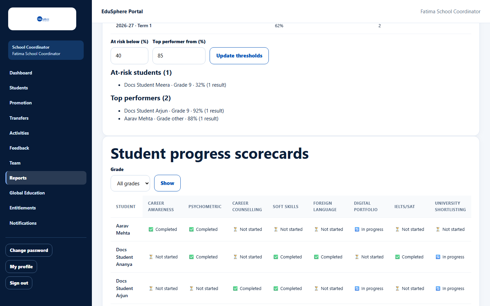
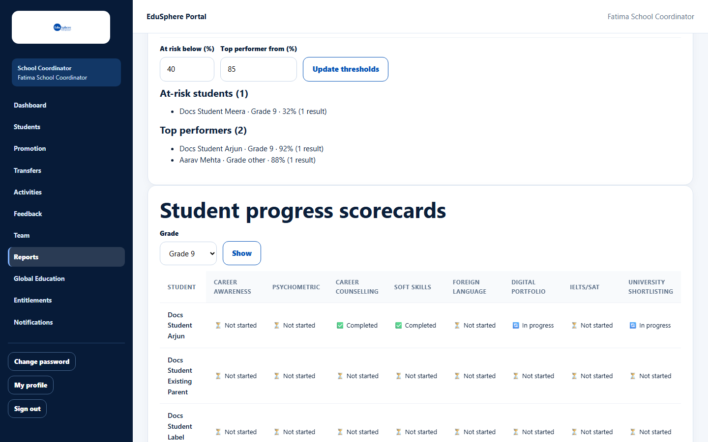

# Student progress scorecards

> Doc ID: DOC-SCH-RPT-005 · Verified on 2026-10-06 against `main` @ `ce1f07c2` · Roles: School Coordinator, Principal

## Purpose
See, for every student, which EduSphere programme areas are completed, in progress or not started.

## Who Can Use This Feature
**School Coordinator** and **Principal**.

## Prerequisites
None.

## How to Access
Sidebar > **Reports** > section **Student progress scorecards** (at the bottom).

## Steps

### Step 1 — Read the grid
One row per student, sorted by name. Each column is a programme area, with a status in each cell.

### Step 2 — Filter by grade
Choose a **Grade** (All grades, or Grade 8–12) and click **Show**.

### Step 3 — Page through
25 students are shown per page. Use **← Previous** and **Next →** under the grid *(from code; the documentation
school has fewer than 25 students)*.

### Step 4 — Open a student
Click a student's name to open their profile *(from code)*.

## Fields
**Areas (12):** Career Awareness, Psychometric, Career Counselling, Soft Skills, Foreign Language, Digital Portfolio,
IELTS/SAT, University Shortlisting, Scholarship, Application, Visa, Internship. The last four are to the right of the
screenshot; scroll the grid sideways *(column list from code)*.

| Status | Meaning |
|---|---|
| Completed | The area is done for the student. |
| In progress | Started but not finished. |
| Not started | Included in your partnership but nothing recorded yet. |
| Not in plan | Your partnership tier does not include this area. |
| Not tracked yet | EduSphere does not record this area yet (Scholarship). |

## Expected Result
The address changes to `…/reports?grade=9#scorecards` and the grid shows only that grade.

## Validation Messages
| Message | When |
|---|---|
| No students match this grade. | No student is in the chosen grade *(from code)*. |
| This page is past the end of the list. | You edited the page number in the address *(from code)*. |

## Common Errors
None seen.

## Tips
- The grade filter uses the grade level, like the dashboard tiles.
- "Not in plan" depends on your tier; see [Partnership tiers explained](../entitlements/ent-002-partnership-tiers-explained.md).

## Related Features
- [Student 360° view](../student-360/s360-001-student-360-view.md)
- [Student development](rpt-004-student-development.md)
