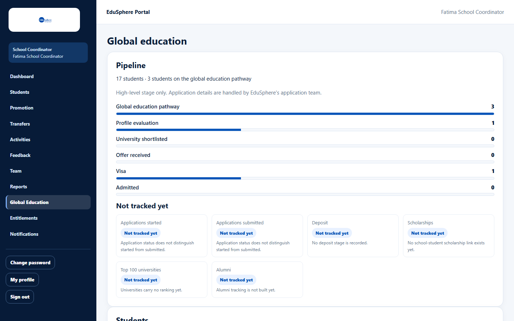
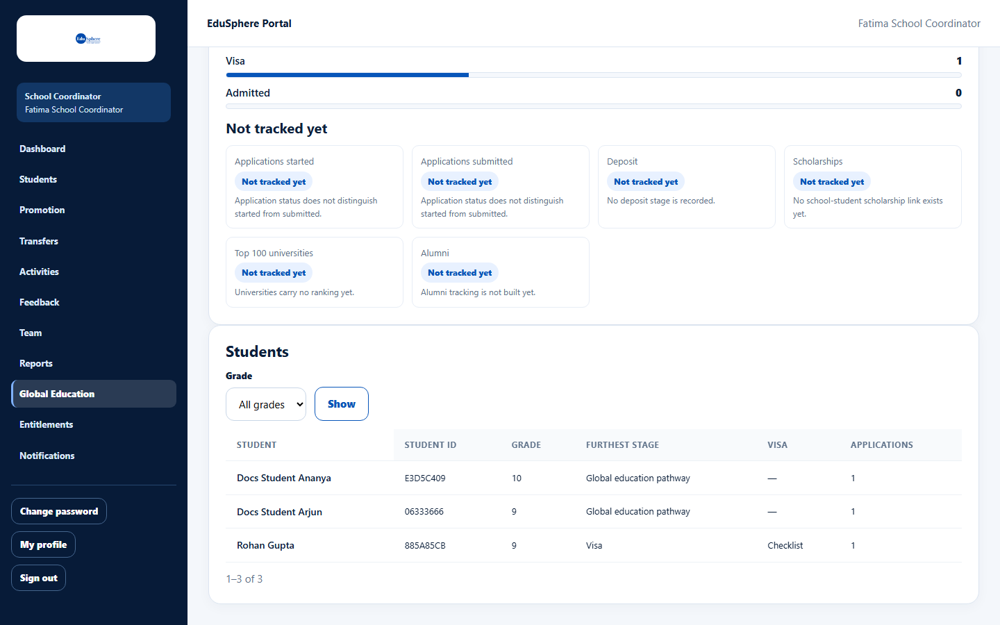
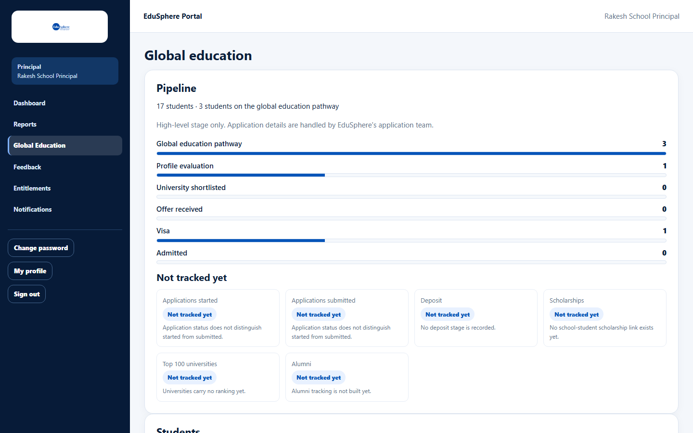

# Global education pipeline

> Doc ID: DOC-SCH-RPT-006 · Verified on 2026-10-06 against `main` @ `ce1f07c2` · Roles: School Coordinator, Principal

## Purpose
See how many of your students are on the overseas (global) education pathway and how far each one has got.

## Who Can Use This Feature
**School Coordinator** and **Principal** (read only).

## Prerequisites
EduSphere has started overseas applications for your students.

## How to Access
Sidebar > **Global Education**.

## Steps

### Step 1 — Read the pipeline
**Pipeline** shows how many students the school has and how many are on the pathway, then the number of students at each
stage: Global education pathway, Profile evaluation, University shortlisted, Offer received, Visa, Admitted. **Not
tracked yet** lists figures EduSphere does not record yet, with the reason.

### Step 2 — See the students
**Students** lists each student on the pathway with Student ID, Grade, **Furthest stage**, **Visa** stage and number of
**Applications**. Choose a **Grade** and click **Show** to filter; 25 students per page.

## Fields
| Column | Description |
|---|---|
| Furthest stage | The furthest stage any of the student's applications has reached. |
| Visa | The most advanced of Checklist, Documentation, Interview preparation, Tracking or Decision; **In progress** when a visa case exists at another stage; — when none. |
| Applications | Number of linked applications. |

## Expected Result
You know which students are progressing and where.

## Validation Messages
None.

## Common Errors
**Problem:** "No students from this school are on the global education pathway yet…" *(From code.)*
**Cause:** No application has been linked to your students.
**Resolution:** Contact EduSphere's team.

## Tips
- "High-level stage only. Application details are handled by EduSphere's application team." Names are not links, and
  you cannot change anything here.
- The stage counts are not strictly cumulative (a student can be counted at Visa and at Profile evaluation but not at
  the stages between).
- The Principal sees the same page.

## Related Features
- Admin manual: [Start an overseas application for a school student](../../admin-manual/sadm-006-school-applications.md)
