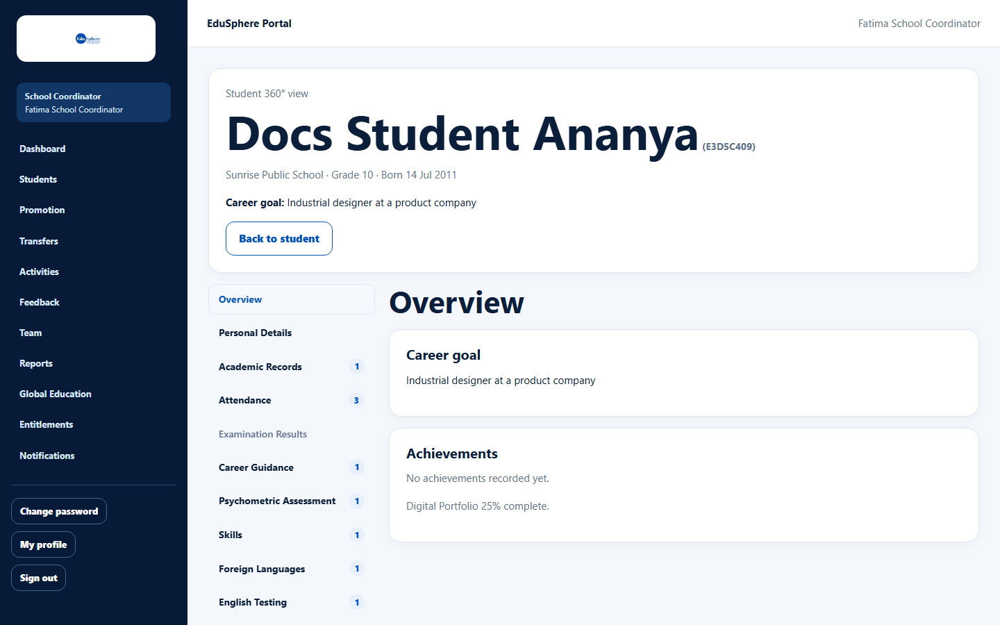
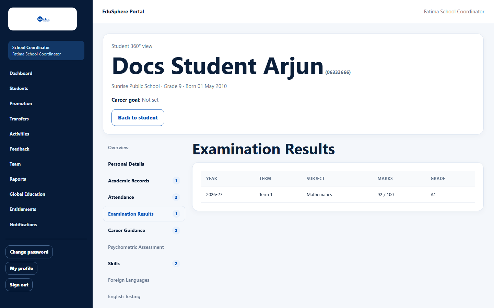
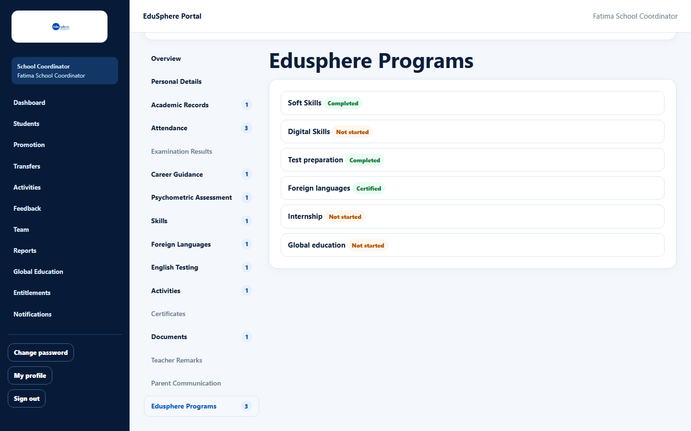
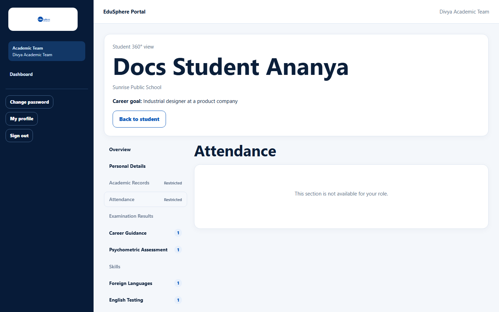
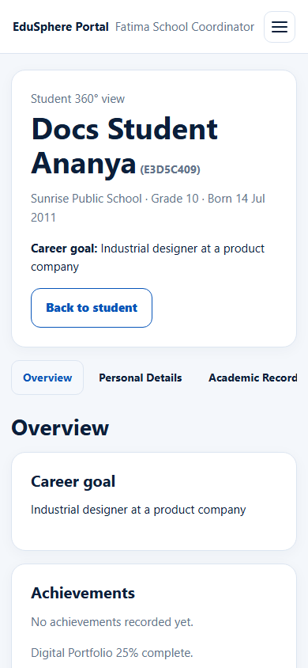

# Student 360° view

> Doc ID: DOC-SCH-S360-001 · Verified on 2026-10-06 against `main` @ `ce1f07c2` · Roles: all school roles

## Purpose
See everything EduSphere knows about one student — profile, attendance, results, career guidance, assessments, skills,
languages, activities, certificates and EduSphere programmes — organised in 16 tabs.

## Who Can Use This Feature
Every school role, for the students they can see: School Coordinator, Principal, Teacher (assigned students), Parent
(their children), Academic Team, Career Counselor and Psychometric Team (their school portfolio).

## Prerequisites
You can open the student.

## How to Access
- **School Coordinator, Principal, Teacher, Academic Team:** the student's page > **Open 360° view**.
- **Parent:** the child's page > **Open 360° view** *(verified in S10)*.
- **Career Counselor, Psychometric Team:** Dashboard > **Student 360° view** list > the student's name.

## Steps

### Step 1 — Read the header
The header shows the student's name (and Student ID for school roles), school, grade and date of birth, and **Career
goal** (set by the Career Counselor).

### Step 2 — Choose a tab
The tabs are on the left. A number shows how many records a tab holds; tabs without records are grey. Use the mouse,
or the arrow keys, Home and End.

### Step 3 — Link straight to a tab
The address remembers the tab (for example `…/360?tab=career_guidance`), so you can bookmark or share a tab with
colleagues who can see the student.

## What each role sees
| Tab | School roles (Coordinator, Principal, Teacher, Parent) | Academic Team | Career Counselor | Psychometric Team |
|---|---|---|---|---|
| Overview (career goal, achievements, portfolio %) | ✔ | ✔ | ✔ (can edit the goal) | ✔ |
| Personal Details | ✔ full | name and school | name and school | name and school |
| Academic Records, Attendance | ✔ | Restricted | Restricted | Restricted |
| Examination Results (published only) | ✔ | ✔ | ✔ | ✔ |
| Career Guidance, Psychometric Assessment, Certificates, Documents, Parent Communication | ✔ | ✔ | ✔ | ✔ |
| Skills, Foreign Languages, Activities, Edusphere Programs | ✔ | ✔ (portfolio entries) | ✔ | ✔ (portfolio entries) |
| English Testing, Teacher Remarks | ✔ | ✔ | Restricted | Restricted |

*(Tab-by-role details beyond the tabs shown in the screenshots are from code.)* A **Restricted** tab shows "This
section is not available for your role."

## Fields
Read-only, except the **Career goal** (Career Counselor; see [Set a student's career goal](../career-counselor/car-004-career-goal.md)).

## Expected Result
You see the student's whole record in one place.

## Validation Messages
| Message | When |
|---|---|
| This section is not available for your role. | You opened a Restricted tab. |

## Common Errors
**Problem:** A tab is empty, for example "No published results yet. Results appear after the Academic Team publishes
them."
**Cause:** Nothing has been recorded or published yet.
**Resolution:** None needed; the empty message says who adds the information.

## Tips
- On a phone the tabs form a row you can swipe sideways.

- **Parent Communication** is always empty: a communication log is not built yet.

## Related Features
- [Student profile and journey timeline](../students/stu-006-student-profile-and-timeline.md)
- [Digital Portfolio overview](../portfolio/port-001-digital-portfolio-overview.md)
