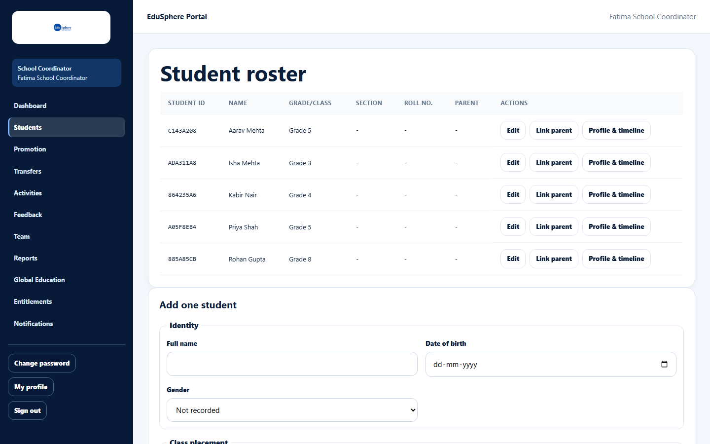
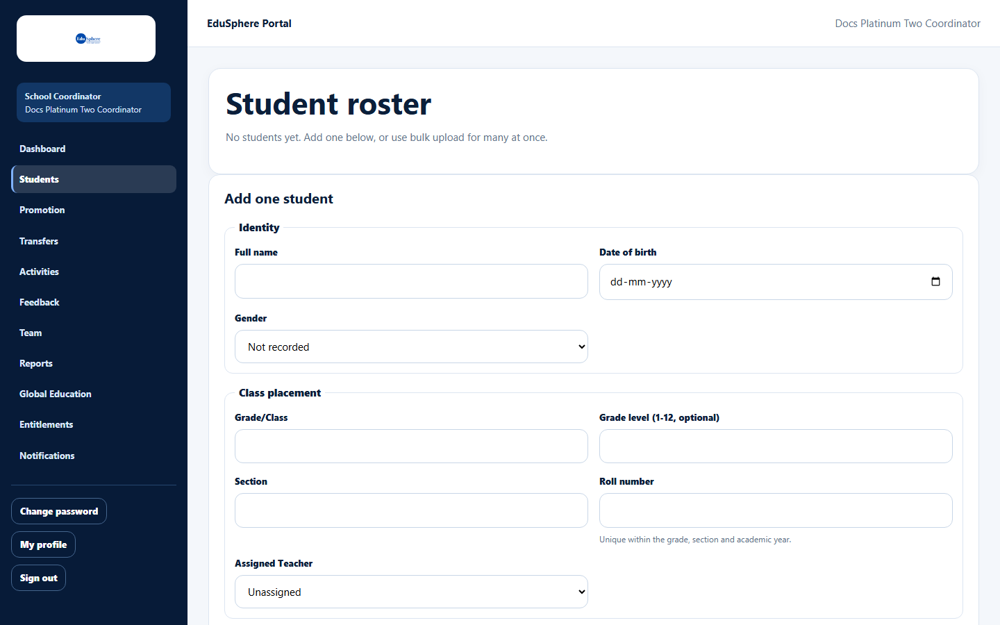

# View the student roster

> Doc ID: DOC-SCH-STU-001 · Verified on 2026-10-06 against `main` @ `ce1f07c2` · Roles: School Coordinator

## Purpose
See every student at your school, with their Student ID and class placement, and reach the actions for each student.

## Who Can Use This Feature
**School Coordinator.**

## Prerequisites
None. A new school starts with an empty roster.

## How to Access
Sidebar > **Students** (or Dashboard > **Go to student roster**).

## Steps

### Step 1 — Open the roster
Click **Students**. The **Student roster** table lists every student, sorted by name.

### Step 2 — Use the row actions
Each row has:
- **Edit** — change the student's details (see [Edit a student](stu-003-edit-a-student.md)).
- **Link parent** — connect an existing Parent account (see [Link a parent](stu-004-link-a-parent.md)).
- **Profile & timeline** — open the student's page (see [Student profile and journey timeline](stu-006-student-profile-and-timeline.md)).

Below the table is **Add one student** (see [Add one student](stu-002-add-a-student.md)).

## Fields
| Column | Description |
|---|---|
| Student ID | The 8-character code EduSphere gives each student. Use it for transfers. |
| Name | The student's full name. |
| Grade/Class | The class label, for example "Grade 9". |
| Section, Roll no. | Class section and roll number ("-" when not recorded). |
| Parent | "Invite sent to {email}" while a parent invitation is waiting; otherwise "-". |
| Actions | Edit, Link parent, Profile & timeline. |

## Expected Result
You can see and act on every student at your school.

## Validation Messages
None.

## Common Errors
**Problem:** The roster says "No students yet. Add one below, or use bulk upload for many at once."
**Cause:** The school has no students yet.
**Resolution:** Add students one at a time or [upload the roster in bulk](stu-005-bulk-upload-roster.md).

**Problem:** A bookmarked address ending in `/students/new` shows "Access unavailable — [object Object]".
**Cause:** There is no separate "new student" page; adding is done on the roster page.
**Resolution:** Open **Students** and use **Add one student**.

## Tips
- The roster has no search, filter, sort or paging: it shows every student on one page, sorted by name.
- The **Parent** column shows only invitations that have not been accepted yet. Parents already linked to a student are
  not shown here *(from code)*.
- Students cannot be deleted or archived from the roster.

## Related Features
- [Add one student](stu-002-add-a-student.md)
- [Upload the roster in bulk](stu-005-bulk-upload-roster.md)
- [Student profile and journey timeline](stu-006-student-profile-and-timeline.md)
