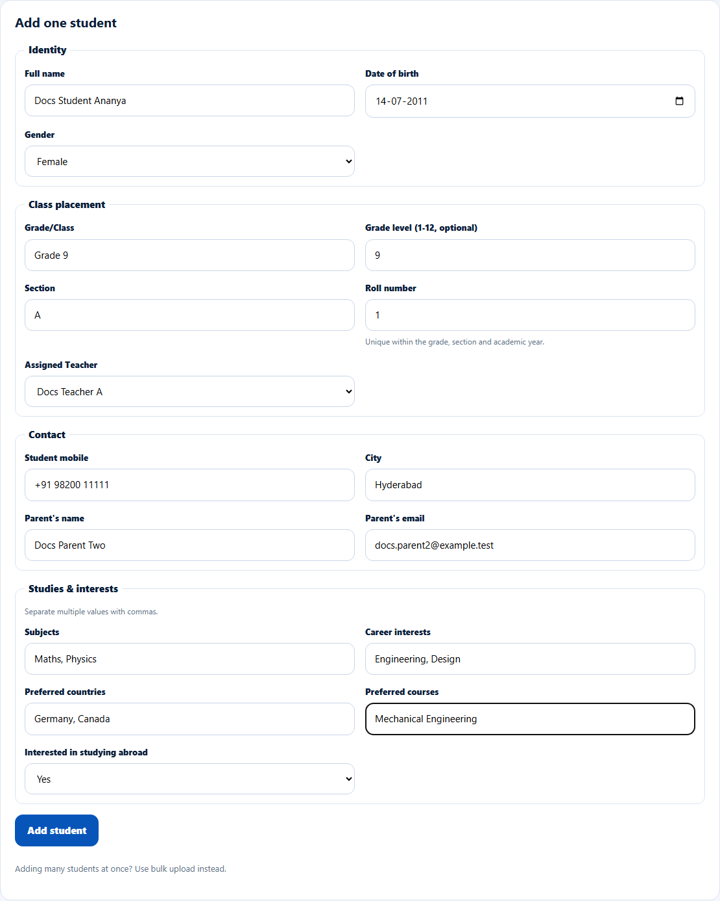
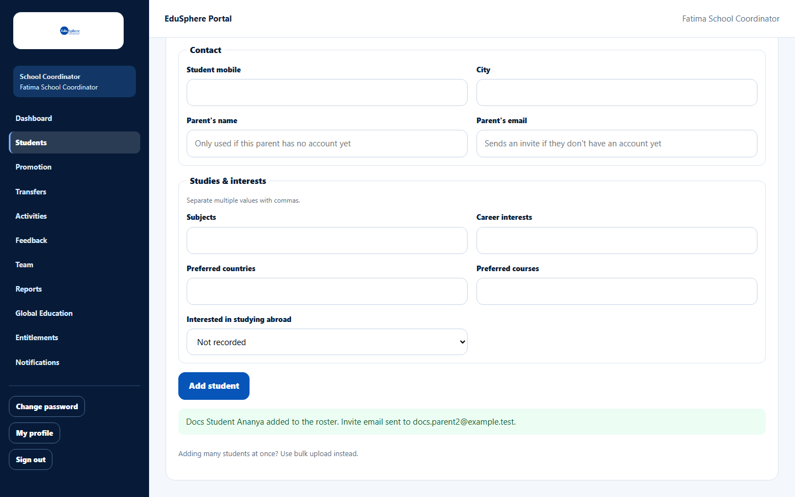
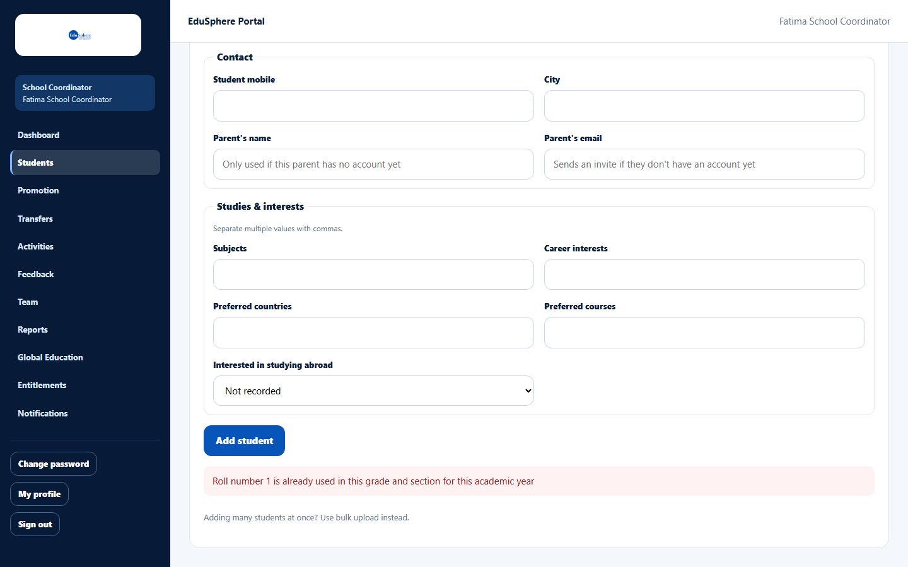

# Add one student

> Doc ID: DOC-SCH-STU-002 · Verified on 2026-10-06 against `main` @ `ce1f07c2` · Roles: School Coordinator

## Purpose
Add a single student to your school's roster, assign their class teacher and, optionally, invite or link their parent.

## Who Can Use This Feature
**School Coordinator.**

## Prerequisites
- To assign a teacher, the teacher has accepted their invitation (see
  [Invite a Principal, Teacher or Parent](../team/team-001-invite-a-team-member.md)).
- Students do not get their own login.

## How to Access
Sidebar > **Students** > **Add one student** (below the roster).

## Steps

### Step 1 — Fill in the form
Only **Full name** is required. Fill in what you know in the four groups: **Identity**, **Class placement**,
**Contact** and **Studies & interests**. In Studies & interests, separate several values with commas.

### Step 2 — Add the student
Click **Add student**. The message confirms the student and tells you what happened with the parent:

| Message | Meaning |
|---|---|
| "{Name} added to the roster. Invite email sent to {email}." | The parent had no account, so an invitation was created. This message appears even if the email could not be sent; if the parent receives nothing, contact your Overseas Admin. |
| "{Name} added to the roster. Parent linked immediately (they already had an account)." | The parent already had a Parent account; they can see this child now. |
| "{Name} added to the roster." | No parent email was given. |

## Fields
| Field | Description | Required | Example |
|---|---|---|---|
| Full name | Student's full name. | Yes | Ananya Rao |
| Date of birth | Pick from the calendar. | No | 14-07-2011 |
| Gender | Not recorded, Female, Male, Other, Prefer not to say. | No | Female |
| Grade/Class | Class label as your school writes it (up to 60 characters). | No | Grade 9 |
| Grade level (1-12, optional) | The grade as a number; needed for promotion and grade reports. | No | 9 |
| Section | Up to 20 characters. | No | A |
| Roll number | Unique within the grade, section and academic year. | No | 1 |
| Assigned Teacher | The class teacher (active teachers at your school). | No | Docs Teacher A |
| Student mobile | 7–20 characters: digits, spaces, + - ( ). | No | +91 98200 11111 |
| City | Up to 120 characters. | No | Hyderabad |
| Parent's name | Used only if the parent has no account yet. | No | Ravi Rao |
| Parent's email | Invites the parent, or links them if they already have a Parent account. | No | parent@example.com |
| Subjects, Career interests, Preferred countries, Preferred courses | Comma-separated lists (up to 20 items). | No | Maths, Physics |
| Interested in studying abroad | Not recorded, Yes, No. | No | Yes |

## Expected Result
The student appears in the roster with a new Student ID, in the current academic year. A new parent receives an
invitation email from you via EduSphere.

## Validation Messages
| Message | When |
|---|---|
| Your browser asks you to fill in the field | **Full name** is empty. |
| Roll number {n} is already used in this grade and section for this academic year | Another student already has that roll number in the same grade and section. |
| Parent's email '{email}' belongs to an existing account that is not a Parent | The email belongs to a teacher, coordinator or other non-parent account. |
| Grade level must be an integer between 1 and 12 | Grade level outside 1–12. *(From code.)* |
| Student mobile must be 7-20 characters of digits, spaces, +, -, ( or ) with at least 7 digits | Invalid mobile. *(From code.)* |

## Common Errors
**Problem:** "Something went wrong."
**Cause:** On the documentation server this appeared when the full name was extremely long (170 characters). Full names
are limited to 160 characters but the form does not warn you.
**Resolution:** Shorten the name and try again.

**Problem:** The teacher you want is not in **Assigned Teacher**.
**Cause:** They have not accepted their invitation yet, or their account is deactivated.
**Resolution:** Check [Your team](../team/team-002-view-your-team.md).

## Tips
- Adding many students? Use [bulk upload](stu-005-bulk-upload-roster.md).
- If the same new parent email is used for two children, one invitation links them to both once accepted.
- Edit details later with **Edit** on the roster.

## Related Features
- [View the roster](stu-001-view-the-roster.md)
- [Edit a student](stu-003-edit-a-student.md)
- [Link a parent to a student](stu-004-link-a-parent.md)
- [Upload the roster in bulk](stu-005-bulk-upload-roster.md)
