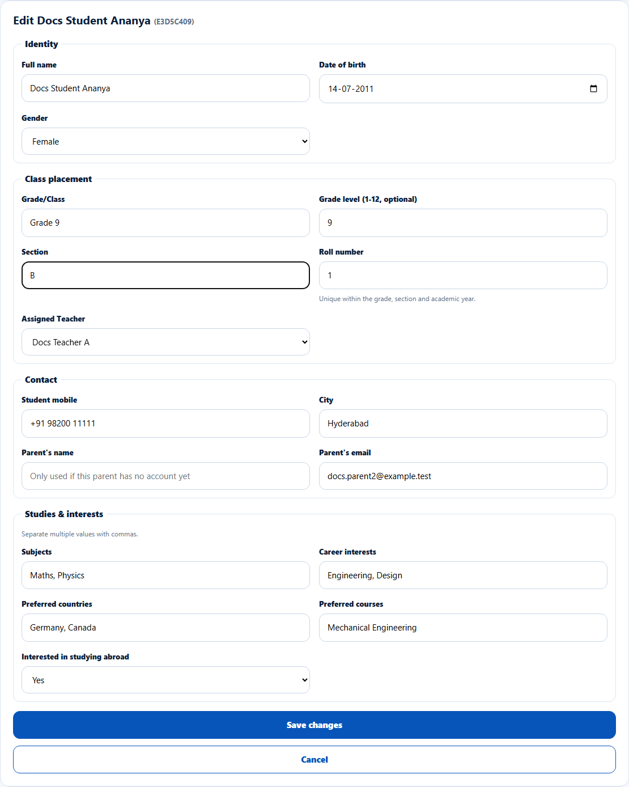
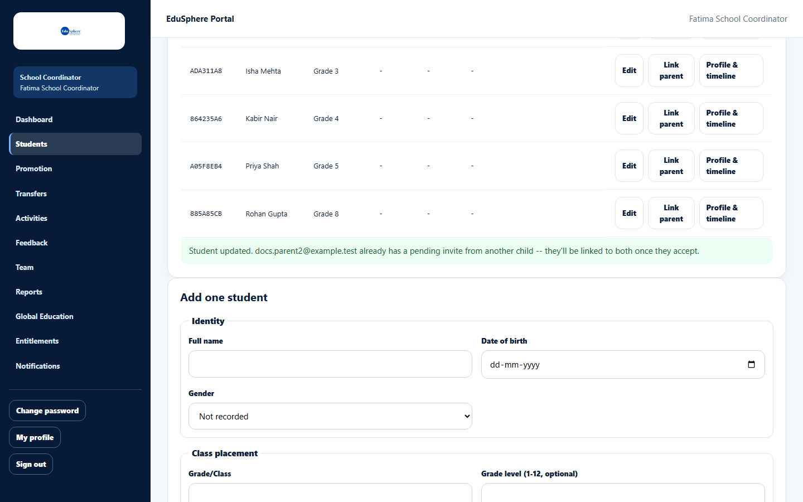

# Edit a student

> Doc ID: DOC-SCH-STU-003 · Verified on 2026-10-06 against `main` @ `ce1f07c2` · Roles: School Coordinator

## Purpose
Correct a student's details, change their class placement or assign a different class teacher.

## Who Can Use This Feature
**School Coordinator.**

## Prerequisites
The student is on your roster.

## How to Access
Sidebar > **Students** > **Edit** on the student's row.

## Steps

### Step 1 — Open the edit form
Click **Edit** on the row. A form titled **Edit {name} ({Student ID})** opens with the current details. It has the same
fields as [Add one student](stu-002-add-a-student.md).

### Step 2 — Save
Change what you need (for example **Section** or **Assigned Teacher**) and click **Save changes**. The message
"Student updated." appears below the roster. Click **Cancel** to close without saving.

## Fields
See [Add one student](stu-002-add-a-student.md#fields). In the edit form, **Assigned Teacher** also lists deactivated
teachers, marked "(inactive)", so an existing assignment is not lost.

## Expected Result
The roster shows the new details.

## Validation Messages
The same as [Add one student](stu-002-add-a-student.md#validation-messages).

## Common Errors
**Problem:** After saving, the message adds "{email} already has a pending invite from another child -- they'll be linked
to both once they accept."
**Cause:** The parent email on this student matches an invitation that is still waiting.
**Resolution:** Nothing to do; the parent is linked to every child with that email once they accept.

## Tips
- Profile details can only be changed here, not on the student's profile page.
- Changing the roll number, grade or section is checked again for duplicate roll numbers.

## Related Features
- [View the roster](stu-001-view-the-roster.md)
- [Add one student](stu-002-add-a-student.md)
