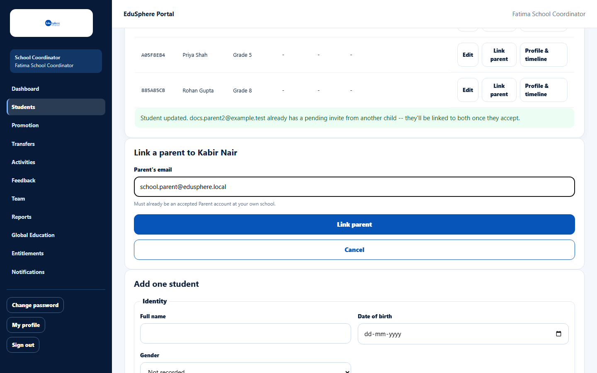
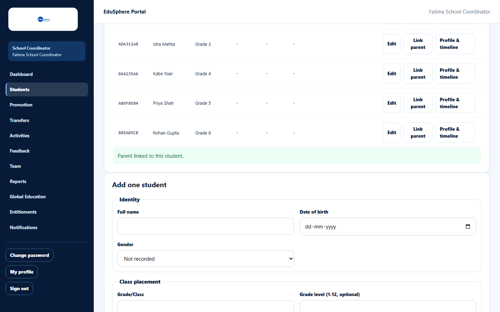
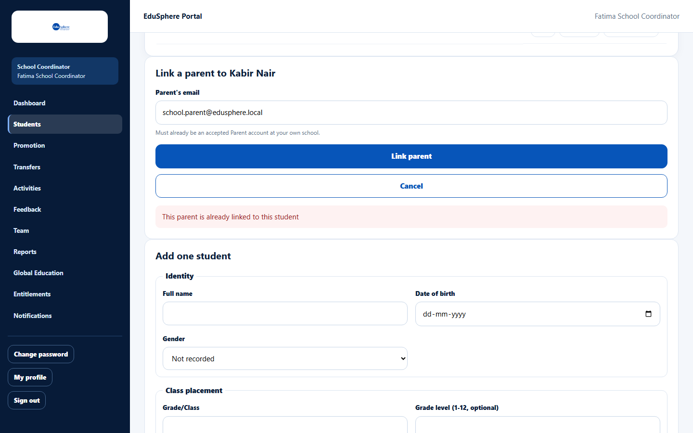

# Link a parent to a student

> Doc ID: DOC-SCH-STU-004 · Verified on 2026-10-06 against `main` @ `ce1f07c2` · Roles: School Coordinator

## Purpose
Connect a parent who already has an EduSphere Parent account to one of your students, so they can follow that child's
progress.

## Who Can Use This Feature
**School Coordinator.**

## Prerequisites
The parent has accepted an invitation and has a Parent account. (For a parent without an account, enter their email on
the student instead — see [Add one student](stu-002-add-a-student.md).)

## How to Access
Sidebar > **Students** > **Link parent** on the student's row.

## Steps

### Step 1 — Enter the parent's email
Click **Link parent**. In **Link a parent to {name}**, type the **Parent's email**.

### Step 2 — Link
Click **Link parent**. The message "Parent linked to this student." appears.

## Fields
| Field | Description | Required | Example |
|---|---|---|---|
| Parent's email | The email of an existing Parent account. | Yes | parent@example.com |

## Expected Result
The parent sees this child on their **My children** dashboard.

## Validation Messages
| Message | When |
|---|---|
| This parent is already linked to this student | The link exists already. |
| Parent's email '{email}' belongs to an existing account that is not a Parent | The email belongs to another kind of account. |
| Parent's email must belong to an existing Parent account | No Parent account has this email. *(From code.)* |

## Common Errors
**Problem:** The email is refused although the parent was invited.
**Cause:** They have not accepted the invitation yet, so there is no Parent account.
**Resolution:** Ask them to accept the invitation first, or put their email on the student with **Edit** — they will be
linked when they accept.

## Tips
- One parent can be linked to several children, including children at other schools.
- Existing links cannot be viewed or removed from the roster *(from code)*. Contact EduSphere if a link is wrong.

## Related Features
- [Add one student](stu-002-add-a-student.md)
- [Invite a Principal, Teacher or Parent](../team/team-001-invite-a-team-member.md)
