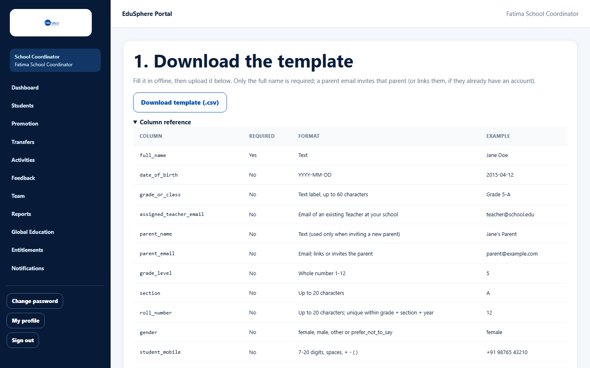
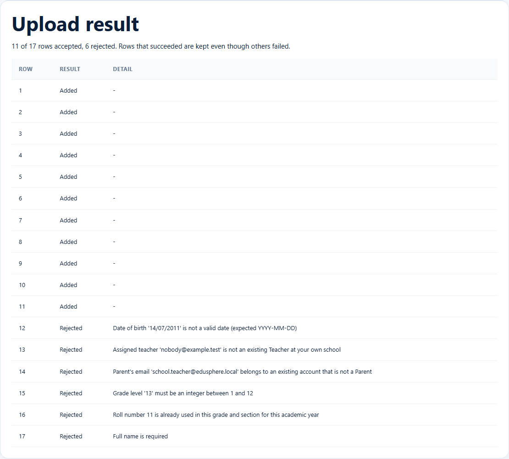

# Upload the roster in bulk (CSV)

> Doc ID: DOC-SCH-STU-005 · Verified on 2026-10-06 against `main` @ `ce1f07c2` · Roles: School Coordinator

## Purpose
Add many students at once from a spreadsheet saved as CSV — for example your whole roster at the start of a year.

## Who Can Use This Feature
**School Coordinator.**

## Prerequisites
- A spreadsheet program that can save as CSV (UTF-8).
- Teachers you want to assign have accepted their invitations.

## How to Access
Dashboard > **Go to bulk upload**, or the bulk upload link on the **Students** page (opens
**/school/coordinator/students/bulk-upload**; it is not in the sidebar).

## Steps

### Step 1 — Download the template
Under **1. Download the template**, click **Download template (.csv)**. Open **Column reference** to see the format of
each column.

### Step 2 — Fill in the file
Keep the header row exactly as it is. Add one row per student.
- **Delete the example row ("Jane Doe")** that comes in the template — otherwise it is imported as a real student.
- In list columns (subjects, career_interests, preferred_countries, preferred_courses), separate values with a
  semicolon `;` (the on-screen form uses commas).

### Step 3 — Upload
Under **2. Upload your filled-in roster**, choose the file in **Filled-in roster file** and click **Upload roster**.

### Step 4 — Read the result
**Upload result** says how many rows were accepted and lists every row as **Added** or **Rejected** with the reason.
Rows that succeeded are kept even though others failed.

## Fields
| Column | Required | Format | Example |
|---|---|---|---|
| full_name | Yes | Text | Jane Doe |
| date_of_birth | No | YYYY-MM-DD | 2015-04-12 |
| grade_or_class | No | Text label, up to 60 characters | Grade 5-A |
| assigned_teacher_email | No | Email of an existing Teacher at your school | teacher@school.edu |
| parent_name | No | Text (used only when inviting a new parent) | Jane's Parent |
| parent_email | No | Email; links or invites the parent | parent@example.com |
| grade_level | No | Whole number 1–12 | 5 |
| section | No | Up to 20 characters | A |
| roll_number | No | Up to 20 characters; unique within grade + section + year | 12 |
| gender | No | female, male, other or prefer_not_to_say | female |
| student_mobile | No | 7–20 digits, spaces, + - ( ) | +91 98765 43210 |
| city, subjects, career_interests, global_education_interest (yes/no), preferred_countries, preferred_courses | No | see Column reference | — |

## Expected Result
Each **Added** row is a new student. A new parent email sends one invitation; an existing Parent account is linked
straight away.

## Validation Messages
Each message rejects only that row. **Row numbers count data rows: row 1 is the first student after the header.**

| Message | Meaning |
|---|---|
| Full name is required | The name cell is empty. |
| Date of birth '{value}' is not a valid date (expected YYYY-MM-DD) | Wrong date format (for example 14/07/2011). |
| Assigned teacher '{email}' is not an existing Teacher at your own school | Unknown or not-yet-accepted teacher. |
| Parent's email '{email}' belongs to an existing account that is not a Parent | The email belongs to a non-parent account. |
| Grade level '{value}' must be an integer between 1 and 12 | Grade level outside 1–12. |
| Roll number {n} is already used in this grade and section for this academic year | Duplicate roll number. |

## Common Errors
**Problem:** Clicking **Upload roster** does nothing except a browser prompt.
**Cause:** No file was chosen.
**Resolution:** Choose the CSV file first.

**Problem:** Every row is rejected with "Full name is required".
**Cause:** The header row was changed (for example "Full Name" instead of `full_name`).
**Resolution:** Start again from a freshly downloaded template.

**Problem:** A student called "Jane Doe" appeared.
**Cause:** The template's example row was not deleted.
**Resolution:** Ask EduSphere to remove the student (students cannot be deleted from the roster).

## Tips
- Fix rejected rows and upload a file that contains only those rows.
- Photos cannot be uploaded in the CSV; add them on each student's page.

## Related Features
- [Add one student](stu-002-add-a-student.md)
- [View the roster](stu-001-view-the-roster.md)
- [Add, replace or remove a student photo](stu-007-student-photo.md)
