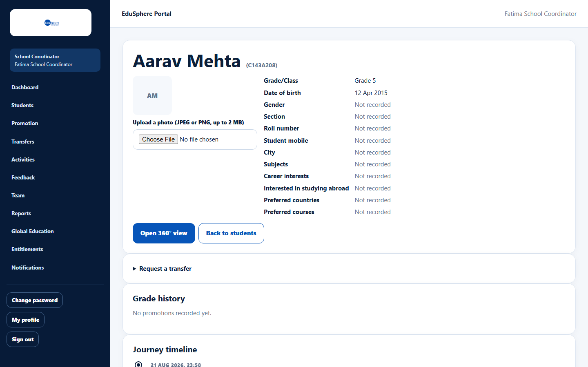
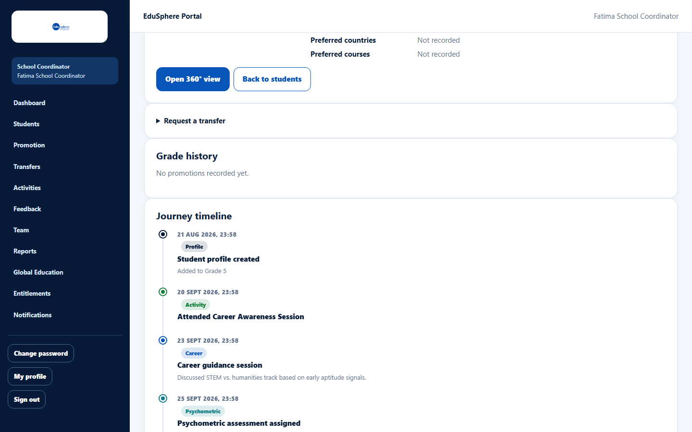
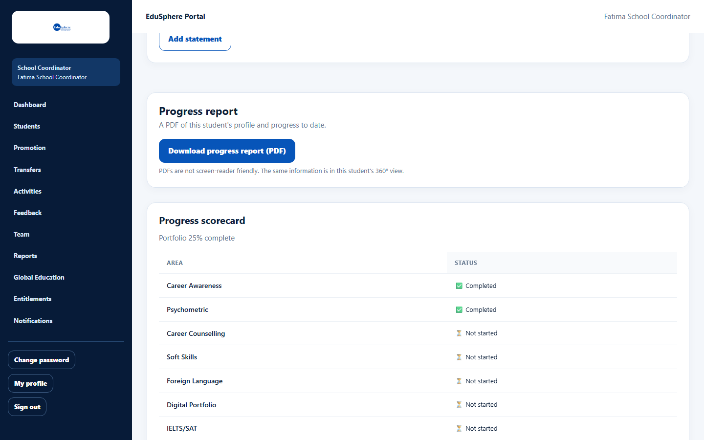
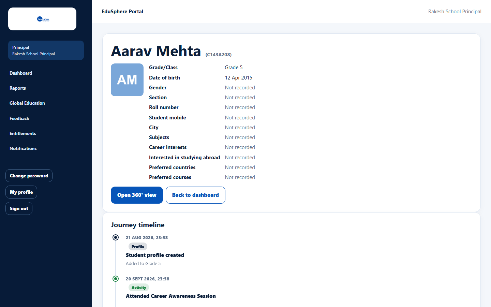
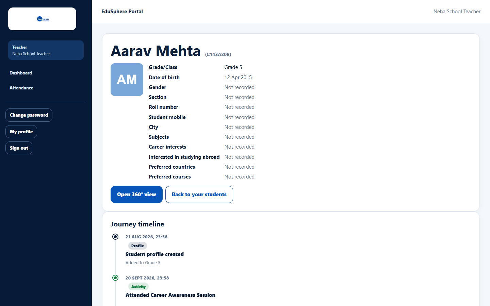

# Student profile and journey timeline

> Doc ID: DOC-SCH-STU-006 · Verified on 2026-10-06 against `main` @ `ce1f07c2` · Roles: School Coordinator, Principal, Teacher

## Purpose
See one student's details and everything that has happened in their EduSphere journey — activities, career guidance,
assessments, results and more — in date order.

## Who Can Use This Feature
**School Coordinator**, **Principal**, and **Teacher** (only for students assigned to them).

## What each role sees
| Section | School Coordinator | Principal | Teacher |
|---|---|---|---|
| Details card (photo, grade, date of birth, contact, interests) | ✔ (can change photo) | ✔ | ✔ |
| Request a transfer | ✔ | — | — |
| Grade history | ✔ | — | — |
| Journey timeline | ✔ | ✔ | ✔ |
| Digital Portfolio | ✔ (can edit) | ✔ (read only) | ✔ |
| Progress report (PDF) | ✔ | ✔ | — |
| Progress scorecard | ✔ | ✔ | — |
| Funding support | ✔ | ✔ | — |

A **Transfer history** card also appears for a Coordinator once the student has moved schools *(from code)*.

## Prerequisites
The student is at your school (Teachers: assigned to you).

## How to Access
- **School Coordinator:** Sidebar > **Students** > **Profile & timeline**.
- **Principal:** Dashboard > **Timeline** on the student's row *(button from code; dashboards are verified in S10)*.
- **Teacher:** Dashboard > **View** on the student's row *(button from code; dashboards are verified in S10)*.

## Steps

### Step 1 — Read the details
The top card shows the student's name, Student ID, photo (or initials) and recorded details; "Not recorded" means
nothing has been entered. Buttons: **Open 360° view** and a back button.

### Step 2 — Follow the journey timeline
**Journey timeline** lists events oldest first, each with a date and a coloured category (Profile, Activity, Career,
Psychometric, Academic, Test prep, Foreign language, Global education, Soft skills, Digital skills).

### Step 3 — Check the progress scorecard (Coordinator and Principal)
**Progress scorecard** shows how far the student is in each area: Completed, In progress, Not started, Not in plan (not
part of your school's partnership tier) or Not tracked yet. It also shows how complete the Digital Portfolio is.

### Step 4 — Other sections
- **Grade history** (Coordinator): promotions and hold-backs; "No promotions recorded yet." until the first one.
- **Digital Portfolio**: see the Digital Portfolio pages (session S7).
- **Progress report**: see [Download a student progress report](stu-008-progress-report-pdf.md).
- **Funding support**: loan, scholarship and funding cases opened by the Career Counselor, or "No funding support
  cases for this student." *(text from code)*.

## Fields
Read-only. To change details, use [Edit a student](stu-003-edit-a-student.md).

## Expected Result
You have a full picture of the student's progress.

## Validation Messages
| Message | When |
|---|---|
| Access unavailable — This student is not assigned to you | A Teacher opens a student who is not assigned to them. |
| Access unavailable — This student is at a different institution | The student belongs to another school. |

## Common Errors
**Problem:** "This student is not assigned to you" (Teacher).
**Cause:** The Coordinator has not set you as the student's **Assigned Teacher**.
**Resolution:** Ask your School Coordinator.

**Problem:** "Timeline is unavailable right now." *(From code.)*
**Cause:** A temporary problem loading the timeline.
**Resolution:** Reload the page.

## Tips
- The details card does not show the assigned teacher or the linked parents.
- **Open 360° view** shows the same student organised in 16 tabs (session S9).

## Related Features
- [Add, replace or remove a student photo](stu-007-student-photo.md)
- [Download a student progress report](stu-008-progress-report-pdf.md)
- [Edit a student](stu-003-edit-a-student.md)
