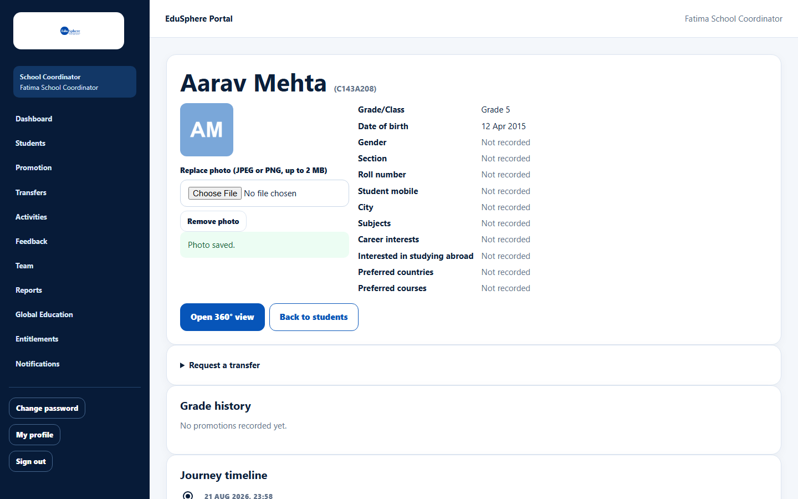
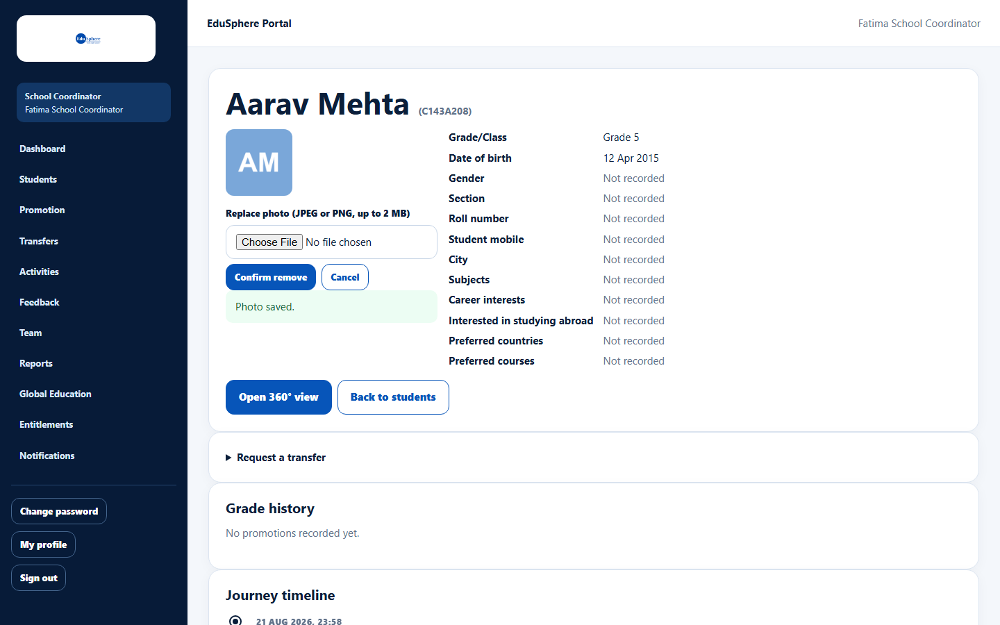
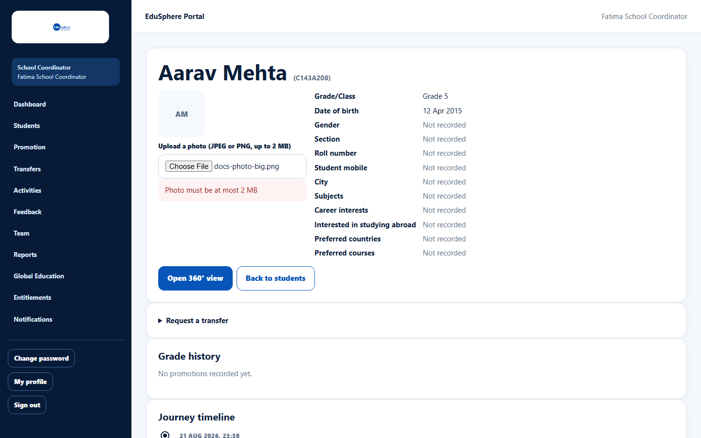

# Add, replace or remove a student photo

> Doc ID: DOC-SCH-STU-007 · Verified on 2026-10-06 against `main` @ `ce1f07c2` · Roles: School Coordinator

## Purpose
Show a photo on the student's profile so staff and parents recognise the student.

## Who Can Use This Feature
**School Coordinator.** Principals, Teachers and Parents see the photo but cannot change it.

## Prerequisites
A JPEG or PNG image of at most 2 MB.

## How to Access
Sidebar > **Students** > **Profile & timeline** > photo area in the top card.

## Steps

### Step 1 — Upload
Under **Upload a photo (JPEG or PNG, up to 2 MB)**, click **Choose File** and pick the image. It uploads straight away
and the message "Photo saved." appears.

### Step 2 — Replace (optional)
When a photo exists, the field is called **Replace photo (JPEG or PNG, up to 2 MB)**. Choose a new file the same way.

### Step 3 — Remove (optional)
Click **Remove photo**, then **Confirm remove** (or **Cancel**). The message "Photo removed." appears and the initials
are shown again.

## Fields
| Field | Description | Required | Example |
|---|---|---|---|
| Upload a photo / Replace photo | A JPEG or PNG file, up to 2 MB. | Yes (to upload) | student.jpg |

## Expected Result
The photo appears on the student's page for every role that can see the student.

## Validation Messages
| Message | When |
|---|---|
| Photo must be a JPEG or PNG image | The file is another type (for example a PDF). |
| Photo must be at most 2 MB | The file is too large. |
| photo could not be read as a valid JPEG or PNG image | The file is damaged or not really an image. *(From code.)* |

## Common Errors
**Problem:** "Photo must be at most 2 MB".
**Cause:** Phone photos are often larger.
**Resolution:** Resize or compress the photo, then upload again.

## Tips
- Location and camera details stored inside the photo file are removed when it is uploaded *(from code)*.
- Photos cannot be included in the bulk-upload CSV.

## Related Features
- [Student profile and journey timeline](stu-006-student-profile-and-timeline.md)
