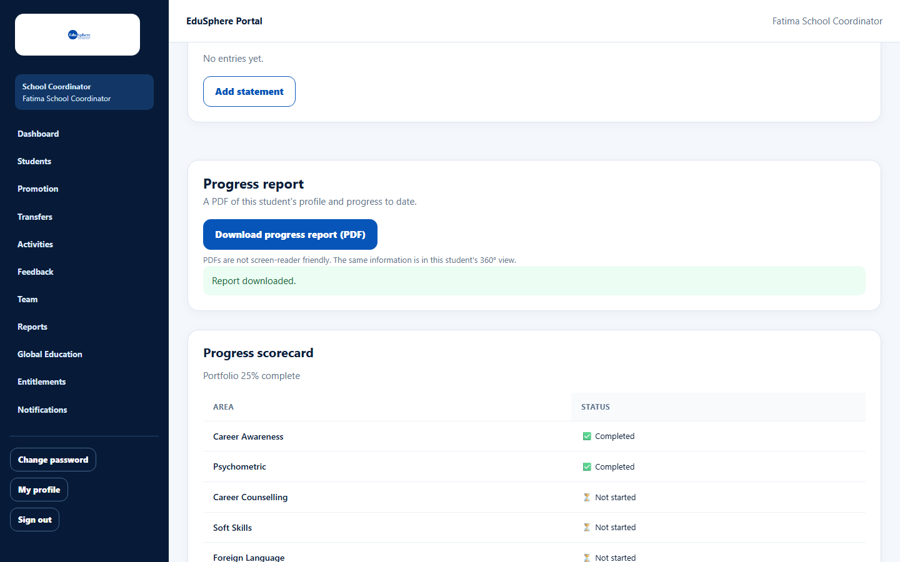

# Download a student progress report (PDF)

> Doc ID: DOC-SCH-STU-008 · Verified on 2026-10-06 against `main` @ `ce1f07c2` · Roles: School Coordinator, Principal, Parent

## Purpose
Save or print a PDF summary of one student's profile and progress to date, for meetings or records.

## Who Can Use This Feature
**School Coordinator**, **Principal**, and **Parent** (for their own children). Teachers do not have this button.

## Prerequisites
You can open the student's page (Parents: the child is linked to you).

## How to Access
- **School Coordinator:** Students > **Profile & timeline** > **Progress report**.
- **Principal:** Dashboard > **Timeline** > **Progress report**.
- **Parent:** Dashboard > **View full profile & progress** > **Download progress report (PDF)** (at the top of the
  page).

## Steps

### Step 1 — Download
Click **Download progress report (PDF)**. The button reads "Preparing PDF…" while the file is created, then your
browser saves **progress-report.pdf** and the message "Report downloaded." appears.

## Fields
None.

## Expected Result
A PDF named `progress-report.pdf` in your downloads folder.

## Validation Messages
| Message | When |
|---|---|
| Report downloaded. | The file was created. |
| Your session has expired. Sign in again. | Your sign-in ended. *(From code.)* |
| Something went wrong on our side. Please try again. | The file could not be created. *(From code.)* |

## Common Errors
**Problem:** Several reports all have the same file name.
**Cause:** Every report is called `progress-report.pdf`.
**Resolution:** Rename each file after downloading (for example add the student's name).

## Tips
- PDFs are not screen-reader friendly. The same information is in the student's **360° view**.
- Each download is recorded in EduSphere's audit log *(from code)*.

## Related Features
- [Student profile and journey timeline](stu-006-student-profile-and-timeline.md)
