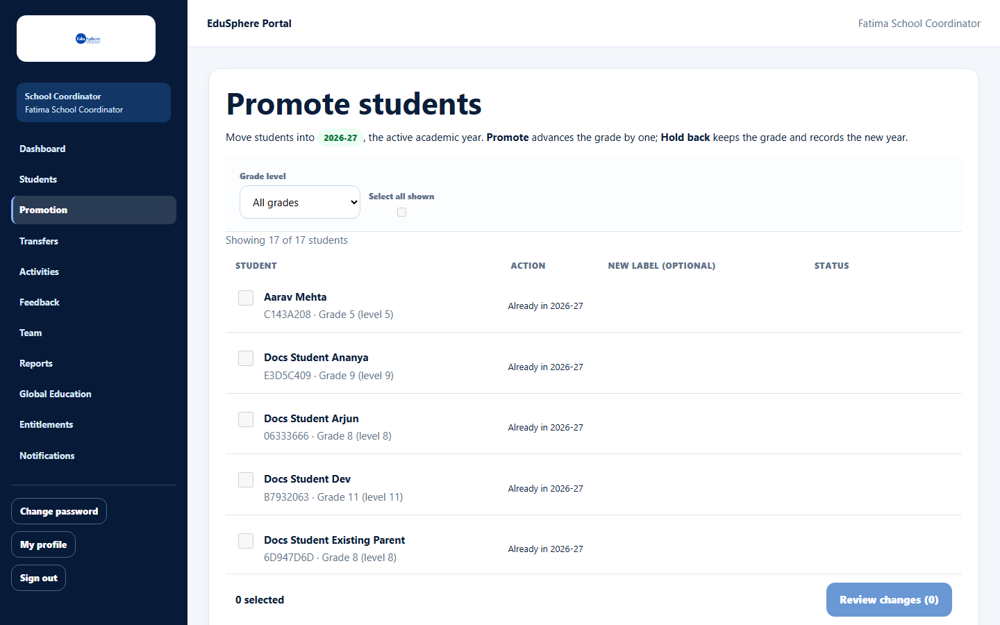
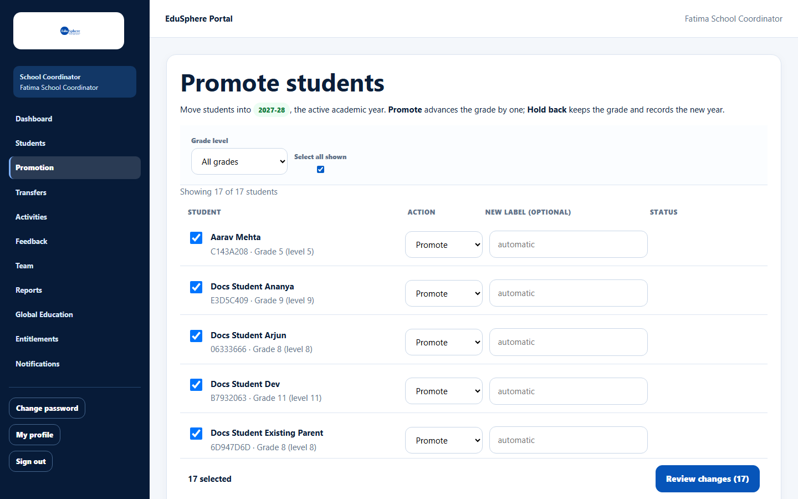
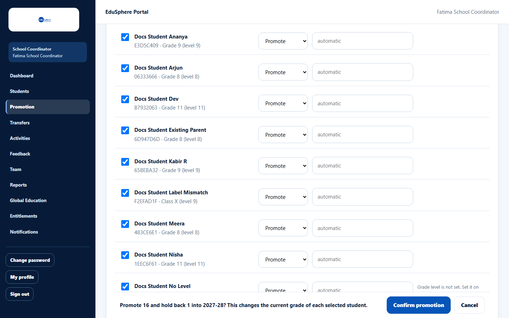
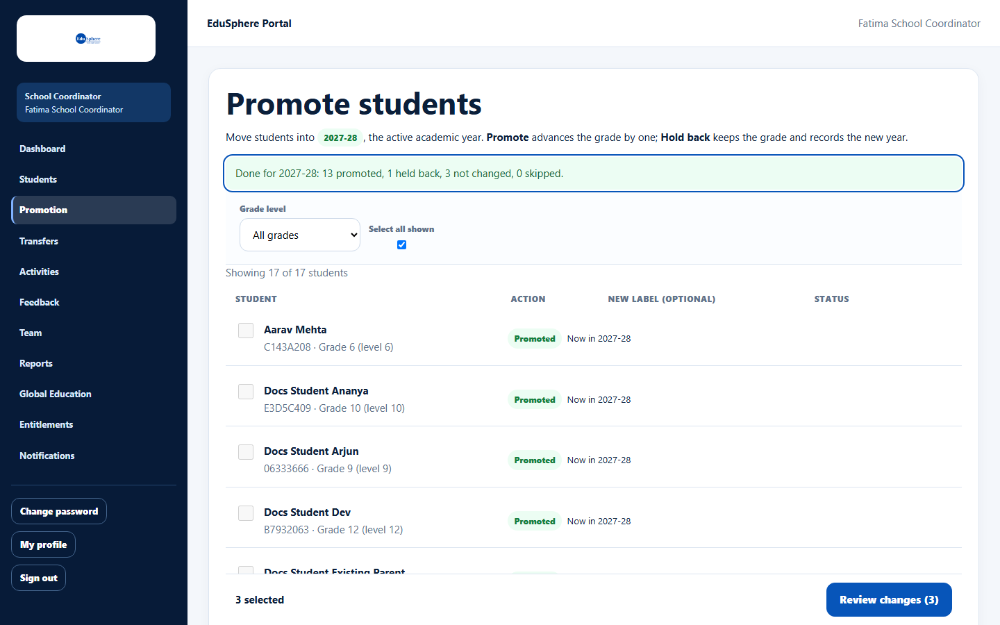
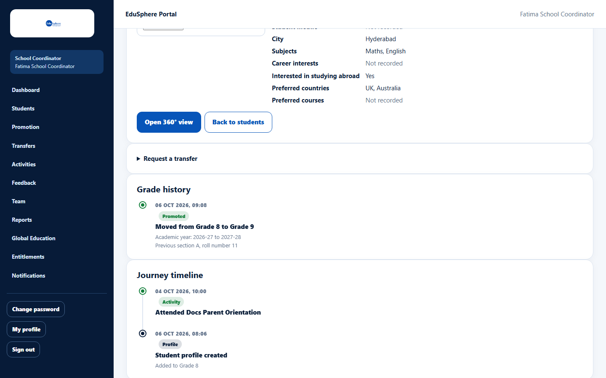

# Promote or hold back students for the new academic year

> Doc ID: DOC-SCH-STU-009 · Verified on 2026-10-06 against `main` @ `ce1f07c2` · Roles: School Coordinator

## Purpose
At the start of a new academic year, move students up one grade (**Promote**) or keep them in the same grade (**Hold
back**). Both record the student in the new year.

## Who Can Use This Feature
**School Coordinator.**

## Prerequisites
- **EduSphere has opened the new academic year.** There is no screen for this at the school; EduSphere's Overseas Admin
  sets it up. Until then every student shows "Already in {current year}".
- Students have a **Grade level (1–12)** set on the roster.

## How to Access
Sidebar > **Promotion**.

## Steps

### Step 1 — Check the year
The page says "Move students into {year}, the active academic year." If every row says "Already in {year}", the new year
has not been opened yet.

### Step 2 — Choose students and actions
Filter by **Grade level** if you want, then tick students (or **Select all shown**). For each, choose **Action**:
**Promote** or **Hold back**. For Promote you can type a **New label (optional)**; leave it empty to update the label
automatically (for example "Grade 8" becomes "Grade 9"). Hints warn about students who cannot be promoted.

### Step 3 — Review and confirm
Click **Review changes ({n})**. A summary asks, for example, "Promote 16 and hold back 1 into 2027-28? This changes the
current grade of each selected student." Click **Confirm promotion** (or **Cancel**).

### Step 4 — Read the result
The message "Done for {year}: {a} promoted, {b} held back, {c} not changed, {d} skipped." appears. Each row shows
**Promoted** or **Held back** with "Now in {year}". Students that could not be changed stay selected, with the reason.

### Step 5 — Check grade history
Each moved student's profile now has an entry in **Grade history**.

## Fields
| Field | Description | Required | Example |
|---|---|---|---|
| Grade level (filter) | All grades, one grade, or "Grade level not set". | No | Grade 8 |
| Select all shown / row checkbox | Which students to change. | At least one | ✓ |
| Action | Promote (grade + 1) or Hold back (same grade, new year). | Yes | Promote |
| New label (optional) | The new class label for promoted students; must contain the new grade number. | No | Grade 9-B |

## Expected Result
Selected students are in the new academic year, with their grade advanced (Promote) or kept (Hold back).

## Validation Messages
Reasons shown for students that were **not changed**:

| Message | Meaning |
|---|---|
| Grade 12 is the highest grade; graduation is not supported yet. | A Grade 12 student was set to Promote; choose Hold back. |
| Grade level is not set. Set it on the roster before promoting. | The student has no grade level. |
| This student's grade label can't be advanced automatically. Type the new grade in "New label", then try again. | The label does not contain the grade number (for example "Class X" with level 9). |
| Already in the active academic year. | The student was already moved. *(From code.)* |

## Common Errors
**Problem:** Every student shows "Already in {year}" and nothing can be selected.
**Cause:** The new academic year has not been opened.
**Resolution:** Ask EduSphere's Overseas Admin to open the new academic year.

**Problem:** "No active academic year. Ask an Overseas Admin to activate one." *(From code.)*
**Cause:** There is no active year at all.
**Resolution:** Contact EduSphere.

## Tips
- **Promotion clears each moved student's roll number** (Grade history keeps the previous section and roll number). Set
  new roll numbers on the roster afterwards.
- At most 500 students can be changed at once.
- Students who were not changed stay selected; fix the cause and run the review again.

## Related Features
- [Edit a student](stu-003-edit-a-student.md) (set grade level and labels)
- [Student profile and journey timeline](stu-006-student-profile-and-timeline.md) (grade history)
