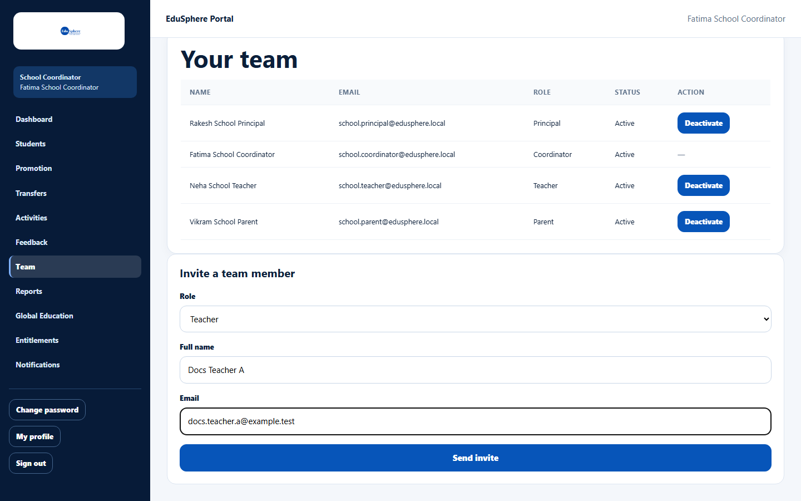
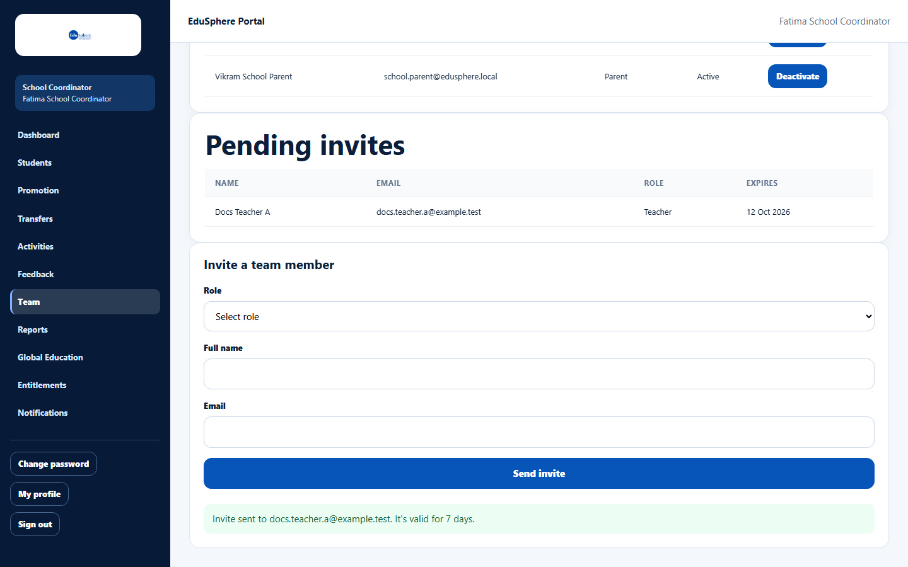
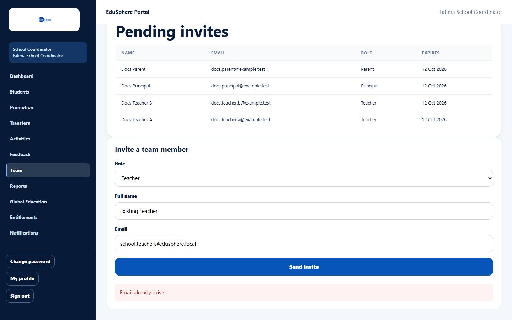

# Invite a Principal, Teacher or Parent

> Doc ID: DOC-SCH-TEAM-001 · Verified on 2026-10-06 against `main` @ `ce1f07c2` · Roles: School Coordinator

## Purpose
Give your school's Principal, Teachers and Parents their own EduSphere login by sending them an invitation.

## Who Can Use This Feature
**School Coordinator.**

## Prerequisites
The person's email address is not already used by an EduSphere account.

## How to Access
Sidebar > **Team** > **Invite a team member** (below the team tables).

## Steps

### Step 1 — Fill in the invitation
Choose the **Role** (Principal, Teacher or Parent) and type the person's **Full name** and **Email**.

### Step 2 — Send it
Click **Send invite**. The message "Invite sent to {email}. It's valid for 7 days." appears, and the person is listed under
**Pending invites**.

### Step 3 — The person accepts
The person receives an email "You're invited to join {school} on EduSphere", from you via EduSphere (replies come to
you). When they accept, they move from **Pending invites** to **Your team** (Parents only once linked to a student — see
Tips).

## Fields
| Field | Description | Required | Example |
|---|---|---|---|
| Role | Principal, Teacher or Parent. | Yes | Teacher |
| Full name | The person's name. | Yes | Docs Teacher A |
| Email | Their email; it becomes their login. | Yes | teacher@school.example |

## Expected Result
An invitation valid for 7 days is emailed. The person sets their own password (see the user page
[Accept a school invitation](../account-access/auth-002-accept-an-invitation.md)).

## Validation Messages
| Message | When |
|---|---|
| Email already exists | The email already belongs to an EduSphere account (any role). |
| Your browser asks you to fill in the field | **Role**, **Full name** or **Email** is empty. |

## Common Errors
**Problem:** The message ends with "(email sending isn't configured yet -- share the link manually)" or "(the email
could not be sent -- share the link manually)". *(From code.)*
**Cause:** The invitation was created but the email could not be sent. The page does not show the link.
**Resolution:** Contact your Overseas Admin.

**Problem:** "Email already exists".
**Cause:** The person already has an EduSphere login.
**Resolution:** For a Parent who already has an account, link them to the student instead ("Link parent" on the
**Students** page; see [Link a parent to a student](../students/stu-004-link-a-parent.md)).

## Tips
- Pending invitations cannot be re-sent or cancelled from this page. Ask the person to check spam first.
- An invited **Parent** appears in **Your team** only after being linked to one of your students *(from code)*.
- You can also invite a parent by entering their email on a student's record (see [Edit a student](../students/stu-003-edit-a-student.md)).

## Related Features
- [View your team and pending invites](team-002-view-your-team.md)
- [Deactivate or reactivate a team account](team-003-deactivate-or-reactivate.md)
- [Accept a school invitation](../account-access/auth-002-accept-an-invitation.md)
