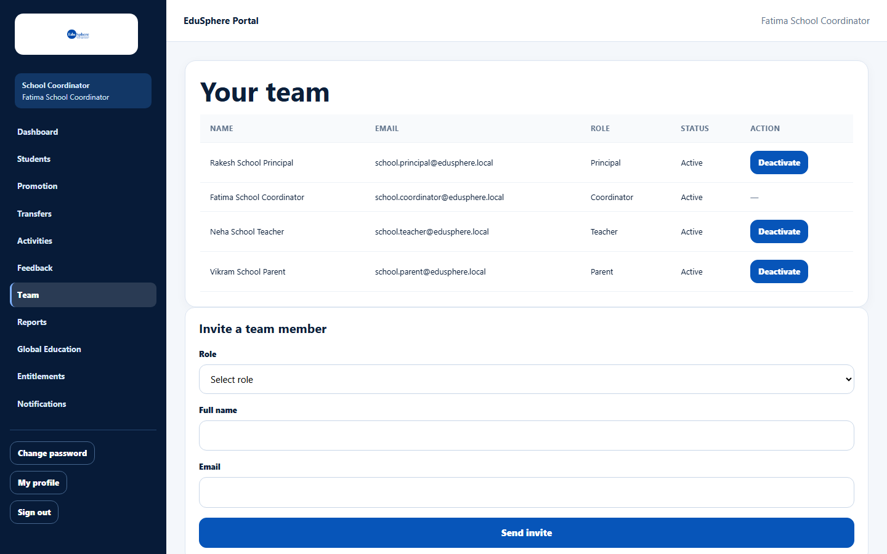
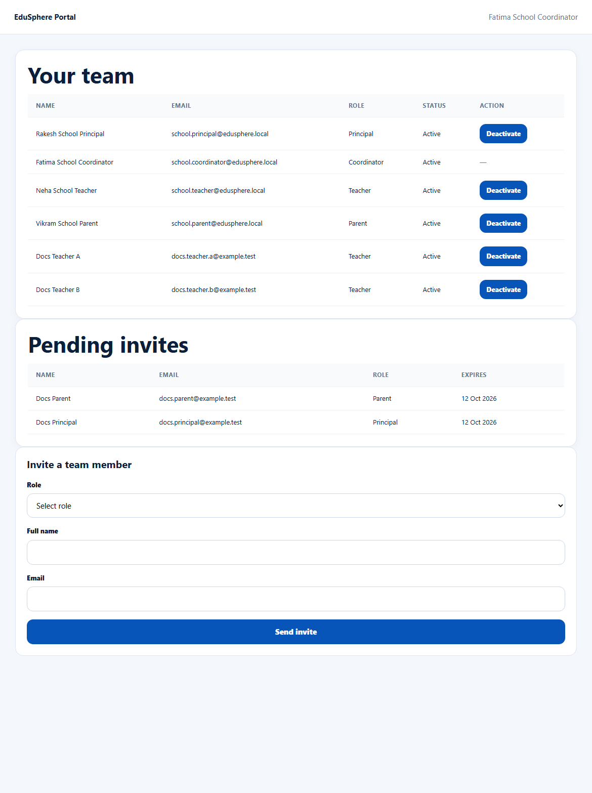

# View your team and pending invites

> Doc ID: DOC-SCH-TEAM-002 · Verified on 2026-10-06 against `main` @ `ce1f07c2` · Roles: School Coordinator

## Purpose
See everyone at your school who has an EduSphere login, and the invitations not yet accepted.

## Who Can Use This Feature
**School Coordinator.**

## Prerequisites
None.

## How to Access
Sidebar > **Team**.

## Steps

### Step 1 — Open Team
Click **Team** in the sidebar. **Your team** lists the accounts at your school.

### Step 2 — Check pending invitations
When invitations are waiting, a **Pending invites** table appears below **Your team**, with the date each one
**Expires** (7 days after it was sent).

## Fields
| Column | Description |
|---|---|
| Name, Email | The account holder. |
| Role | Coordinator, Principal, Teacher or Parent. |
| Status | **Active**, or **Inactive** for a deactivated account. |
| Action | **Deactivate** / **Reactivate** (not shown for Coordinators). |
| Expires (Pending invites) | The last day the invitation can be accepted. |

## Expected Result
You can see who has access and who still has to accept.

## Validation Messages
None.

## Common Errors
**Problem:** A parent who accepted an invitation is not in **Your team**.
**Cause:** Parents are listed only once they are linked to one of your students *(from code)*.
**Resolution:** Link them to their child from the **Students** page (see [Link a parent to a student](../students/stu-004-link-a-parent.md)).

## Tips
- When you are the only account, the page says "It's just you so far. Invite your Principal, teachers, or parents to
  give them their own login." *(From code.)*
- The tables have no search or sorting; they list everyone at once.
- An invitation whose **Expires** date has passed stays in **Pending invites** but can no longer be accepted; invite the
  person again.

## Related Features
- [Invite a Principal, Teacher or Parent](team-001-invite-a-team-member.md)
- [Deactivate or reactivate a team account](team-003-deactivate-or-reactivate.md)
