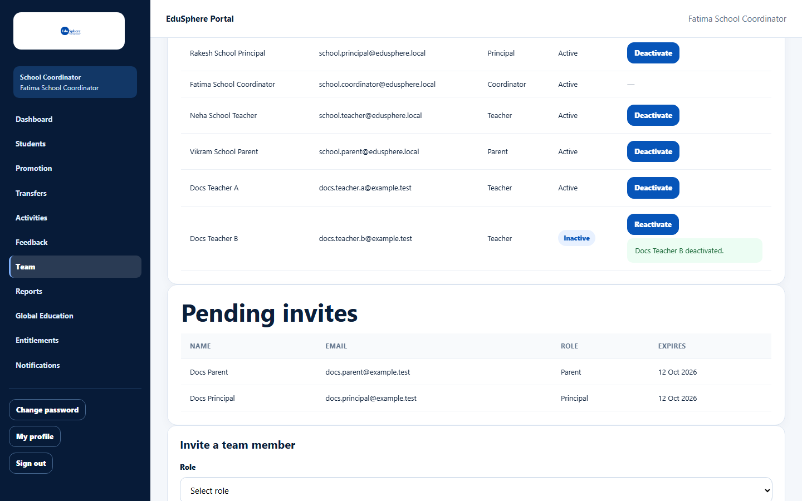

# Deactivate or reactivate a team account

> Doc ID: DOC-SCH-TEAM-003 · Verified on 2026-10-06 against `main` @ `ce1f07c2` · Roles: School Coordinator

## Purpose
Stop a Principal, Teacher or Parent from signing in (for example when a teacher leaves), or let them back in.

## Who Can Use This Feature
**School Coordinator.**

## Prerequisites
The person is listed in **Your team**.

## How to Access
Sidebar > **Team** > **Your team**.

## Steps

### Step 1 — Deactivate
Find the person and click **Deactivate**. There is no confirmation step. The message "{name} deactivated." appears,
**Status** changes to **Inactive**, and the button becomes **Reactivate**.

### Step 2 — Reactivate (when needed)
Click **Reactivate** on the same row. The message "{name} reactivated." appears *(from code)*.

## Fields
None.

## Expected Result
A deactivated person cannot sign in — they see "Invalid credentials" — and receives no new notifications.

## Validation Messages
| Message | When |
|---|---|
| {name} deactivated. / {name} reactivated. | The change was saved. |
| Can only activate/deactivate Principal, Teacher, or Parent accounts | Not possible from the screen (Coordinator rows have no button). *(From code.)* |

## Common Errors
**Problem:** You deactivated the wrong person.
**Cause:** There is no confirmation step.
**Resolution:** Click **Reactivate** on the row straight away.

## Tips
- A deactivated Teacher keeps their student assignments but can no longer be picked when you assign teachers
  *(from code)*.
- A **Parent** has one account for all schools. Deactivating a parent here blocks them at every school where they have
  a child *(from code)*.

## Related Features
- [View your team and pending invites](team-002-view-your-team.md)
- ["Access unavailable" messages](../account-access/auth-008-access-unavailable.md)
