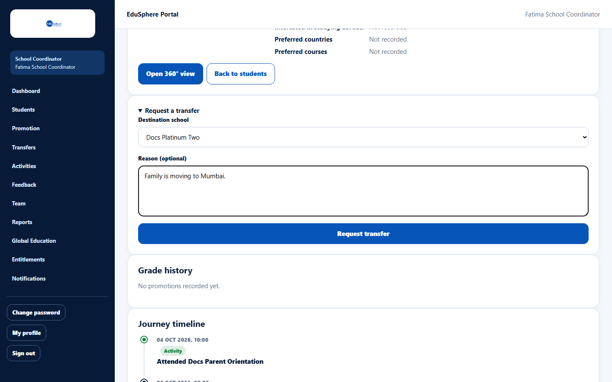
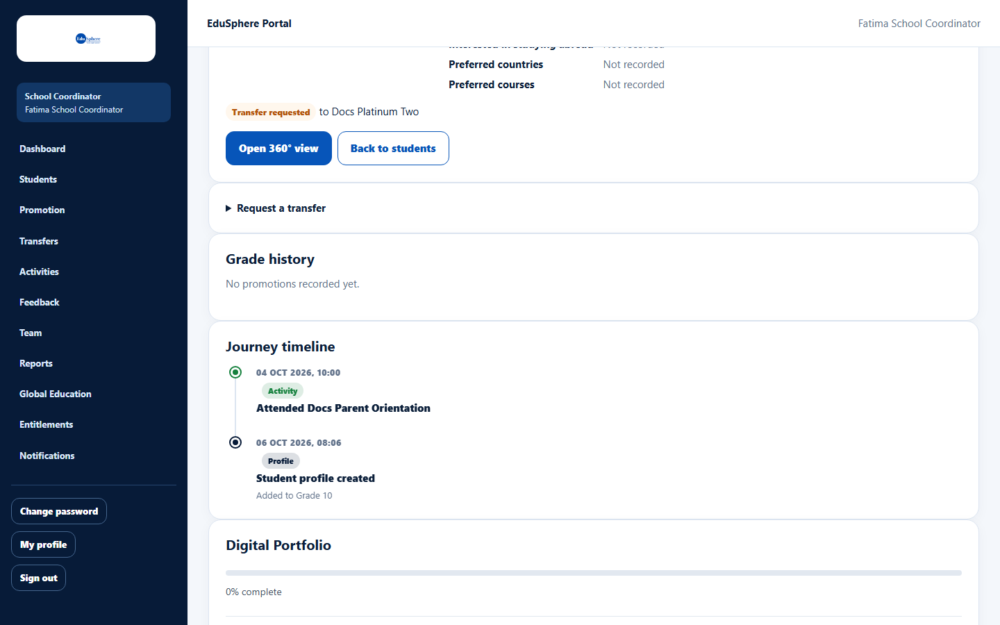

# Request a transfer out to another school

> Doc ID: DOC-SCH-XFER-001 · Verified on 2026-10-06 against `main` @ `ce1f07c2` · Roles: School Coordinator

## Purpose
Ask EduSphere to move one of your students to another partner school, for example when the family moves.

## Who Can Use This Feature
**School Coordinator** of the school the student is leaving.

## Prerequisites
- The student is on your roster and has no other pending transfer request.
- The destination is an EduSphere partner school.

## How to Access
Sidebar > **Students** > **Profile & timeline** > **Request a transfer** (a collapsed section below the details card).

## Steps

### Step 1 — Open the request form
Click **Request a transfer**. Choose the **Destination school** and, if you want, type a **Reason (optional)**.

### Step 2 — Send the request
Click **Request transfer**. The message "Transfer request sent for review. An admin decides; nothing changes until it is
approved." appears. The student's details card now shows **Transfer requested** to the destination school.

### Step 3 — Wait for the decision
EduSphere's Overseas Admin approves or rejects the request. You get a notification either way (see
[Track and cancel transfer requests](xfer-003-track-and-cancel-transfers.md)).

## Fields
| Field | Description | Required | Example |
|---|---|---|---|
| Destination school | Any other partner school. | Yes | Docs Platinum Two |
| Reason (optional) | Up to 500 characters; visible to the admin. | No | Family is moving to Mumbai. |

## Expected Result
- **While pending:** nothing changes for the student.
- **If approved:** the student moves to the new school, and their teacher assignment, section and roll number are cleared. Parents keep access to their child.

## Validation Messages
| Message | When |
|---|---|
| Choose a school. | No destination chosen. *(From code.)* |
| A transfer request is already pending for this student | A request already exists. *(From code.)* |
| Too many transfer requests; try again in N seconds | More than 30 requests in an hour. *(From code.)* |

## Common Errors
**Problem:** The **Request a transfer** form is not shown; instead it says "Transfer to {school} requested {date}. Waiting
for admin review." *(From code.)*
**Cause:** A request is already pending.
**Resolution:** Wait for the decision, or cancel it on the **Transfers** page.

## Tips
- Results that were not yet published are withdrawn when the transfer is approved *(from code; shown to the admin before
  approving)*.
- If the student's parent has a pending invitation, ask them to accept it before the transfer is approved; approval
  clears the invitation.

## Related Features
- [Request a student from another school](xfer-002-request-a-student-in.md)
- [Track and cancel transfer requests](xfer-003-track-and-cancel-transfers.md)
- Admin manual: [Review school transfer requests](../../admin-manual/sadm-007-review-transfers.md)
