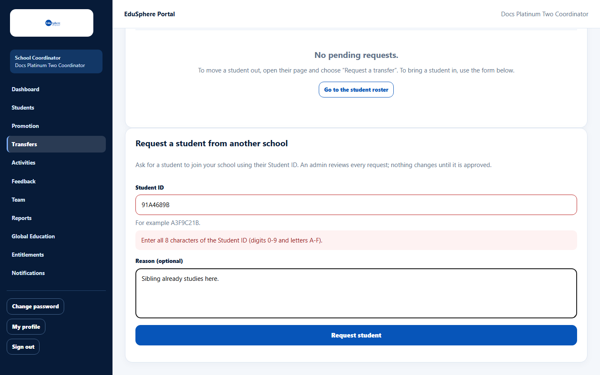
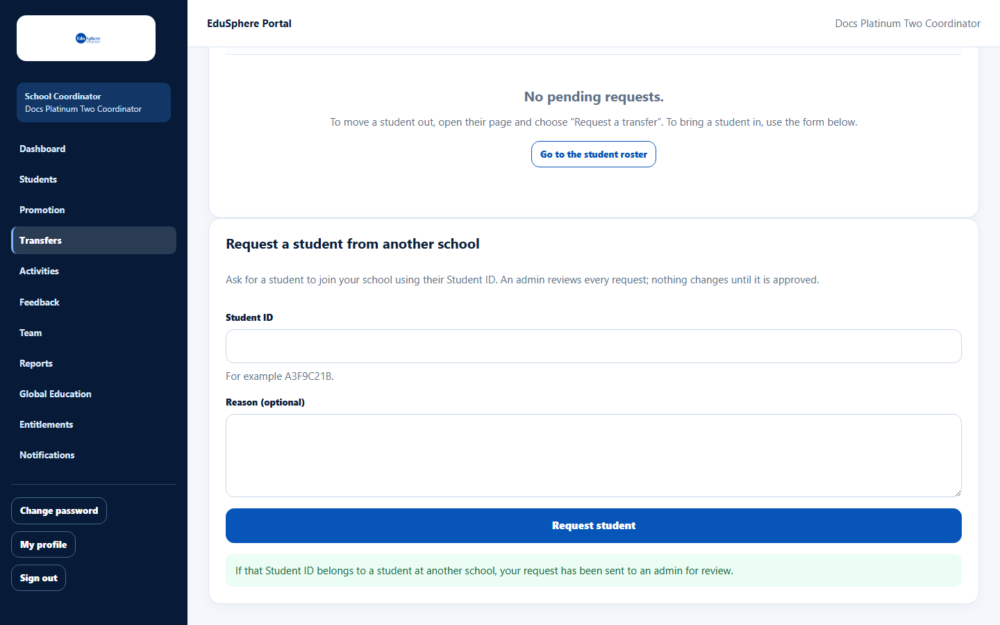

# Request a student from another school

> Doc ID: DOC-SCH-XFER-002 · Verified on 2026-10-06 against `main` @ `ce1f07c2` · Roles: School Coordinator

## Purpose
Ask EduSphere to move a student who is joining your school from another partner school, using their **Student ID**.

## Who Can Use This Feature
**School Coordinator** of the school the student is joining.

## Prerequisites
You know the student's 8-character **Student ID** (ask the family or the previous school).

## How to Access
Sidebar > **Transfers** > **Request a student from another school** (below the requests list).

## Steps

### Step 1 — Enter the Student ID
Type the **Student ID** (8 characters, digits 0–9 and letters A–F) and, if you want, a **Reason (optional)**.

### Step 2 — Send the request
Click **Request student**. The page always answers: "If that Student ID belongs to a student at another school, your
request has been sent to an admin for review."

### Step 3 — Follow it in the list
The request appears in **Transfer requests** as "Student ID {code}" with "Student details are shown once approved."

## Fields
| Field | Description | Required | Example |
|---|---|---|---|
| Student ID | The student's 8-character code. | Yes | 91A4689B |
| Reason (optional) | Up to 500 characters. | No | Sibling already studies here. |

## Expected Result
If the Student ID is valid, the admin sees the request with the student's name and both schools.

## Validation Messages
| Message | When |
|---|---|
| Enter all 8 characters of the Student ID (digits 0-9 and letters A-F). | The code is incomplete or has other characters. *(From code; on the documentation server the browser stopped the short code first.)* |
| Too many open transfer requests; wait for a decision or cancel one | Your school has 50 open requests. *(From code.)* |

## Common Errors
**Problem:** The request never appears for the admin.
**Cause:** The answer is the same whether or not the Student ID exists (to protect students' privacy), so a mistyped ID
fails silently. A student already at your school is also ignored.
**Resolution:** Check the Student ID with the family and request again.

## Tips
- You see the student's name only after the transfer is approved.

## Related Features
- [Request a transfer out](xfer-001-request-a-transfer-out.md)
- [Track and cancel transfer requests](xfer-003-track-and-cancel-transfers.md)
