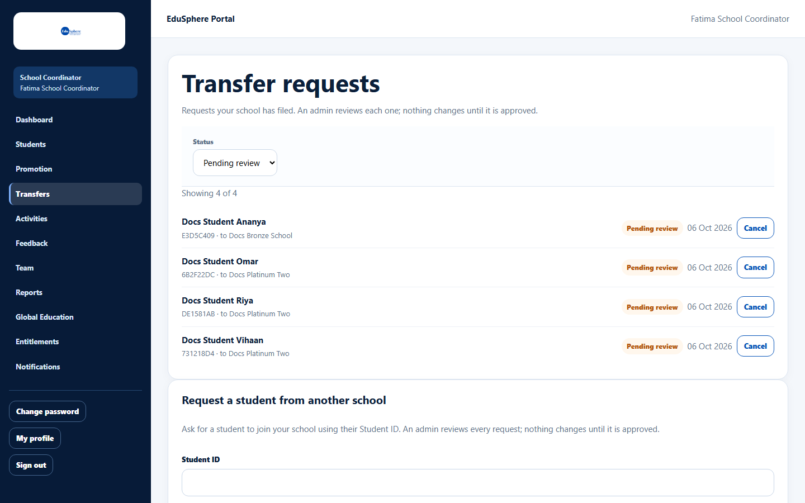
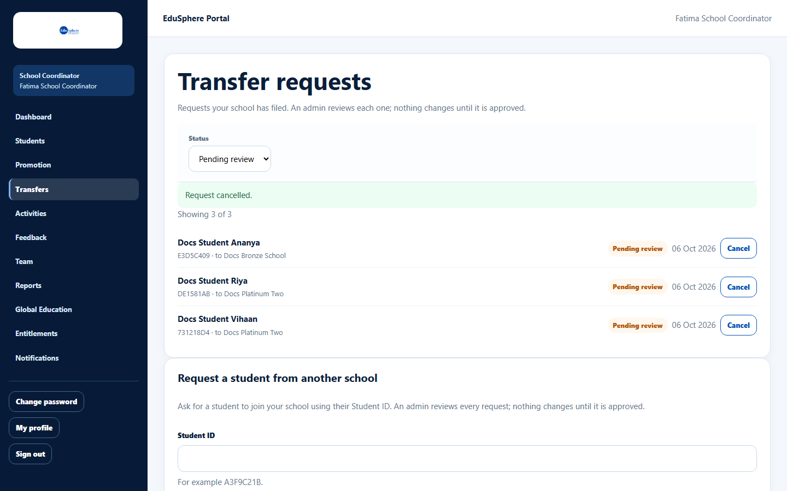
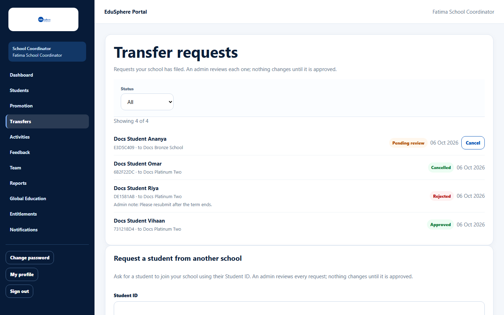
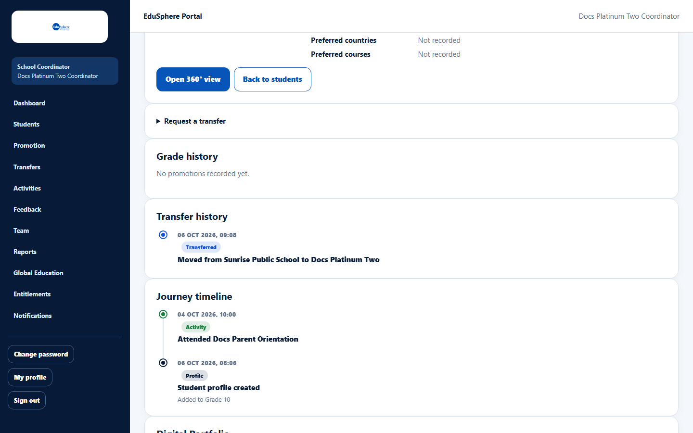

# Track and cancel transfer requests

> Doc ID: DOC-SCH-XFER-003 · Verified on 2026-10-06 against `main` @ `ce1f07c2` · Roles: School Coordinator

## Purpose
See the transfer requests your school has filed, cancel one that is no longer needed, and read the admin's decision.

## Who Can Use This Feature
**School Coordinator.**

## Prerequisites
None.

## How to Access
Sidebar > **Transfers**.

## Steps

### Step 1 — See pending requests
**Transfer requests** opens on **Pending review**. Each row shows the student (or "Student ID {code}" for an incoming
request), the other school, the status and the date filed.

### Step 2 — Cancel a request
Click **Cancel** on the row. There is no confirmation step. The message "Request cancelled." appears.

### Step 3 — See every request and its outcome
Set **Status** to **All** (or Approved, Rejected, Cancelled). A rejected request shows the admin's note, for example
"Admin note: Please resubmit after the term ends." When there are more than 25 requests, click **Load more**.

### Step 4 — Notifications
Your **Notifications** page tells you about each decision:
- "Transfer approved: {student} moved to {school}"
- "Transfer of {student} to {school} was not approved" ("An admin reviewed the request and did not approve it. Nothing has changed.");
  for a request to bring a student in: "Transfer request for Student ID {code} was not approved"
- At the receiving school: "{student} has joined {school}"

### Step 5 — After an approved transfer
At the new school the student's profile shows a **Transfer history** card ("Moved from {A} to {B}").

## Fields
| Field | Description |
|---|---|
| Status | Pending review, All, Approved, Rejected, Cancelled. |

## Expected Result
You know where each request stands.

## Validation Messages
| Message | When |
|---|---|
| Request cancelled. | The request was cancelled. |
| This transfer request has already been decided | The admin decided before you cancelled. *(From code.)* |

## Common Errors
**Problem:** You cancelled the wrong request.
**Cause:** Cancel works immediately.
**Resolution:** File the request again.

## Tips
- A moved student's section, roll number and teacher are empty at the new school; set them with **Edit** on the roster.

## Related Features
- [Request a transfer out](xfer-001-request-a-transfer-out.md)
- [Request a student from another school](xfer-002-request-a-student-in.md)
