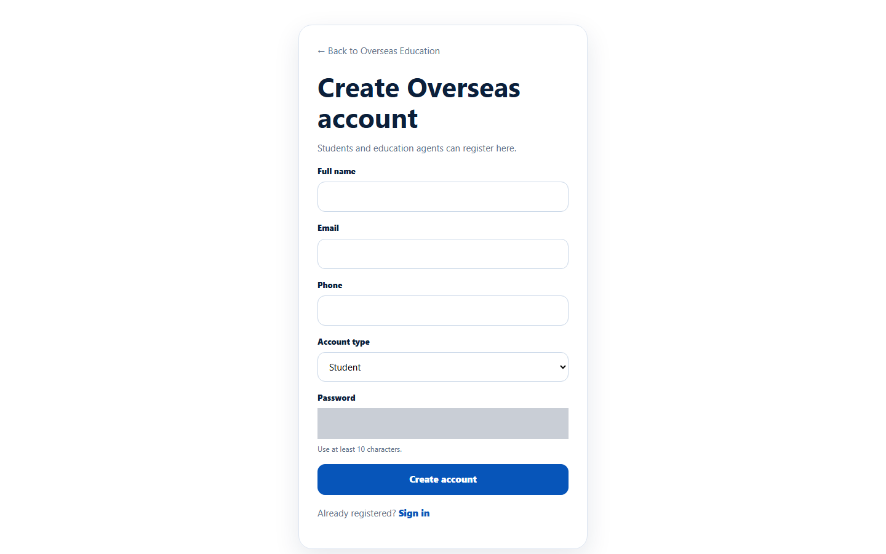
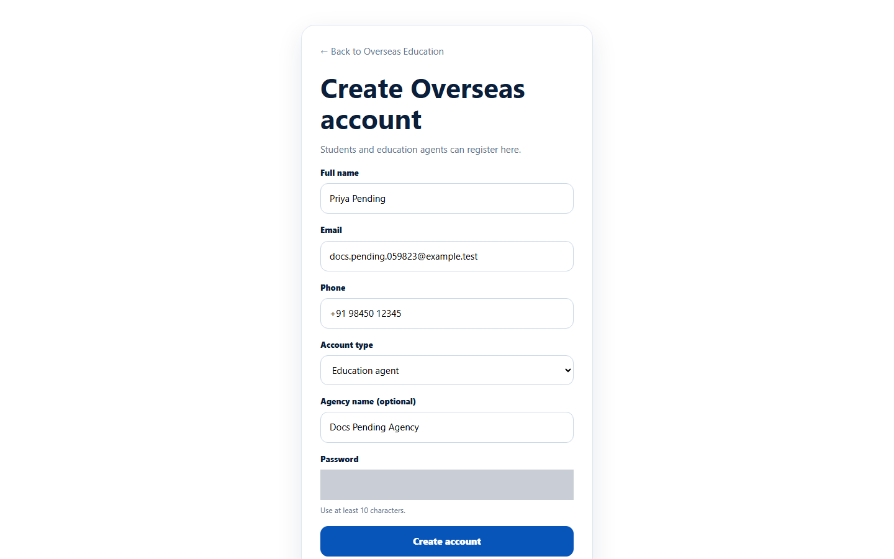
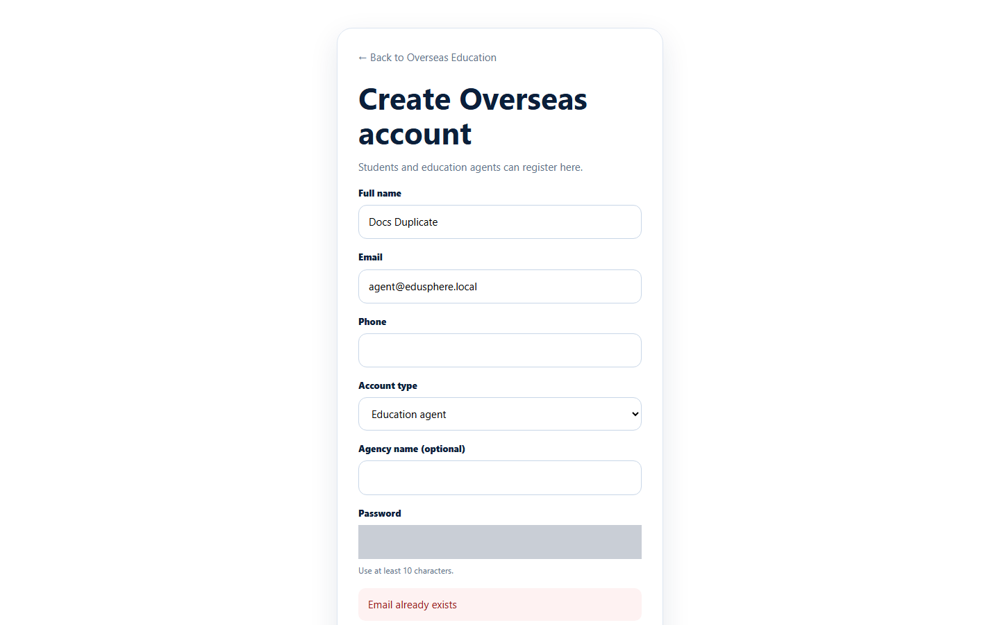

# Register an agency

> Doc ID: DOC-AUTH-001 · Verified 2026-10-05 against `main` @ `6a9be770` (docs branch) · Roles: anyone not signed in

## Purpose
Use this page to create an EduSphere account for your education agency. The person who registers becomes the agency's
first **Agency Master** (the owner account that manages the agency and its staff).

## Who Can Use This Feature
Anyone who does not have an EduSphere Overseas account yet.

## Prerequisites
- An email address that is not already used by an EduSphere account.
- A password of at least 10 characters.

## How to Access
Overseas sign-in page (`/overseas/login`) > **Create an account** (next to "Student or agent?").

## Steps

### Step 1 — Open the registration form
On the Overseas sign-in page, click **Create an account**. The page **Create Overseas account** opens.

### Step 2 — Fill in your details and choose "Education agent"
1. Enter your **Full name**, **Email** and (optionally) **Phone**.
2. In **Account type**, choose **Education agent**. A new field, **Agency name (optional)**, appears.
3. Enter your agency's name.
4. Enter a **Password** (at least 10 characters).

### Step 3 — Create the account
Click **Create account**. You are signed in straight away and taken to your agency workspace.

### Step 4 — Wait for approval
Your agency must be approved by EduSphere's Overseas Admin before you can use it. Until then every page shows
**Access unavailable — Agent registration is pending approval**.

## Fields
| Field | Description | Required | Example |
|---|---|---|---|
| Full name | Your name. It is shown to your team and to EduSphere. | Yes | Priya Pending |
| Email | Your sign-in email. Must not be used by another account. | Yes | priya@agency.example |
| Phone | Your contact number. | No | +91 98450 12345 |
| Account type | Choose **Education agent** to register an agency. ("Student" creates a student account.) | Yes | Education agent |
| Agency name (optional) | Your agency's name, up to 160 characters. If you leave it empty, your full name is used. | No | Docs Pending Agency |
| Password | At least 10 characters ("Use at least 10 characters."). | Yes | — |

## Expected Result
- Your agency is created with the status **pending**, and you are its first Master. Your Master code is your agency
  prefix plus `-M001` (for example `DOC-M001`).
- You stay signed in, but you see the "pending approval" message until an Overseas Admin approves the agency.

## Validation Messages
| Message | When |
|---|---|
| Email already exists | The email is already used by an EduSphere account. |
| (browser prompt) | A required field is empty, the email is not in a valid format, or the password is shorter than 10 characters. |

## Common Errors
**Problem:** "Email already exists" appears under the form.
**Cause:** An EduSphere account already uses this email.
**Resolution:** Sign in with that account, use **Forgot your password?** if needed, or register with a different email.

**Problem:** After registering, every page says "Agent registration is pending approval".
**Cause:** This is expected. New agencies must be approved first.
**Resolution:** Wait for EduSphere to approve the agency. EduSphere does not send an email when this happens, so sign in again later to check.

## Tips
- Use an email that your agency will keep long-term; it is the Master sign-in and cannot be changed by staff.
- A **rejected** registration shows the same "pending approval" message. If you have waited a long time, contact EduSphere Overseas Admin.

## Related Features
- [Sign in and sign out](auth-002-sign-in-and-sign-out.md)
- ["Access unavailable" messages](auth-003-access-unavailable.md)
- Admin: [Approve, reject, suspend or reinstate agencies](../../admin-manual/adm-001-agency-approvals.md)
